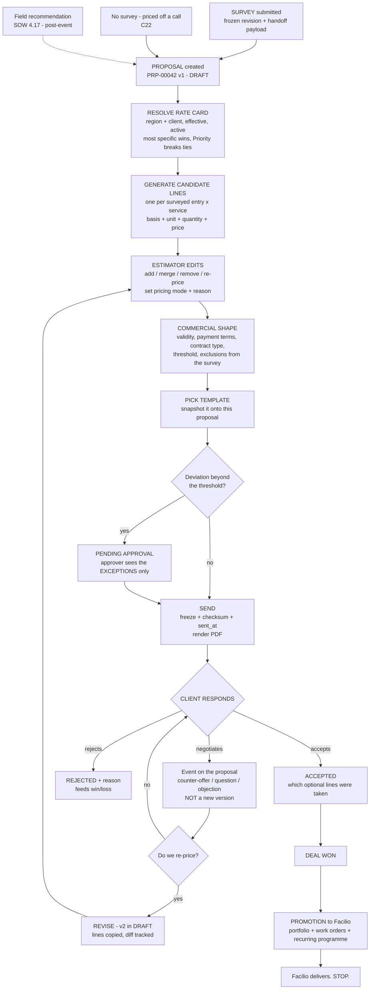
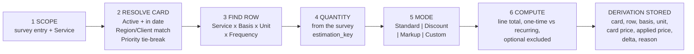
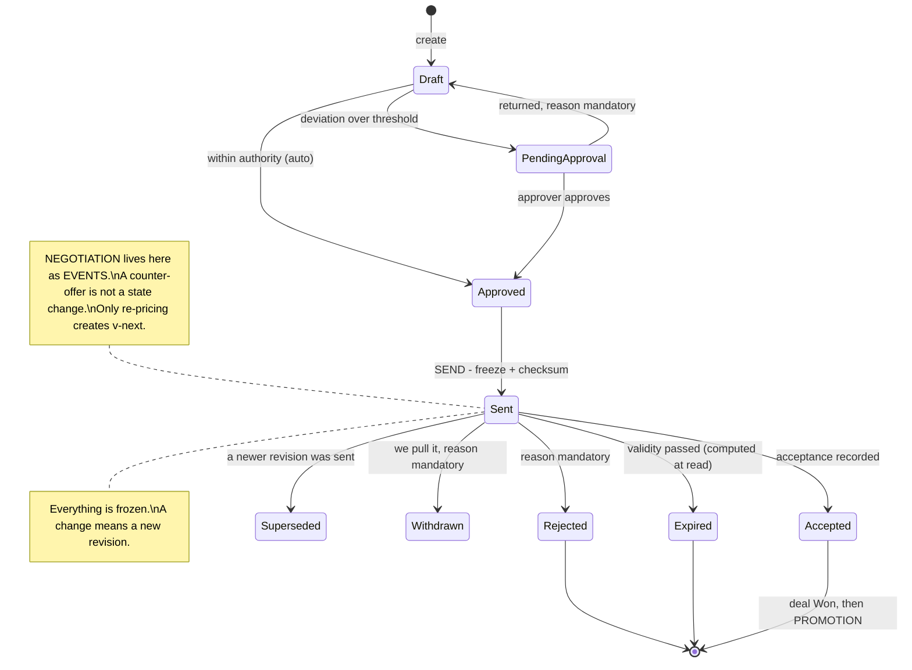

<!--
  FRONTLINE PROPOSAL MODULE — SPEC v1 (review draft)
  Canonical name: claude/proposal-module-spec-v1.md (Vibethon project)
  Author: Claude (as-Sudharsan, replica v2.8) · 14 Aug 2026
  Governed by: claude/CLAUDE.md (mother doc v8.7) — §0a glossary, §3a platform constraints, §6 doctrine.
  Builds on: proposal-module-flow-v1.md (JTBD + business requirements) and
             proposal-pricing-model-v1.md (the four modes, rate-card leverage, the AI P2 layer).
  Rate card settled 14 Aug (Sudharsan): ONE PRICE per row. No cost, no floors, no minimum charge.
  Terminology settled: PROPOSAL everywhere. The word "quote" does not appear in this build.

  PURPOSE: a spec Sudharsan can read, mark up, and hand to Yameen. Flowcharts first, then the model,
  then the build layers. Everything numbered so it can be pointed at.

  Evidence tags: [M] read from source · [M-via-CLAUDE.md] summary only · [S] stated · [I] inference.
  STATUS: REVIEW DRAFT. §10 carries the open calls. Nothing here is frozen.
-->

# Frontline — Proposal Module · Spec v1 *(review draft)*

**In one line:** a Proposal turns a frozen survey revision into priced lines using a rate card, wraps them
in a template, and freezes on send — and every version the client has ever held stays exactly as they saw it.

---

## §1. THE THREE DIAGRAMS

### 1.1 End to end — where a Proposal sits

### 1.2 How a price is derived — six deterministic steps, no model anywhere

### 1.3 Lifecycle — and where negotiation sits

---

## §2. THE OBJECT MODEL — five tables, only one genuinely new

**A revision is a new Proposal row with a parent link** — exactly the pattern the survey lane already uses
for a re-walk (v1.8 T9). One less table, and a pattern the team has built once already.

| # | Table | Notes |
|---|---|---|
| 1 | **`fl_proposal`** | The record **and** the revision. `proposal_number` inherited from the parent, `revision_no` increments → *PRP-00042 v2*. Rename of the drawn `fl_quote` CSV |
| 2 | **`fl_proposal_line`** | **Lines belong to the revision.** Revising copies the lines — which is what makes "their copy never changes" structurally true instead of a rule people remember. Rename of `fl_quote_line` |
| 3 | **`fl_rate_card`** | §3. Already drawn, needs re-cutting to 9 fields |
| 4 | **`fl_rate_card_row`** | §3. Rename of `fl_rate_card_entry`, cut to 6 fields |
| 5 | **`fl_proposal_template`** | **The only genuinely new table.** §6 |

**Reused, not built:** `fl_event` (audit **and** the negotiation thread) · `fl_sequence` (`PRP-`) ·
`fl_setting` (thresholds, defaults) · the Service and Region masters.

> **Money is stored in minor units as integers.** CSV type inference will hand back a float otherwise, and
> float money is a bug you find on stage.

### 2.1 `fl_proposal` — the fields that matter

`proposal_number` · `revision_no` · `parent_proposal_id` · `deal_id` · `account_id` ·
`survey_revision_id` (nullable — the no-survey path) · `rate_card_id` + `rate_card_resolved_reason` ·
`currency` · `status` · `contract_intent` + `threshold_amount` · `valid_until` · `payment_terms` ·
`expected_programme` · `template_id` + **`document_json`** (the snapshot, §6) · totals
(`one_time_total`, `recurring_total`, `recurring_period`, `optional_total`) · `deviation_pct` ·
`approved_by` / `approved_at` · `sent_by` / `sent_at` / `frozen_json` / `checksum` ·
`decision` / `decision_reason` / `decided_at` · `superseded_by_proposal_id`.

### 2.2 `fl_proposal_line` — the derivation is the point

`proposal_id` · `line_no` · `service_id` · **`source`** (`survey_entry` \| `recommendation` \| `manual` \|
`external_schedule`) + `source_ref_id` · `scope_node_id` · `description` ·
**`pricing_basis`** · **`unit`** · **`frequency`** · `quantity` ·
**`rate_card_id`** + **`rate_card_row_id`** (null for Custom) · **`card_price`** (copied at creation) ·
**`pricing_mode`** · **`delta_type`** (`pct` \| `amount`) · **`delta_value`** · **`delta_reason`** ·
**`applied_price`** · `line_total` · `is_optional` · `is_active`.

**Three rules on this table:**

1. **`card_price` is copied, never looked up.** This is what makes a sent proposal immune to a later rate
   change — and the rate card's own immutable audit trail exists because rates *do* change [M — CRM spec §4.4].
2. **Discount and markup are one field with a sign.** Two mechanisms means two rounding bugs.
3. **`delta_reason` is mandatory for Discount, Markup and Custom.** Free text in P1; a seeded list an hour
   later — and structured reasons are what make the P2 AI markup suggestions actually good.

---

## §3. THE RATE CARD — settled, 15 fields, no criteria engine

**Header — 9 fields:** `Rate Card ID` (auto) · `Name` · `Currency` · `Region` *(nullable = all)* ·
`Client` *(nullable = all)* · `Priority` · `Status` (Draft \| Active \| Archived) · `Effective From` ·
`Effective To` *(nullable)*.

**Row — 6 fields:** `Service` · `Pricing Basis` (**Unit \| Hour \| Visit**) · `Unit` *(master, dependent on
basis)* · `Frequency` *(nullable)* · **`Price`** · `Active`.

**Resolution (step 2 of §1.2), and it must be shown on the proposal:** Status = Active · today between
Effective From and To · Region matches or is null · Client matches or is null · **most specific wins**
(Client+Region → Client → Region → neither) · **Priority breaks ties**.

**Price, Basis and Unit are one atomic fact.** A price with no basis is unusable — and the triple is what
collapses CIT's thirteen pricing models into three bases: *per hood* and *per linear metre* are `Unit` with
the Unit master extended; *labour* is `Hour`; *call-out* is `Visit`; *customer-specific* is a Client-scoped
card. Ten of thirteen native; **emergency, equipment and material rates fall to Custom lines** — deliberately.

**Cut and named:** the criteria engine (Criteria/Operator/Value/AND-OR) → two nullable columns ·
Cost Rate, Minimum Sell Rate, Minimum Charge → **one price** · Deal/Account scoping · Default-card flag ·
Approved By · Country · Description · Notes · a separate audit table → `fl_event`.

**Consequence to hold in view:** with cost gone, **margin is not visible anywhere**, so approval keys off
deviation from card price, not profitability (§4). And with Minimum Charge gone, **a small job can price
below what it costs to mobilise a crew.** Both are accepted, not overlooked.

---

## §4. APPROVAL — one threshold, one setting

| Condition | Outcome |
|---|---|
| Every line at Standard, or marked up | **No approval** |
| Any discount within `proposal.discount_approval_pct` (default 10%) | **No approval** |
| Discount beyond the threshold, **or any Custom line** | **Pending Approval** |

The approver's screen is **the exception list** — which lines deviated, by how much, with the stated
reason. Not the document. Showing them the whole proposal is the same as showing them nothing.

**Two different approvals, do not conflate:** the rate card has its own `Approved By` — that approves the
*price list*. This approves a *deviation from it*.

---

## §5. REVISION, NEGOTIATION, AMENDMENT — three different things

**R1 — The revision boundary is `sent`.** Before first send, edits are just edits and no version churn
happens. After send, any change creates a new revision. This is what clients already expect from PandaDoc
and DocuSign.

**R2 — Negotiation is a thread of events, not a state.** A client saying *"do it for 40k"* is an event on
the proposal — `counter_offer` · `question` · `objection` · `scope_change_request` — written to `fl_event`
with who, when and the content. **A revision exists only when we deliberately re-price.** Without this
split you get v7 where nothing changed, and half of the measured 47% rework
[M-via-CLAUDE.md] may be exactly that.

**R3 — Exactly one revision is `sent` at a time.** If the client holds v2 while v3 is in draft, **v2 is
still the live offer.** The parent flips to `superseded` only when the child is sent. Getting this wrong is
how you honour a price you never issued.

**R4 — The diff is line-level:** added · removed · quantity changed · rate changed · mode changed, plus the
delta to each total. **The diff is what makes revision 2 cheaper than revision 1** — that is the whole J2 job.

**R5 — Client-facing labels are v1, v2, v3**, and **the document prints its version and date.** Otherwise
you will one day argue about which one they signed.

**R6 — A new revision resets `valid_until`.** The previous one is superseded, not expired.

**R7 — Amendment is not built.** A change after acceptance is a **new proposal linked to the won deal** —
which is exactly the SOW §4.17 recommendations loop [M], not a new object type.

**R8 — Rejection and expiry are not dead ends.** Both can spawn a revision. Expiry is **computed at read
time**, never a scheduled job — jobs need production and production has not been promoted (§3a P8).

---

## §6. TEMPLATES AND THE DOCUMENT — option B, one seeded template

**A template is an ordered list of sections**, not an uploaded file. Two kinds:

| Section type | Rendered by | Examples |
|---|---|---|
| **System** | A function, from proposal data | pricing table · exclusions · site summary · acceptance block |
| **Text** | The user, with tokens merged in | cover letter · about us · terms · what we will do |

**Tokens are merged by a function, never by a model:** `{{client_name}}` `{{site_name}}`
`{{proposal_number}}` `{{revision_no}}` `{{valid_until}}` `{{one_time_total}}` `{{recurring_total}}`
`{{prepared_by}}`.

**The load-bearing rule: the template is snapshotted onto the proposal at first render** → `document_json`.
An admin editing a template on Friday must not change a proposal already with a client, and a frozen
revision must reproduce byte-identically. Same problem, same solution as the survey question snapshot
(v1.8 §B1.4).

**Editing is a textarea per text section, rendered as Markdown.** Deliberately **not** a rich-text editor:
TipTap / ProseMirror / Lexical are two hours for basic formatting and **days** for comments and version
history — which are usually a paid collaboration server. And they are the wrong home for both: **versioning
belongs to the revision (§5), comments belong to the negotiation thread (R2).** Solving them inside an
editor solves them twice, in the harder place.

**PDF: styled HTML → browser print.** Zero dependencies, and the production reference tool does exactly
this today [M — Imperial tool, `#printArea` + `window.print()`]. Because the revision is frozen, the render
is deterministic and reproduces.

**P1 ships one seeded template.** "Add a template from this screen" is real, and it is a P2 sentence.

---

## §7. AI — P2, and the doctrine makes it sharper

**Functions calculate. Agents interpret.** On this platform it is not merely policy: a Vibe function
**cannot** call a model (§3a P5), so AI is structurally incapable of sitting in the pricing path.

Steps 2, 3, 4 and 6 of §1.2 are lookup and arithmetic — closed. The interpretation is in **what to scope**
and **which mode, and why**. Ranked:

1. **Service matching** — survey answers → which Services apply, at which level. Interpretation into a
   **finite catalogue**, confidence per suggestion, human accepts each. Never touches a number.
2. **Mode + reason recommendation** — *"lift access and overnight crew, three spaces at condition 2 →
   suggest 12% markup on floor care."* The model proposes a mode, a value and **a written justification**;
   the function computes the money.
3. **Exclusion drafting** — not-visited nodes and unanswered questions → printable exclusion sentences.
   Serves J1 and SOW §4.4 requires exclusions by name [M].
4. **Pre-send reviewer** — *"line 7 is 3× standard with no reason recorded"*, *"you scoped window cleaning
   but the walk recorded lift access and there is no access line."* **AI as critic, not author.** This is
   the estimator's real fear served without the model touching a value.
5. **Revision summary for the client** — the diff is computed by a function; AI writes the sentence.
6. **Quantity extraction** from free text — **highest risk, do last or not at all.** A mis-parsed square
   footage is a mispriced job.

**The chat window uses a pattern already shipped in this repo** — `intake-start` / `intake-turn` /
`intake-transcript` / `intake-submit` in the lead module. Browser calls the model, handlers persist the
turns. We are reusing shipped code, not inventing.

**What looks like AI and is not:** rate card resolution · gap detection · deviation checks · totals. All
functions, and one of them must show its working.

---

## §8. HANDLERS — the `proposal` function

Written to the repo's convention: bare verb for the primary entity, `<noun>-<verb>` for secondary.

| Group | Handlers |
|---|---|
| Lifecycle | `create` · `get` · `list` · `update` · `submit-for-approval` · `approve` · `return` · `send` · `withdraw` |
| Lines | `line-generate` · `line-add` · `line-update` · `line-remove` |
| Response | `respond` *(accept / reject)* · `event-add` *(negotiation thread)* |
| Revision | `revise` · `diff` |
| Document | `template-list` · `template-save` · `render` |
| Reference | `reference` *(bases, units, frequencies, modes, reasons)* |

**Pure logic, unit-tested, in `src/domain/`:** `proposal-pricing.ts` · `proposal-state.ts` ·
`proposal-diff.ts`.

> **⚠ Read `pricing.ts` first — 515 lines, 28 passing tests, and nothing currently calls it.** If it already
> implements the mode-and-derivation model, use it. If it implements cost, margin or floors, **strip it to
> price-alone** rather than reintroducing fields the rate card no longer has. Nobody in this lane has read
> it, and it is the single largest piece of pre-built work available.

---

## §9. BUILD LAYERS — stop anywhere and the demo still stands

| Layer | What | Proves |
|---|---|---|
| **L0** | Rename the CSVs (`fl_proposal*`, `fl_rate_card_row`), the `proposal/` directory, the `PRP` sequence. **Import the rate card.** | Nothing — but it is the only work tonight that **cannot be redone tomorrow** under no-DDL |
| **L1** | `create` + `line-generate` + `get`. Given a survey revision, produce priced lines. **No UI** — provable through `facilio vibe function run` | The seam works |
| **L2** | Proposal detail page: lines, edit quantity and rate, pricing mode + reason, the two totals | Money on screen |
| **L3** | Print view → PDF, one seeded template, snapshot on first render | **An artifact in hand.** Stop here and the demo is whole |
| **L4** | `send` freezes v1; `revise` creates v2; line-level diff | The 47% story |
| **L5** | Approval threshold; exclusions block from the survey payload | The trust story |

**Unblock both lanes now: hand-write one frozen survey payload and seed it as a row.** One site, two
buildings, six entries, conditions, `estimation_key` values, two exclusions. The proposal lane then builds
and tests against a real contract **without waiting for the walk to land**, and it doubles as the demo
fixture if the walk runs late.

---

## §10. OPEN CALLS — for your mark-up

| # | Call | My recommendation |
|---|---|---|
| **1** | **Lines on the revision** (copied on revise) vs lines on the proposal (versioned separately) | **On the revision.** Makes immutability structural rather than a rule people remember. Costs rows, and at demo scale that is free |
| **2** | **A revision is a new `fl_proposal` row with a parent link** vs a separate revisions table | **New row + parent link** — the survey lane already does this for re-walks, and it saves a table |
| **3** | **Frequency on the rate card row** vs on the proposal line | **On the row** — per-visit economics genuinely change between weekly and monthly. Moving it later is a re-import |
| **4** | **Discount threshold default** | **10%**, in `fl_setting`, admin-editable |
| **5** | **Optional lines at acceptance** — does the client pick options, and does the accepted set drive the work orders? | **Yes to both.** Forcing a re-sign to add an upsell is how you lose the upsell |
| **6** | **Negotiation events** — `fl_event` rows vs their own table | **`fl_event`.** One audit spine; the thread is a filtered query |
| **7** | **Currency** — always inherited from the resolved rate card? | **Yes.** One currency per proposal, stamped at creation |
| **8** | **`is_optional` lines** — excluded from totals but shown. Shown *where* in the document? | A separate "Optional services" block after the pricing table, with its own subtotal, clearly outside the total |
| **9** | **D-e — condition scale direction, 1 worst or best** | `1_is_worst`. **Still unanswered, and it now gates survey capture, condition pricing and the AI markup reasoning** |

---

## §11. NOT IN THIS BUILD — say it, don't hide it

Tax / VAT *(out of the CRM MVP, in the CIT SOW §4.4 — call it a fast-follow, never an oversight)* ·
cost and margin *(price-alone rate card)* · minimum charge · rate-card approval workflow · deal-scoped rate
cards · template library beyond one seeded template · rich-text editing, comments, collaborative editing ·
amendments to accepted proposals · the tender submission format · **Proof of Service, its on-site
acceptance, the Proforma Invoice, payments, QR certification and the customer portal — SOW §4.10–4.18, all
Facilio-side** · and **acceptance itself is a separable slice, blocked by the no-public-page constraint
(§3a P7 / G3)**.
