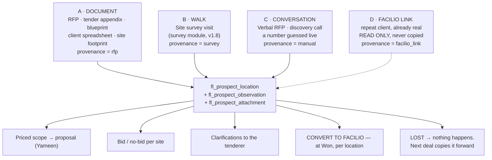
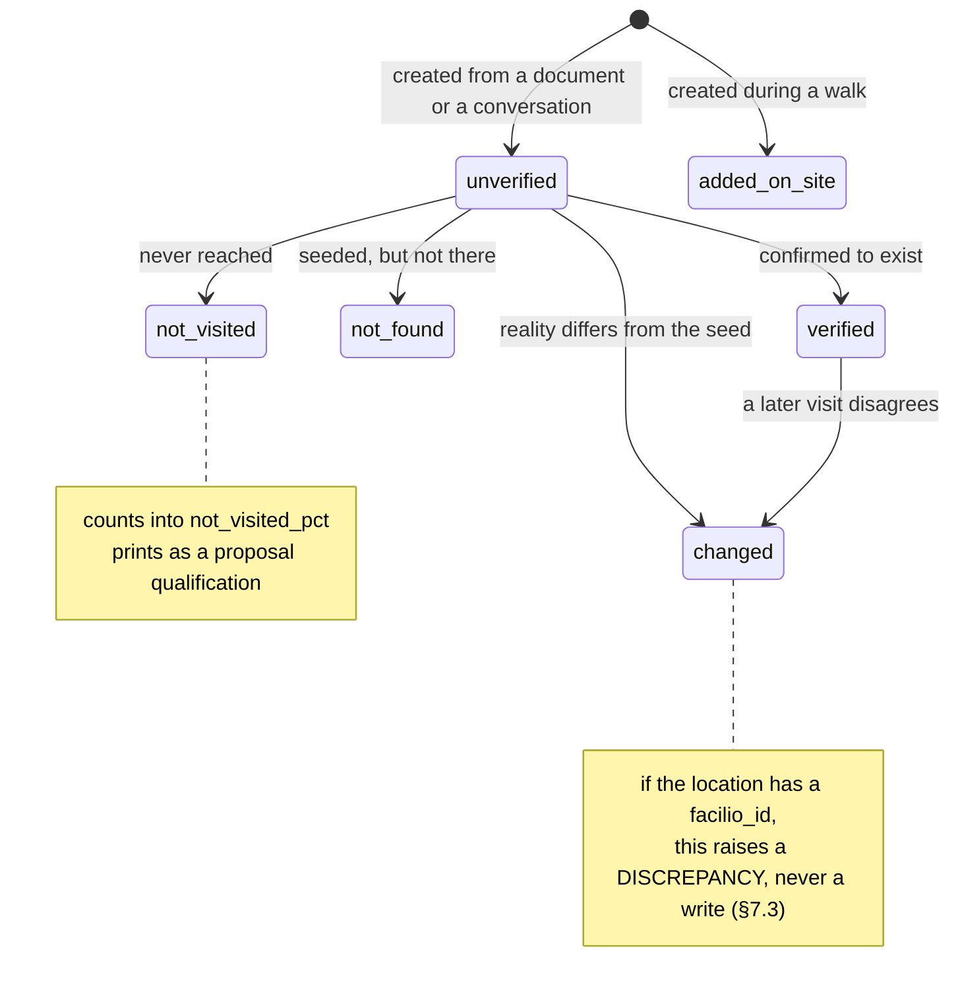
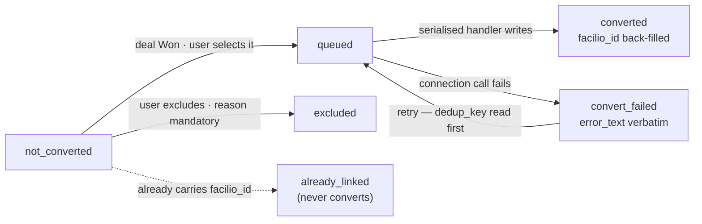
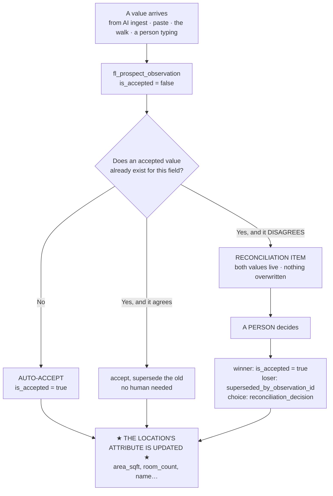
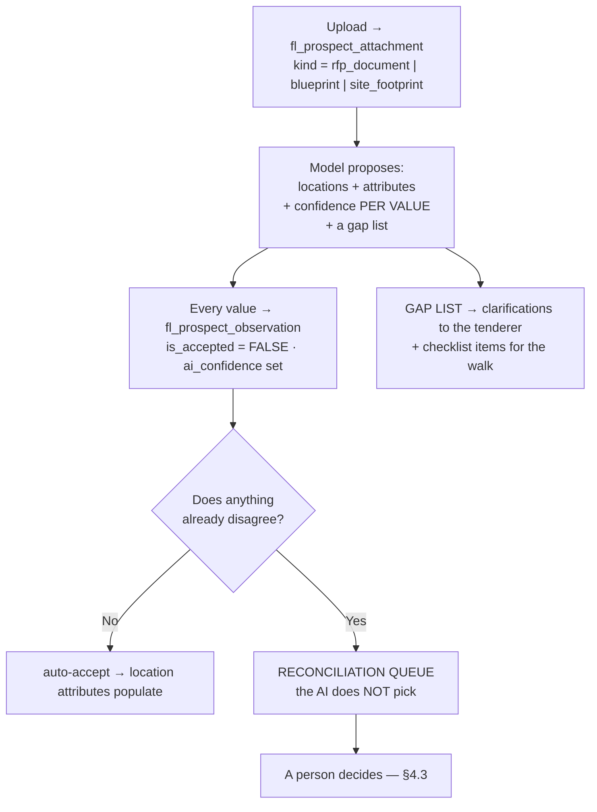

<!--
  PROSPECT PORTFOLIO — MODULE STRUCTURE & BUILD SPEC v1.1
  Canonical name: claude/prospect-portfolio-module-spec-v1.1.md (Vibethon project)
  Author: Claude (as-Sudharsan, replica v2.8) · 14 Aug 2026
  Governed by: claude/CLAUDE.md (mother doc v8.7.3) — §0a glossary, §3a platform constraints, §3b this lane,
    §6 doctrine, and C35 / C36 / C37 / C38 which were registered FROM the review of v1.0.

  SUPERSEDES claude/prospect-portfolio-module-spec-v1.md ON STRUCTURE.
  v1.0 REMAINS AUTHORITATIVE AND IMMUTABLE FOR THE EVIDENCE BASE — the 88-call sweep, the named
  quotes, and the four corrections to the project's own documents (v1.0 §2.6). This file does not
  repeat that evidence; it cites it. Read v1.0 §2 before quoting anything from this lane to a judge.

  ALSO SUPERSEDES claude/survey-module-structure-v1.8.md §A1.3.

  WHAT CHANGED, AND WHY — all seven from Sudharsan's review, 14 Aug:
   1. ONE TABLE, not two. The v1.0 → v1.1 draft proposed splitting the building from the pursuit of it.
      He asked for the simplest thing that works. It is one table plus one self-reference column
      (`previous_pursuit_id`). I was wrong about the split, and the simple version is also MORE CORRECT —
      a survey is a point-in-time record, so copying forward is truer than sharing one row across two
      visits eighteen months apart. §5.4.
   2. `fl_prospect_node` → `fl_prospect_location`; `node_type` → `type`. "Node" is engineering jargon
      no FM person uses. Glossary updated (CLAUDE.md §0a).
   3. NO LIFECYCLE STATE FOR A LOST DEAL, and no clone feature. The DEAL carries the outcome. §6.
   4. THE PROMOTION ONLY EVER CREATES. Never updates an existing Facilio record. §7.3.
   5. EVERY FIELD CARRIES A "WHY IT EXISTS" LINE — C35, which this document's own review created.
   6. LIFECYCLE + PERSONAS + OPERATIONS + SPECIAL ACTIONS all defined, because the permission set is
      built from them — C36. §6, §9, §10, §11.
   7. CUT: `quantity_confidence`, `quantity_variance_pct`, clone-tree, the summary strip, the
      matching UI. ADDED: address (a straight miss in v1.0), attachments + blueprints, the
      observation lifecycle (absent from v1.0 AND from v1.8), and the AI layer as its own section.

  VERSIONING RULE (standing): every revision is a NEW FILE. v1.0 is immutable.
  STATUS: BUILDABLE. No open decisions block starting on the table.
-->

# Prospect Portfolio — Module Structure & Build Spec v1.1

**Doctrine (CLAUDE.md §6, binding):** humans act, workflows automate, AI assists. No AI sits in any state machine here — and structurally cannot, because a Vibe function cannot call a model (§3a P5).

**Evidence tags:** **[M]** measured from a real artifact · **[S]** stated by a named person on a dated recorded call · **[I]** inference. Full evidence base: **v1.0 §2**.

---

## §1. WHAT THIS IS, IN ONE PARAGRAPH

Facilio's Portfolio holds buildings you are **paid** to maintain. Every FM service provider carries a second, larger, messier portfolio: buildings they **hope** to be paid to maintain — the sites named in an RFP, the store someone walked last Tuesday, the "about 200, sorry, 200 to 220" buildings a prospect guessed at on a call **[S]**. Today it lives in an email attachment, a spreadsheet, and one person's head — *"So usually it's just in their head"* **[S — Sean Smith, 13 Aug 2026]**. It cannot go into Facilio's Portfolio, because Facilio's Portfolio has exactly one lifecycle lever — `inactive` — and no concept of "not ours yet" **[M]**. **This module is that second portfolio, modelled properly, in the app DB, shape-compatible with Facilio but never written to it — until a human wins the deal and explicitly converts each location into a Facilio site, building or space.**

---

## §2. THE THREE FEEDS — why this is its own product area

A location can be born three ways and **only one involves a survey**. That is the entire argument for separation, and it is why D-p (the survey lane's "repeatable sections replace the tree screen") does not apply here.

**The load-bearing evidence:** *"So if we get the dimensions of the store, then like a blueprint or something like that, then we can kind of just price it out from home"* **[S — Sean Smith]**. A large share of pursuits are priced with **nobody ever walking the building**. With no walk there are no survey entries, so something other than the survey has to build the tree. Hence: its own product area, its own screens, its own permissions.

---

## §3. PERSONAS → SURFACE  *(C36 requirement 2)*

| Persona | Their surface | What they do here | Sections |
| --- | --- | --- | --- |
| **RFP / proposals coordinator** (U1) | Portfolio tab on the Deal · Paste-from-RFP | Seeds sites from the incoming pack, sets bid / no-bid per site, chases the gaps | §8 S1, S2 |
| **BD / deal owner** (U2) | Portfolio tab | Owns the pursuit. Adds locations from a conversation, copies forward a building bid before | §8 S1 |
| **Surveyor** (U3) | **Mobile walk capture** *(the survey module's screen, writing here)* | Creates spaces inline, verdicts seeded locations, shoots photos | §8 S3 |
| **Estimator** (U4) | Read-only frozen payload | Consumes the priced scope. **Yameen's lane starts here** | v1.8 §5 |
| **Ops lead / admin** (U5) | **Convert to Facilio** | Selects what goes into the CMMS at Won, chooses each target level, resolves blockers | §8 S4, §7 |
| **Site contact / tenderer** | *No login in v1* | A record on a visit, never a user | — |

**The adoption test:** the RFP coordinator must be able to turn an attachment into a structured site list faster than she can read it. Martha's team is **five people** doing that by hand **[S]**. If S1 and S2 are slower than a spreadsheet, nothing else in this document matters.

---

## §4. LIFECYCLE  *(C36 requirement 1)*

**Two independent state machines, deliberately separate.** `verdict` answers *"is this real?"*. `convert_state` answers *"is it in Facilio yet?"*. A location can be `verified` forever and never convert (deal lost). It can convert while `unverified` (nobody walked it — the blueprint path).

**There is no third state machine, and specifically there is no lost / archived / inactive state.** A lost deal changes nothing about a building. The **deal** carries the outcome. This was Sudharsan's call on review and it is correct: buildings don't have deal outcomes, deals do.

### 4.1 `verdict` — is this real?

| Transition | Actor | Guard | Side effect |
| --- | --- | --- | --- |
| → `verified` | Surveyor, Survey lead | Location is in the survey's scope | `fl_event` |
| → `changed` | Surveyor, Survey lead | **`verdict_note` mandatory** | `fl_event`; if `facilio_id` present → discrepancy flag (§7.3) |
| → `not_found` | Surveyor, Survey lead | **`verdict_note` mandatory** | Prints as a qualification |
| → `not_visited` | Surveyor, Survey lead | **`verdict_note` mandatory** | Feeds `not_visited_pct` on the handoff |
| → `added_on_site` | Surveyor | Created during a visit | `provenance = survey` |

**Forbidden — assert in the function layer and unit-test:** any verdict change after the deal is Won and the location is `converted` · a `not_found` / `not_visited` / `changed` written without a note · a verdict set by anyone who is not an active assignee on the survey.

### 4.2 `convert_state` — is it in Facilio yet?

**Forbidden:** any move out of `not_converted` while the deal is not Won · `converted → not_converted` · a write with no `fl_prospect_convert_log` row · **any Facilio portfolio write from any handler other than `prospect.convert-to-facilio`.** That last one is the module's entire safety claim — make it a test, not a promise.

### 4.3 Observation lifecycle — **NEW; it was absent from v1.0 and from v1.8**

Sudharsan asked *"who feeds it, what changes it, does it change the location?"* and he had not overlooked it: both prior documents specified the table and never the mechanism. This is that mechanism.

**The rule that was never written down, stated plainly:**

> **A location's attribute columns are a *cache of the latest accepted observation*. Acceptance is the only thing that writes them. Nothing edits an attribute directly — not the UI, not a handler, not an import.**

- **Who feeds it:** the AI ingest (`provenance = rfp`), the surveyor on a walk (`survey`), a person typing (`manual`), a Facilio link read (`facilio_link` — **read-only, may never be accepted over a survey value**).
- **Who changes it:** only the reconciliation decision, and only the Survey lead or the Deal owner.
- **Nothing is ever updated in place, and nothing is ever deleted.** This is C25, and it is what makes "three feeds disagree" a *finding* rather than a data-loss bug.
- **Why it matters commercially:** the RFP says 4,500 sqft, the surveyor measured 5,200. Both are true statements from different sources at different times. Silently picking one is how a proposal gets priced on a number nobody can defend six weeks later in negotiation.

---

## §5. THE OBJECT MODEL

**Platform physics (CLAUDE.md §3a), no exceptions:** no DDL — every column must be right before the first CSV; no indexes — everything full-scans; no sequences — numbering is `fl_sequence` + `UPDATE … RETURNING`; preview and production share one DB — additive forever. Standard columns (`id`, `org_id`, `created_by/at`, `updated_by/at`, `is_active`) are assumed everywhere and omitted below. **Nothing is ever hard-deleted.**

> **⚠ C35 applies to this section and to the built UI.** The "Why it exists" column is not documentation colour — **it is the source text for the field's help line on screen.** If a field's why-line is hard to write, the field is wrong.

### 5.1 `fl_prospect_location` — one table, three levels

| Field | Type | Req | **Why it exists** *(C35 — this is the on-screen help text)* |
| --- | --- | --- | --- |
| `deal_id` | FK | Y | The pursuit this row belongs to. A building bid twice has two rows — one per deal — because a survey is a point-in-time record |
| `type` | enum | Y | `site` \| `building` \| `space`. **The same three words Facilio uses**, so nothing has to be translated at convert |
| `parent_id` | FK | N | Null for a site. **A space may hang directly off a site** — a car park or a lawn has no building. Facilio calls this an *independent space* **[S]** |
| `ancestry_path` | text | Y | The full lineage, materialised. **A Facilio record missing a level saves and then silently vanishes** from the tree, site-scoped work orders and dashboards (C3). We enforce it here, before any write |
| `name` | text | Y | **The only mandatory descriptive field.** Someone must be able to create a location from a name alone — a phone call gives you "the Bleecker Street store" and nothing else |
| `code` | text | N | The client's own reference for it. Tender responses are scored against *their* numbering, not ours |
| `client_level_label` | text | N | **What the client calls this level** — "facility", "tower", "block", "unit", "property", "master community". Absorb their vocabulary; never impose ours. Modon's standard calls a building a *facility* **[S]** |
| `tags` | jsonb *(L15)* | N | **Zone, cluster, precinct, phase.** Groupings that move are tags, not levels — *"if it's bound to change, then it has to just be an identifier"* **[S — Paurnika Ramesh]**. This is what keeps three levels survivable against a ten-level client standard |
| **ADDRESS — the v1.0 miss** | | | *It is the first thing an RFP contains and the last thing Facilio needs* |
| `address_line` | text | N | *"The information that comes in is the address of the sites… the full addresses"* **[S — Martha Gaviria]** |
| `city` / `region` / `country` / `postcode` | text | N | Drives service-area matching (can we even serve here?) and the surveyor's journey |
| `latitude` / `longitude` | numeric | N | **Facilio's stated onboarding minimum is name + lat/long [M].** Capturing it here means convert can never fail for want of it |
| **SIZE AND SHAPE** | | | |
| `area_sqft` | numeric | N | The single most load-bearing number in soft-services pricing. Area → hours → crew → price **[S — Sean Smith]** |
| `floor_count` | int | N | Floors are a **number**, not a hierarchy level — the production walkthrough tool stores them that way **[M]** |
| `room_count` / `restroom_count` | int | N | **[M]** the reference tool's `gen_rooms` / `gen_restrooms`. Restrooms are priced and scored separately in every cleaning contract |
| `floor_label` | text | N | Free text on a space — "2nd floor", "mezzanine", "basement". Replaces the removed floor level |
| `ceiling_height_band` | enum | N | `standard_8_10ft` \| `high_10_20ft` \| `very_high_20ft_plus`. **[M]** The reference tool's own option text says *"may need lift or scaffolding"* — this changes the crew and the equipment, so it changes the price |
| `space_category` | text | N | Facilio's own category id, so convert doesn't have to guess. **L9 open** |
| **DECISION AND ORIGIN** | | | |
| `pursuit_decision` | enum | Y | `undecided` \| `bid` \| `no_bid` \| `deferred`. **The bid/no-bid call, per site.** Martha's team makes it row-by-row on a spreadsheet today **[S]**. `no_bid` drops the row out of every total and never converts |
| `pursuit_decision_note` | text | cond. | **Mandatory on `no_bid`.** "Outside our coverage area" is exactly the thing worth knowing next time this client tenders |
| `provenance` | enum | Y | `rfp` \| `survey` \| `crm` \| `facilio_link` \| `manual`. **Where this came from.** The RFP and the surveyor will disagree; you need to know which is which (C25) |
| `source_attachment_id` | FK | N | Which uploaded document produced it — the page, the sheet, the row. Lets a human check the extraction |
| `verdict` | enum | Y | Is it actually real? See §4.1 |
| `verdict_note` | text | cond. | **Mandatory on `not_found`, `not_visited`, `changed`.** *"Block B basement — escort unavailable, not surveyed."* This prints on the proposal as a qualification; a blank here is a scope gap you cannot defend in negotiation |
| `verdict_by` / `_at` / `_visit_id` | FK/ts/FK | N | Six weeks later someone disputes a finding. This is who to ask, and which visit it came from |
| **FACILIO AND REPEAT PURSUITS** | | | |
| `facilio_id` | text | N | Set when this building already exists in Facilio (repeat client) **or** after convert. **Its presence is the whole "already there, don't create it again" rule** (§7.3) |
| `facilio_module` | text | N | Which Facilio module the id points at — set at convert, because the target level is a **choice**, not a fixed mapping |
| `previous_pursuit_id` | FK | N | **This same building, on an earlier deal.** Bidding it again copies the row forward — area, photos, blueprint, Facilio id — so the second bid starts warm. **This replaces a clone feature entirely** (§5.4) |
| `convert_state` | enum | Y | See §4.2 |

### 5.2 `fl_prospect_observation` — the no-silent-overwrite spine (C25)

*Table unchanged from v1.0. Its lifecycle is now specified — §4.3.*

| Field | Type | Req | **Why it exists** |
| --- | --- | --- | --- |
| `location_id` | FK | Y | Which building or space this value is about |
| `field_key` | text | Y | Which attribute — `area_sqft`, `room_count`, `name`… |
| `value_text` / `value_number` / `value_json` | typed | Y (one) | **Typed columns, never a stringly `value`.** A field's type is discovered, not assumed — and `"~4,500 sq ft"` reaching an estimator as a string is a silent corruption path into money |
| `provenance` | enum | Y | Which feed said it |
| `observed_by` / `_at` / `_visit_id` | FK/ts/FK | Y | Who, when, on which visit |
| `is_accepted` | bool | Y | **"Current" means the latest accepted observation.** Nothing is ever updated in place |
| `accepted_by` / `_at` | FK/ts | N | Who resolved the disagreement |
| `superseded_by_observation_id` | FK | N | The value that replaced this one — the history chain |
| `reconciliation_decision` | enum | N | `accepted_survey` \| `accepted_rfp` \| `manual_override` \| `pushed_to_clarification` |
| `ai_confidence` / `ai_source` | numeric/text | N | **Only populated when AI extracted it.** Null means a human typed it (§6 #6, C37) |
| `geo_lat` / `geo_lng` / `geo_accuracy_m` | numeric | N | Where the surveyor was standing. **Capture-time only — never live tracking** |

### 5.3 `fl_prospect_attachment` — photos, blueprints, documents  *(NEW — a v1.0 gap)*

Sudharsan: *"Attachments should be there, photos should be there for each of the entities, and then blueprint can be a separate attachment field which can have documents."* v1.0 had no attachment model at all.

| Field | Type | Req | **Why it exists** |
| --- | --- | --- | --- |
| `location_id` | FK | N | Attachable at **any** level — site, building or space. A blueprint is usually a site; a photo is usually a space |
| `deal_id` | FK | Y | Some documents (the RFP pack itself) belong to the pursuit, not to one building |
| `kind` | enum | Y | `photo` \| **`blueprint`** \| `floor_plan` \| `site_footprint` \| `rfp_document` \| `sketch` \| `other`. **Kind is what makes a blueprint findable** instead of buried in a pile of images |
| `file_id` | text | Y | The Vibe file store id |
| `caption` | text | N | *"Grease film on skirting, north wall"* — an uncaptioned photo is unusable to the estimator who wasn't there |
| `uploaded_by` / `uploaded_at` | FK/ts | Y | Server truth |
| `captured_at` | ts | N | **Device time, which is not server time.** A photo "taken" yesterday or a phone in the wrong timezone corrupts the evidence chain |
| `geo_lat` / `geo_lng` | numeric | N | Where it was taken |
| `is_extraction_source` | bool | Y | Was this the document the AI read (C37)? Lets a human trace a proposed location back to the page it came from |

**Evidence this is real, not defensive design:** *"they send footprints of the sites"* **[S — Martha]** · *"we get the blueprint from the customer… or the breakdown of the dimensions"* **[S — Sean Smith]** · *"Can you put some site plans in there as well? So like a basic sketch so you can see where the mains is coming in, where the meters are, where isolation point"* **[S — Tony Hatton, KSD, 15 Jul 2026]**.

> **⚠ Blocked on L17.** If `fl_photo` can carry `kind`, `captured_at` and geo **without an ALTER**, reuse it and this table does not exist. If it cannot, this table ships. **Decide before the first CSV — there is no second chance** (§3a P1).

### 5.4 `previous_pursuit_id` — how a repeat building works, and why there is no clone feature

The simplest thing that solves it. **One column.**

| Situation | What happens |
| --- | --- |
| New building, never seen | Create a row. `previous_pursuit_id` null |
| **Building you bid before** | *"Add from a previous pursuit"* copies the row forward — structure, area, address, photos, blueprint, `facilio_id` — and sets `previous_pursuit_id` to the old row |
| **Deal lost** | **Nothing happens.** The row belongs to a lost deal; the deal carries the outcome. No state, no archive, no cleanup |
| **Already in Facilio** | The copied row carries `facilio_id`, so convert skips it automatically. **No Facilio id = new = convert.** One rule |

**Why copying beats sharing one record** — and this is why the two-table split proposed mid-review was wrong: a survey is a **point-in-time** record. That building's condition in March genuinely is not its condition eighteen months later; it may have been fitted out or extended. Sharing one row would force a single truth onto two different visits. **Copying forward is both simpler and more correct.**

**What it costs:** *"show me every time we've bid this building"* walks the `previous_pursuit_id` chain instead of one lookup. With no indexes that is a full scan either way, and it is a P2 report, not P1.

### 5.5 `fl_prospect_convert_log` — the idempotency ledger

| Field | Type | Req | **Why it exists** |
| --- | --- | --- | --- |
| `location_id` / `deal_id` | FK | Y | What was written, for which pursuit |
| `target_module` | enum | Y | `site` \| `building` \| `space` — **the user's choice**, recorded, because the same prospect site may correctly become either a Facilio site or a building |
| `target_parent_facilio_id` | text | cond. | Required for `building` and `space`. **Missing parents are how records silently vanish** (C3) |
| `dedup_key` | text | Y | `location:{id}:{target_module}`. **Read before every write.** A *check*, not a constraint — no unique index can be created (§3a P1) |
| `status` | enum | Y | `pending` \| `written` \| `failed` \| `rolled_back` |
| `facilio_id_created` | text | N | Back-filled onto the location |
| `error_text` | text | N | **Verbatim from the connection call.** A generic "something went wrong" mid-demo is worse than the failure itself |
| `run_id` | text | Y | One serialised run per deal — the guard against a double-write |
| `attempted_by` / `_at` | FK/ts | Y | |

**Residual risk, stated not hidden:** `dedup_key` is a check, not a constraint. Two concurrent runs on one deal could still double-write. Mitigation: one guarded run per deal, plus a `facilio_id` reconciliation read before each create. **Say this to a judge rather than claiming idempotency we don't have** — §9.1 rewards exactly that.

---

## §6. THE AI LAYER — C37 · CRITICAL NEED, EXPLICITLY NOT P1

*Called out as its own section on Sudharsan's instruction, because the team will take it up separately.*

**What it does:** reads what the client actually sends — Excel, PDF, a tender appendix, a scope of work, **and a site plan or floor plan** — and proposes the portfolio hierarchy from it.

**Six required behaviours:**

1. **Ingest the real formats**, including drawings — not a clean CSV nobody actually sends.
2. **Propose a hierarchy**, not a flat extraction — attributes attached at the right level.
3. **Confidence per extracted value**, never per document.
4. **A gap list** — what the document does *not* answer becomes a clarification or a walk checklist item.
5. **Reconciliation, not resolution.** The appendix says four chillers, the SOW says five — **the AI must not pick.** It raises it.
6. **Everything unambiguous flows straight through**, so a human only ever touches the conflicts.

**Constraints that shape the build — not considerations:**

- **§3a P5 — a Vibe function cannot call a model.** This cannot be a server-side handler. It must use the built client-side two-call split (`ingest-input` hands out the prompt and the file → the client calls the model → `ingest-store` saves with confidence), exactly as `lead.analyse` already does.
- **C8** — AI drafts, humans confirm. Per value.
- **§6 #2** — the manual and paste paths must work with AI switched **off entirely**. This is a layer on top of a working human path, never the only path.
- **§6 #6 / #7** — confidence recorded, reasoning auditable, `is_extraction_source` traceable back to the page.

**Why "critical" though not P1:** it is the only thing that removes actual headcount — *"our proposals email, which is the RFP team, and we are like, consists of **five people**"* **[S — Martha Gaviria]**. And customers hold their portfolios in templates a vendor cannot read unaided: *"the template might be a bit difficult for us to kind of interpret until Kamil says that, no, this is how you read it"* **[S — Deepak Simon, 21 May 2026]**.

**Post-event upgrade path, already proven on the platform:** Facilio digitises floor plans, pins assets onto them, and creates records directly from the plan **[S — jake@facilio.com, 6 May 2026]**. A site plan can eventually be the substrate the portfolio is built *on*, not a document beside it.

---

## §7. CONVERT TO FACILIO

> **Sudharsan, 14 Aug:** *"Once the deal is won, the user should have an option to convert it into a portfolio site or portfolio building or a space, whichever, to Facilio. That's a separate action."*

### 7.1 Four rules

1. **A separate action, on its own screen.** Winning a deal writes nothing to Facilio.
2. **Per location.** A 200-building pursuit may convert 40 in phase one — *"initially we'll go for Dubai first, then later we'll plan about other regions"* **[S — Sadikali Kottilil]**.
3. **The target level is a choice, defaulted to like-for-like.** A prospect `site` may correctly become a Facilio **site** *or* a **building** — *"if your sites don't have multiple buildings, then site and building is pretty much the same thing"* **[S]**. Default like-for-like; require an explicit change.
4. **Nothing else in Facilio is touched.** No work orders, no PPM, no service records.

### 7.2 The four outputs, in dependency order  *(C38)*

| # | Output | Target | Note |
| --- | --- | --- | --- |
| **1** | Account → **Facilio Client**; contacts → **Facilio Client Contacts** | Client module | **This is C28's resolution.** Applied, it fixes the live `F-08` violation — five clients currently created at `convert` instead of at Won. **Blocked on L22** |
| **2** | Locations → **site / building / space** | Portfolio | Per-location chosen level |
| **3** | Accepted quote → **Contract** | Contract | **⚠ Yameen's lane, and there is no quote engine — zero lines (CLAUDE.md §2.2). Sequence honestly; do not spec around it** |
| **4** | Contract → work orders / PPM | Facilio native | **We do not build this.** Pointing at native Facilio *is* the platform pitch |

**The order is a hard dependency, not a preference:** client before site, site before building, building before space. A pre-flight that does not enforce it produces exactly the C3 failure — *a record saves and then silently disappears*.

### 7.3 ★ THE PROMOTION ONLY EVER CREATES ★

**One rule: no `facilio_id` = new = convert. A location that already carries a `facilio_id` is skipped, always.**

And the case that rule exists for — a repeat client where the survey **disagrees** with the live record:

| Situation | What happens | Why |
| --- | --- | --- |
| Already linked, `verdict = verified` | **Skip.** Nothing written | It's already right |
| Already linked, **`verdict = changed`** | **Write nothing. Raise a discrepancy flag** on the pre-flight and as a line in the handoff | Facilio holds 4,500 sqft; the surveyor measured 5,200. That 4,500 is what the **existing contract was priced on**, what PPM frequencies were sized against, possibly what you invoice. A bid surveyor on a 20-minute walk must not change the basis of a live contract as a side effect of a sales action — and *his* number may be the wrong one (gross vs net, corridor included) |
| Already linked, but **mis-linked** | Pre-flight shows the match; a human confirms or unlinks **before** anything writes | Fuzzy name matching gets it wrong, and a wrong link writes into someone else's building |
| `pursuit_decision = no_bid` | **Never converts**, even if new | We didn't bid it |
| New descendant of a linked parent | **Converts**, parented to the existing Facilio record | Repeat client adds Building 5 to an existing Site A. Filtering at *site* level would lose it — **the filter is per location, not per site** |

**The framing worth keeping:** *Facilio's number is an operational and contractual fact. The survey's number is a pricing input for this bid. They are allowed to differ; the difference is worth surfacing; the bid does not get to overwrite the contract.* Whether the record actually changes is a deliberate portfolio decision by whoever owns that site — sometimes it should, the tenant really did extend — never a by-product of winning a deal.

### 7.4 Pre-flight (C26)

Blocks on: a target level chosen for every selected location · parent exists in Facilio or is earlier in this run · mandatory Facilio fields present (site name; building name + site + floor count **[M]**) · enums resolved (**L9**).

Warns, never blocks, on: `not_visited` locations · unaccepted latest observations · **discrepancies from §7.3**.

### 7.5 Engineering non-negotiables (C2–C4, unchanged)

Ancestry stamped on every write, unit-tested per path · no transaction across connection calls — log as you go, reverse-walk **deactivate never delete** on failure (**L21**), never call it atomic · idempotency is read-before-write in one serialised handler · **no async on the critical path** — synchronous with progress polling · read from Facilio, never copy.

---

## §8. SCREENS

| # | Surface | Persona | What it does | Priority |
| --- | --- | --- | --- | --- |
| **S1** | **Portfolio tab** on the Deal — the tree | U1, U2 | Add / rename / re-parent / soft-delete. Inline create from a name alone. Set bid/no-bid. Provenance, verdict and Facilio-link shown as chips. **"Add from a previous pursuit"** | **P1 — this is the module** |
| **S2** | **Paste from RFP** | U1 | Paste rows from the client's spreadsheet → preview → accept per row. **The doctrine-mandated manual path** (§6 #2) | **P1** |
| **S3** | **Location detail** | All | Attributes, observation history with provenance, photos and blueprints, both values shown side by side when they disagree | **P1** |
| **S4** | **Convert to Facilio** — pre-flight + run | U5 | §7. Select, choose target level, resolve blockers, run, watch progress | **P1 — it is the demo** |
| **S5** | AI ingest (C37) | U1 | Upload → proposed tree → accept per location | **NOT P1 — critical need, taken up separately** |
| ~~S6~~ | ~~Summary strip~~ | — | **CUT** | — |
| ~~S7~~ | ~~Clone tree~~ | — | **CUT — `previous_pursuit_id` replaces it** | — |
| ~~S8~~ | ~~Building-matching UI~~ | — | **CUT — the user picks the previous pursuit; the system never guesses** | — |

---

## §9. OPERATIONS — CRUD matrix  *(C36 requirement 3)*

`C` create · `R` read · `U` update · `D` **always soft** · `(R)` read-only after lock

| Entity | Admin | RFP coord (U1) | BD owner (U2) | Surveyor (U3) | Estimator (U4) | Ops lead (U5) | Locks at |
| --- | --- | --- | --- | --- | --- | --- | --- |
| `fl_prospect_location` | R | **C R U D** | **C R U D** | C R U *(inline on the walk)* | R | R | Deal Won + `converted` → (R) |
| `fl_prospect_observation` | R | C R | C R | **C R** | R | R | **Append-only always — never U, never D** |
| `fl_prospect_attachment` | R | C R D | C R D | **C R D** *(own, pre-submit)* | R | R | Survey `pending_review` → (R) |
| `fl_prospect_convert_log` | R | R | R | R | R | R | **Nobody writes. Workflow-only, append-only** |
| Reconciliation decision | R | R U | **R U** | R | R | R | Only U1/U2 and the Survey lead decide |

**Three rules that override the table:** no hard deletes anywhere — `D` means `is_active = false` plus an `fl_event` row · **nobody, not even Admin, writes `fl_prospect_convert_log` or `fl_event`** — an Admin who can edit the audit trail means there is no audit trail · **`converted` beats every role**.

---

## §10. SPECIAL ACTIONS  *(C36 requirement 4 — this is what the permission set is made of)*

| Action | Actor | Permission key | Guard | Audit |
| --- | --- | --- | --- | --- |
| Create a location | U1, U2, U3 | `prospect.create` | `name` present; parent's `type` is one level up | `fl_event` |
| Re-parent | U1, U2 | `prospect.reparent` | No cycle; `ancestry_path` recomputed for the whole subtree | `fl_event` |
| **Set bid / no-bid** | U1, U2 | `prospect.decide` | `no_bid` requires a note | `fl_event` |
| **Set verdict** | U3, Survey lead | `prospect.verdict` | Note mandatory on `not_found` / `not_visited` / `changed` | `fl_event` |
| **Decide a reconciliation** | U1, U2, Survey lead | `prospect.reconcile` | An open conflict exists | Observation chain + `fl_event` |
| **Link to a Facilio record** | U2, U5 | `prospect.link-facilio` | Human confirms the match. **Never automatic** | `fl_event` |
| **Add from a previous pursuit** | U1, U2 | `prospect.copy-forward` | Source row readable in this org | `fl_event` + `previous_pursuit_id` |
| **Convert to Facilio** | U5 | `prospect.convert` | **Deal is Won.** Pre-flight clean. Target level chosen | `fl_prospect_convert_log` + `fl_event` |
| **Exclude from convert** | U5 | `prospect.convert` | Reason mandatory | `fl_event` |
| Upload an attachment | All except U4 | `prospect.attach` | Kind set | `fl_event` |
| Run AI ingest | U1 | `prospect.ingest` | *(C37, not P1)* | Observations with `ai_confidence` |

**Every key is enforced server-side in the function layer, never only in the UI** (C24). Live symptom of skipping that: `F-13`.

---

## §11. HANDLERS — the `prospect` function

Written to the repo's convention: bare verb for the primary entity, `<noun>-<verb>` for secondary. Kebab-case.

| Group | Handlers |
| --- | --- |
| Locations | `create`, `get`, `list`, `update`, `reparent`, `deactivate` |
| Decisions | `set-decision`, `set-verdict` |
| Observations | `observe`, `reconcile-list`, `reconcile-decide` |
| Attachments | `attach`, `attachment-list`, `attachment-remove` |
| Repeat pursuits | `copy-forward` |
| Facilio | `link-facilio`, `unlink-facilio`, **`convert-to-facilio`**, `convert-preflight`, `convert-status` |
| AI *(C37, not P1)* | `ingest-input`, `ingest-store` |
| Reference | `reference` *(enums, kinds, level labels)* |

**Two engineering notes carried from the built repo:** one file per function is all the platform accepts, so everything pre-bundles through `scripts/bundle.mjs`; and the state machines belong in **`src/domain/prospect-state.ts`**, beside the shipped `lead-state.ts` — pure logic, no IO, unit-tested on a laptop. That pattern already exists with 81 passing tests. Use it.

---

## §12. DEVIL'S ADVOCATE — where this is still weak

| # | Finding | Status |
| --- | --- | --- |
| **F-1** | **The premise rests on one customer quote.** *"sites that aren't quote clients yet"* — Ryan Sklar, once, in 88 calls. Everything else called a "site survey" in the corpus is post-contract | **UNRESOLVED, and it is a pitch risk not a build risk.** Lead with the *mechanism* — Sadikali's chain, Martha's five people, Sean's "in their head". Never with the object. Now CLAUDE.md §11 answer 10 |
| **F-2** | **Three fixed levels will not hold.** Modon runs ten; retail expects five to six; some collapse site and building; one operator excludes tenant units entirely | **MITIGATED** — `tags` for volatile groupings, `client_level_label` for their words. A real fourth level is post-event |
| **F-3** | **Prospect data is commercially sensitive and there is no visibility control.** *"first of all we need to sign an NDA"* **[S — Savills]**; *"you might want certain users not to see"* **[S — Butlins]**; the prime withholds the blueprint from subs **[S — Sean Smith]** | **REGISTERED, NOT BUILT.** P1 relies on module-level permission keys only. Named, not silently omitted |
| **F-4** | **"Was the surveyor actually there?" is unsolved** — and it is a known product limit: *"The system limitation is limiting them. They can't make it the mandatory step"* **[S — Mario Zubac, 12 Aug 2026]** | **ACCEPTED.** Capture-time geo is best-effort. Facilio already enforces geofenced QR check-in at building level **[S]** — reuse post-event |
| **F-5** | **No indexes → the tree and every rollup full-scan** | **ACCEPTED** — fine at demo scale, named as a week-one limit |
| **F-6** | **No ALTER after the first import** | **DESIGN CONSTRAINT** — which is why every column is specified now. **Cut screens, never columns** |
| **F-7** | **The convert target-level choice can produce a wrong hierarchy** at scale, unrecoverable without deactivating production records | **MITIGATED** — default like-for-like, require an explicit change, pre-flight previews the resulting tree before any write |
| **F-8** | **The clutter argument has no customer voice.** No customer in 88 calls complains about prospect data polluting their CMMS | **HONEST GAP.** Argue it **mechanically** — the only lifecycle lever is `inactive` **[M]** — plus Facilio staff typing a throwaway space into a live customer tenant on a recording: *"you might have to delete it later, but I'll just type it… call it like a car park"* **[S, internal]**. Never as a customer quote |
| **F-9** | **`previous_pursuit_id` duplicates a building across deals.** "How many times have we bid this?" is a chain walk | **ACCEPTED, DELIBERATELY.** A survey is point-in-time; two visits eighteen months apart are two facts, not one. The report is P2 |

---

## §13. LEDGER

| # | Item | Resolve at | Blocks |
| --- | --- | --- | --- |
| **L15** | Does `jsonb` survive CSV type inference, or land as `text`? | **Before the first CSV — most urgent** | `tags`, `value_json` |
| **L17** | Can `fl_photo` carry `kind`, `captured_at` vs `uploaded_at`, geo **without an ALTER**? | Before the first CSV | Whether §5.3 exists as its own table |
| **L9** | Mandatory Facilio enums/categories on a portfolio create | G1 | The §7.4 pre-flight |
| **L20** | Does the API accept a **space directly under a site**? Facilio's demos say yes — **verify against the API, not the demo** | G1 | Independent spaces (car park, lawn) |
| **L21** | Can our role **deactivate** a Facilio record, for the §7.5 reverse walk? | G1 | **If not, rollback is manual and we say so out loud** |
| **L22** | Can a Facilio **Client Contact** be created via connections? | G1 | **C38 output #1 — the fix for `F-08`** |
| **L14** | Platform user list readable; permission keys registerable per module? | G1 | §10, C24 |

**Routed out of this module:** estimation and pricing (Yameen) · the survey walk itself (v1.8) · clarifications (deal-level, C13) · offline capture (the known two-day trap) · visibility/NDA control (F-3, post-event).

---

## §14. BUILD ORDER, AND THE CUT LINE

1. **Verify L15 and L17** — one throwaway CSV import each. Everything below assumes the answers.
2. **Add the root `tsconfig.json`** (G11). The backend is typechecked by nothing.
3. `fl_prospect_location` — **all columns present from row one** (F-6), `ancestry_path` unit-tested on every create path.
4. **S1, the tree** — create / rename / re-parent / soft-delete / inline-create-from-name / bid-no-bid / copy-forward.
5. `prospect.create / get / list / update / reparent / set-decision / set-verdict / copy-forward`.
6. `fl_prospect_observation` + the §4.3 acceptance flow — **including the attribute-cache write, which is the part everyone forgets.**
7. `fl_prospect_attachment` (or the `fl_photo` reuse, per L17) — photos and blueprints, at every level.
8. **S3 location detail** with observation history and the side-by-side disagreement view.
9. **S2 paste from RFP.**
10. `fl_prospect_convert_log` + `prospect.convert-to-facilio` — serialised, synchronous, logged per write, **create-only**.
11. **S4 convert pre-flight + run.** Demo a Won deal end to end so judges watch buildings appear in Facilio live.

**M-P = steps 1–11, standing alone.** It depends on neither the survey module nor the quote engine — **which matters, because the quote engine does not exist.**

**If the window tightens, cut in this order:** the disagreement view in S3 → S2 (paste; keep manual entry) → attachment kinds beyond `photo` and `blueprint`. **Do not cut S1 or S4.** S1 is the module; S4 is the demo.

---

## §15. WHAT TO TELL YAMEEN AND MITHUN

1. **The prospect portfolio is its own product area now** — this file, not survey v1.8 §A1.3.
2. **`fl_prospect_node` is `fl_prospect_location`. `node_type` is `type`.** "Node" is purged from the vocabulary (CLAUDE.md §0a).
3. **Nothing writes to Facilio's portfolio except `prospect.convert-to-facilio`** — and it only ever **CREATES**. If the survey disagrees with a live record, it flags and writes nothing.
4. **`lead.convert` is untouched.** Ours is `prospect.convert-to-facilio`; the ledger stays `fl_promotion_log`-shaped as `fl_prospect_convert_log`. The *button* reads "Convert to Facilio".
5. **The Won write creates the Facilio client and client contact too** (C38) — which is the fix for `F-08`, where five clients already exist for non-Won accounts.
6. **Every column must exist before the first CSV.** No ALTER, ever. **Cut screens, not columns.**
7. **C35 and C36 now apply to everything you write:** every field carries a why-line; every module defines lifecycle, personas, operations and special actions, **because the permission set is built from them.**
8. **Do not quote the Anand-derived tender claims to a judge** (v1.0 §2.6 C-1, CLAUDE.md §1 caveat). Use Sadikali, Martha, Sean Smith and Tony Graf — recorded, named, dated.
