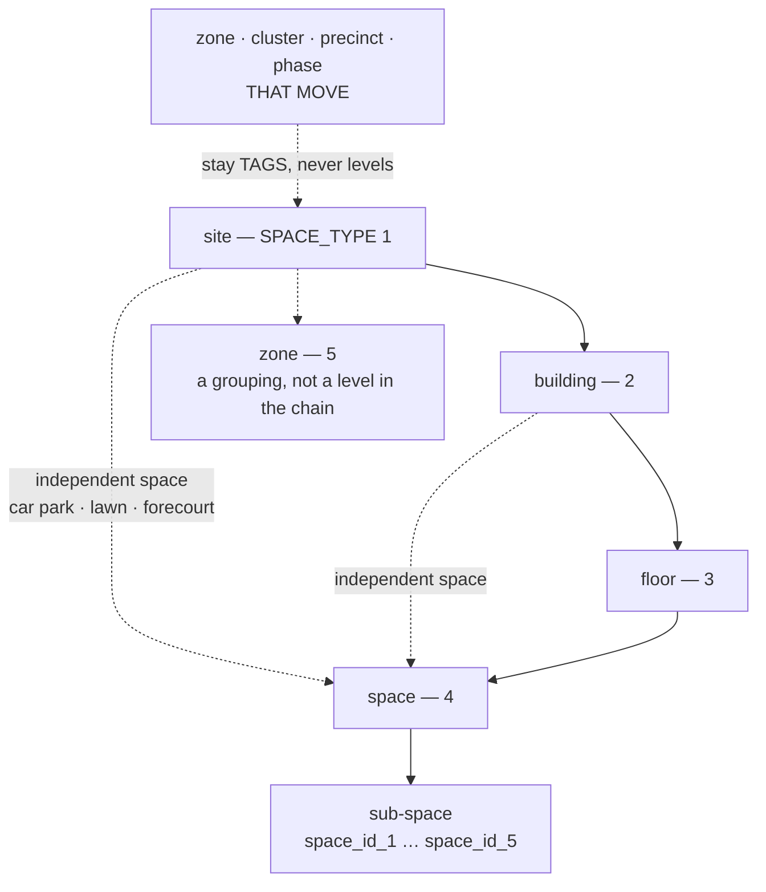

<!--
  PROSPECT PORTFOLIO — MODULE STRUCTURE & BUILD SPEC v1.3
  Canonical name: claude/prospect-portfolio-module-spec-v1.3.md (Vibethon project)
  Author: Claude (as-Sudharsan, replica v2.8) · 14 Aug 2026
  Governed by: claude/CLAUDE.md (mother doc v8.7.3) — §0a, §3a, §3b, §6, C2–C4, C19, C24, C25, C32, C35–C38.

  THIS IS THE ONE DOCUMENT. It supersedes v1.1 and v1.2 on hierarchy, field names, the list
  surface, and the reconciliation rule. v1.0 remains the immutable evidence base (the 88-call
  sweep and the named quotes) and is cited, never repeated.

  WHY v1.3 EXISTS — three inputs, in order of weight:

   1. ⚠ THE HIERARCHY IN v1.1 AND v1.2 WAS WRONG, and I asserted it from a secondary source.
      Sudharsan: "Just go and see the Facilio documentation or Facilio account… there is a base
      space which is of type site, building, floor, space, etc. Let's use the same hierarchy,
      same set of fields wherever possible."
      I queried the production schema (US-Production-1, bms.Modules / bms.Fields / bms.BaseSpace,
      14 Aug 2026). He is right. FLOOR IS A REAL MODULE. Sub-spaces nest FIVE deep. §2 and §3
      rebuild the model against what the platform actually is. Everything marked [M-DB] below is
      read from that schema, not inferred.

   2. THE BUILD WAS TESTED LIVE and two blockers plus seventeen defects were found —
      claude/prospect-portfolio-build-test-report-14Aug2026-v1.md. §1 carries them forward as a
      register with a fix against each. The build implements v1.1; v1.2 never reached the screens.

   3. SUDHARSAN'S THREE CALLS, 14 Aug: the list must show every portfolio site with deal as one
      filter among several (§5); the "Record a measurement" form must go (§6); and `building_key`
      is approved (§4.3).

  ⚠ NEW COLUMNS IN THIS REVISION. Per §3a P1 there is no ALTER — they must exist before the
  first CSV. §3 is the complete, final column list. Nothing may be added after the first import.

  VERSIONING RULE (standing): every revision is a NEW FILE. v1.0, v1.1 and v1.2 are immutable.
-->

# Prospect Portfolio — Structure & Build Spec v1.3

**One document. §1 is what is wrong with what has been built. §2–§7 are what to build instead. §9 says what that costs given that v1.1 is already in production preview.**

**Evidence tags:** **[M-DB]** read from the live Facilio production schema, 14 Aug 2026 · **[M]** measured from a real artifact · **[S]** stated by a named person on a dated recorded call · **[I]** inference · **[T]** observed in the live build test, 14 Aug 2026.

---

## §0. THE ONE-PARAGRAPH VERSION

The commercial thesis is intact and the copy is the best on any Vibe build so far. Three things are wrong and all three are cheap to fix **today** and impossible to fix after the first CSV. **The hierarchy is missing a level Facilio actually has** (`floor`), and the field names don't match the platform they convert into, so every convert becomes a translation. **The append-only observation ledger was shipped as the data-entry screen**, which is why nobody can tell what the module is. And **the module is still deal-scoped**, so it is a Deal tab wearing a module's clothes. Fix those three, fix the one SQL bug that makes reconciliation throw a raw Postgres error, and this is a demo.

---

## §1. ISSUE REGISTER — what the live test found

Full evidence: `claude/prospect-portfolio-build-test-report-14Aug2026-v1.md`. Ranked. Every row has a fix.

### 1.1 Blockers

| # | Issue | Fix | § |
| --- | --- | --- | --- |
| **X-1** | **Settle fails on all four branches** with `bind message supplies 7 parameters, but prepared statement "" requires 6`, rendered verbatim to the user **[T]**. A conflict, once raised, can never be resolved | Parameter-count bug in `reconcile-decide`. Separately: **never surface a driver error to a user** — catch, log verbatim to `fl_event`, show one sentence | §6.4 |
| **X-2** | **The list renders the *rejected* value.** Detail shows 4500 `in use`; the list row shows **5200 sq ft**, still `waiting` **[T]**. Two screens, two areas, same building, no warning | Read the **accepted** observation everywhere. Unit-test that a value with `is_accepted = false` can never reach a list | §6.3 |
| **X-3** | **`floor` is missing from the type enum.** Facilio has it as a real module **[M-DB]**. Every floor-scoped record we convert has nowhere to land | §2 rebuilds the enum | §2 |
| **X-4** | **Field names don't match Facilio.** `area_sqft` vs `AREA`, `floor_count` vs `NO_OF_FLOORS`, `postcode` vs `ZIP`, `region` vs `STATE` **[M-DB]**. v1.1 §5.1 claimed the three type words were chosen *"so nothing has to be translated at convert"* — that principle was applied to three words and abandoned for thirty columns | §3 renames every column to the platform's own name | §3 |
| **X-5** | **No Convert to Facilio.** v1.1 §14: *"Do not cut S1 or S4. S1 is the module; S4 is the demo."* Not built, and there are **zero Won deals** to run it against **[T]** | §7 | §7 |
| **X-6** | **The module is deal-gated.** Lands on *"Pick the pursuit"*; the empty state still quotes v1.1's *"A portfolio belongs to one deal"* **[T]**. No Lead, Account or Deal portfolio tab — **and the Deal detail page now exists** (`F-14` is resolved) and still has none | §4, §5 | §4 |

### 1.2 Serious

| # | Issue | Fix |
| --- | --- | --- |
| X-7 | **"Record a measurement" is the only way to edit anything.** Sixteen fields, one modal each, under a panel headed MEASUREMENTS, including Country and Name. No Edit button anywhere **[T]** | §6.1 — one edit form |
| X-8 | **No attachments, photos or blueprints anywhere** **[T]**. Facilio holds floor plans on the Floor record **[M-DB]** — we have no level to hang them on either | §2, §3.4 |
| X-9 | **Paste silently drops extra columns.** Pasted `name,ref,city,4500` — the area vanished, no warning **[T]**. Area is the field that prices the job | §5.4 |
| X-10 | **Paste creates exact duplicates silently** — two identical rows, both pre-checked, both written **[T]**. The live system already carries `F-07` duplicate pain | §5.4 |
| X-11 | **List order is unstable** — identical rows landed non-adjacent; no sort, search, filter or collapse **[T]**. Unusable at 200 buildings | §5 |
| X-12 | **Ceiling height is a free-text number.** Spec says banded enum *because it changes the crew and the equipment, so it changes the price*. Typed `12`, accepted, no unit **[T]** | §3.3 |
| X-13 | **Broken copy string** on the conflict toast — two sentences fused — and it leaks the raw enum `rfp` into text that reads *"From documents"* everywhere else **[T]** | §6.2 |

### 1.3 Worth fixing, not blocking

| # | Issue |
| --- | --- |
| X-14 | **Vocabulary drifts across three screens**: chips say *From documents / From the walk*; the settle picker says *Take the document value / Take the survey value*; the toast says *rfp*. Pick one set of words **[T]** |
| X-15 | **The custom Select is not keyboard-operable** (arrows and Enter do nothing) and **swallows the first click after a popover closes** — reproducible in every dialog **[T]**. Accessibility failure and a reliability failure |
| X-16 | Stale error text persists after the input changes **[T]** |
| X-17 | Provenance enum incomplete — no `crm`, no `facilio_link` |
| X-18 | **Verdict notes are write-only** — captured, never displayed. Spec: *"this prints on the proposal as a qualification"* **[T]** |
| X-19 | Detail page carries no actions but "Record a measurement" — no verdict, bid/no-bid, move, children or parent breadcrumb **[T]** |
| X-20 | Deal detail shows `Site —` and no link to its six portfolio rows **[T]** |
| X-21 | "Add inside" omits Address/City, which top-level Add offers **[T]** |
| X-22 | Remove reason optional; v1.2 §2.4 requires `is_active = false` **+ reason** **[T]** |
| X-23 | Lead location is still free text — *"Dubai, Sheikh Zayed Road"* **[T]**. `D-04` / `D-13`, unfixed |

### 1.4 What is already right — do not regress it

Conflict **detection** is faithful to v1.1 §4.3: both values kept, nothing overwritten, `1 VALUE TO SETTLE`, `in use` vs `waiting`, full audit line. · The numeric guard fires at the keystroke — `about 4.5k` produces nothing. · Every mandatory-note guard holds and trims whitespace. · **Move** is the best-built thing here: legal parents only, no self-move, *"It is already there"*, *"Move (with 1 inside)"*. · **Remove** is soft and cascade-aware — *"Everything inside it goes too — 1 more row"*; no orphans. · **C35 is honoured** — every field carries its why-line as on-screen help. **[T]**

---

## §2. ★ THE HIERARCHY — rebuilt against the real platform ★

### 2.1 What Facilio actually is

`bms.Modules`, org 1 and every production org, 14 Aug 2026 **[M-DB]**:

| Module | Table | What it is |
| --- | --- | --- |
| `basespace` | **`BaseSpace`** | **The shared parent table.** Every level is a row in it, discriminated by `SPACE_TYPE` |
| `site` | `Site` | `SPACE_TYPE = 1` |
| `building` | `Building` | `SPACE_TYPE = 2` |
| **`floor`** | **`Floor`** | **`SPACE_TYPE = 3` — a real, first-class module** |
| `space` | `Space` | `SPACE_TYPE = 4` |
| `zone` | `Zone` | `SPACE_TYPE = 5` |

**And the ancestry is not a path string.** `BaseSpace` carries it as denormalised nullable FKs, every one of them pointing back at `BaseSpace` **[M-DB]**:

```
SITE_ID · BUILDING_ID · FLOOR_ID · SPACE_ID1 · SPACE_ID2 · SPACE_ID3 · SPACE_ID4 · SPACE_ID5
```

**Spaces nest five levels deep below the floor.** v1.1 modelled one flat `space` level and a `parent_id`. That is not the platform.

### 2.2 The measured proof that the ancestry rule is real

C3 has always been argued from a story — *"a record saves and then silently disappears."* Here it is counted, on live production data **[M-DB]**:

| Level | Rows | Missing site | Missing building | Missing floor |
| --- | --- | --- | --- | --- |
| Site (1) | 8,320 | — | — | — |
| **Building (2)** | 3,915 | **145** | — | — |
| **Floor (3)** | 10,139 | 103 | **860** | — |
| **Space (4)** | 116,254 | **480** | 25,110 * | 28,388 * |
| Zone (5) | 108 | 12 | — | — |

\* *Most of these are legitimate independent spaces — a car park under a site, a lobby under a building. The site nulls are not.*

**145 buildings with no site. 860 floors with no building. 480 spaces with no site.** That is C3 happening at scale, in production, today. It is now the single strongest engineering argument in the deck: *we enforce, before the write, the completeness the platform does not enforce after it.* **Do not soften this into a slide bullet — show the numbers.**

### 2.3 The prospect hierarchy, corrected

**`type` enum: `site` | `building` | `floor` | `space` | `zone`.** The platform's own five words, so convert is a copy and not a translation.



**Six rules, and each one is a rule because the platform behaves that way:**

1. **Every level is optional except `site`.** A space may hang off a site, a building or a floor. Production proves it — 25,110 spaces have no building and are not broken **[M-DB]**. The tree offers the next legal level down and permits skipping it.
2. **`floor` is a level, and it carries a number, not a label.** `Floor.floorlevel` is an **integer** **[M-DB]**. `-1` basement, `0` ground, `1` first. The floor's *name* ("Mezzanine", "Podium") is the ordinary `name` field. **This kills `floor_label` outright** — and with it the `Floors` / `Floor` dropdown collision that made the build unreadable (X-7, X-12).
3. **`floor_count` does not disappear** — it becomes **`no_of_floors` on the building**, because that is what `Building.NO_OF_FLOORS` is **[M-DB]**. Both exist in Facilio: a count on the building *and* floor records under it. v1.1's *"floors are a number, not a level"* was half the story. Half right, wholly wrong to build on.
4. **Ancestry is stored the platform's way** — `site_id`, `building_id`, `floor_id`, `space_id_1..5` — **in addition to** `parent_id` and `ancestry_path`. Cheap columns, and it makes the convert payload a field-for-field copy.
5. **`zone` exists as a real type** — but only 108 rows in all of production **[M-DB]**. It converts if someone wants it; it is **not** the answer to Modon's zones. Paurnika's rule stands: *"if it's bound to change, then it has to just be an identifier"* **[S]** — volatile groupings remain `tags`.
6. **`client_level_label` survives unchanged.** Modon calls a building a *facility* **[S]**. The build already renders this as `tower (site)`, which is the right pattern — keep it.

### 2.4 The honest cost of adding a level

It is one more enum value, three more nullable FK columns, and one more option in a dropdown. **The real cost is in the walk**: the surveyor now has one more place to put a room. Mitigated by rule 1 — floor is *permitted*, never *required*, and the mobile capture flow should default to skipping it unless the client's own numbering uses floors. **Devil's advocate:** this partially reopens the survey v1.5 scope cut (change (k)), which cut `floor` and `asset` together to protect the two-day window. **`asset` stays cut. `floor` comes back as columns and one dropdown option — not as a screen.** If the window tightens, the floor *level* is the first thing to hide in the UI; the columns stay regardless, because they cannot be added later.

---

## §3. THE FIELD SET — `fl_prospect_location`, final

**Platform physics (CLAUDE.md §3a), no exceptions:** no DDL — every column must be right before the first CSV · no indexes — everything full-scans · no sequences — `fl_sequence` + `UPDATE … RETURNING` · preview and production share one DB — additive forever. Standard columns (`id`, `org_id`, `created_by/at`, `updated_by/at`, `is_active`) assumed and omitted. **Nothing is ever hard-deleted.**

> **The naming rule for this table, and it is new:** *where Facilio has a field, we use Facilio's name for it.* The "Why it exists" column remains the on-screen help text (C35).

### 3.1 Identity, ownership, lineage

| Field | Type | Req | **Facilio counterpart** | **Why it exists** |
| --- | --- | --- | --- | --- |
| `lead_id` | FK | N | — | The enquiry that first named this building — *"the address of the sites… the full addresses"* **[S — Martha Gaviria]** arrives before any deal exists |
| `account_id` | FK | N | — | The client it belongs to, across every deal. Powers the Account tab and the repeat-business motion |
| `deal_id` | FK | N | — | The pursuit this row is scoped to. Null until qualification |
| **`building_key`** | text | N | — | **★ NEW, approved 14 Aug.** A stable key shared by every row that is the same physical building across pursuits. Stamped at copy-forward. **This is what makes the global list (§5) show one building instead of one row per bid.** Without it, grouping means walking `previous_pursuit_id` — a full scan per row, on a screen that is now the P1 default. It cannot be added later |
| `previous_pursuit_id` | FK | N | — | This same building on an earlier deal. Copy-forward sets it. Retained for the *chain*; `building_key` answers the *set* |
| `type` | enum | Y | `BaseSpace.SPACE_TYPE` | `site` \| `building` \| **`floor`** \| `space` \| `zone` — §2.3 |
| `parent_id` | FK | N | — | Immediate parent. Null for a site |
| `site_id` / `building_id` / `floor_id` | FK | N | `SITE_ID` / `BUILDING_ID` / `FLOOR_ID` | **Materialised ancestry, the platform's own shape [M-DB].** Makes convert a copy. **145 live buildings have a null site — we enforce this before the write, not after** (§2.2) |
| `space_id_1` … `space_id_5` | FK | N | `SPACE_ID1..5` | Sub-space nesting, five deep, exactly as `BaseSpace` carries it **[M-DB]** |
| `ancestry_path` | text | Y | — | Kept as the guard we unit-test against. C3 / C32 |
| `name` | text | Y | `Resource.NAME` *(required there too)* | The only mandatory descriptive field. A phone call gives you "the Bleecker Street store" and nothing else |
| `description` | text | N | `Resource.DESCRIPTION` | Free note that travels to Facilio at convert |
| `code` | text | N | — *(see `local_id`)* | **The client's** reference. Tender responses are scored against *their* numbering |
| `local_id` | int | N | `BaseSpace.LOCAL_ID` | Facilio's own human-readable number, back-filled at convert. Distinct from `code` — one is theirs, one is Facilio's |
| `client_level_label` | text | N | — | What the client calls this level: facility, tower, block, unit, master community. Modon's standard calls a building a *facility* **[S]** |
| `tags` | jsonb *(L15)* | N | — | Zone, cluster, precinct, phase — groupings that move **[S — Paurnika Ramesh]** |

### 3.2 Address — as a Location record, because that is what Facilio stores

**Facilio does not put the address on the site.** `Site.LOCATION_ID`, `Building.LOCATION_ID` and `Space.LOCATION_ID` all point at a separate **`Location`** record **[M-DB]**. Convert must create the Location *first*. Our columns take its field names exactly:

| Field | Type | Facilio counterpart | **Why it exists** |
| --- | --- | --- | --- |
| `location_name` | text | `Location.NAME` | Facilio's Location carries its own name |
| `street` | text | `Location.STREET` | *was `address_line`* — *"they send footprints of the sites… the full addresses"* **[S — Martha]** |
| `city` | text | `Location.CITY` | |
| `state` | text | `Location.STATE` | *was `region`.* Facilio calls it State / Province |
| `zip` | text | `Location.ZIP` | *was `postcode`* |
| `country` | text | `Location.COUNTRY` | Drives service-area matching — can we even serve here? |
| `lat` / `lng` | numeric | `Location.LAT` / `LNG` | *was `latitude`/`longitude`.* **Facilio's stated onboarding minimum is name + lat/long [M]** |
| `location_phone` | text | `Location.PHONE` | The site's own number, not the account's |
| `facilio_location_id` | text | — | Back-filled at convert, so a second convert never creates a second Location |

### 3.3 Size and shape — Facilio's names, plus the five that price the job

| Field | Type | Facilio counterpart | **Why it exists** |
| --- | --- | --- | --- |
| `area` | numeric | `BaseSpace.AREA` | *was `area_sqft`.* **The single most load-bearing number in soft-services pricing.** Area → hours → crew → price **[S — Sean Smith]** |
| `gross_floor_area` | numeric | `Site.GROSS_FLOOR_AREA`, `Building.GROSS_FLOOR_AREA` | Facilio keeps gross separate from net. **The RFP's number and the surveyor's number are frequently these two different things** — gross vs net, corridor included or not. Having both columns is how that argument gets settled instead of relitigated |
| `no_of_buildings` | int | `Site.NO_OF_BUILDINGS` | *"about 200, sorry, 200 to 220"* **[S]** — the guessed number, captured as itself |
| `no_of_floors` | int | `Building.NO_OF_FLOORS` | *was `floor_count`.* A count on the building, alongside real floor records |
| `no_of_independent_spaces` | int | `Site/Building/Floor.NO_OF_INDEPENDENT_SPACES` | Facilio counts them at every level **[M-DB]** |
| `no_of_sub_spaces` | int | `Space.NO_OF_SUB_SPACES` | |
| `floor_level` | int | `Floor.FLOOR_LEVEL` | **★ replaces `floor_label`.** An integer: `-1` basement, `0` ground, `1` first. The name goes in `name` |
| `max_occupancy` | int | `BaseSpace.MAX_OCCUPANCY` | Free from the platform, and a real cleaning-frequency driver |
| `operation_hours_start` / `_end` | numeric | `BaseSpace.OPERATION_HOURS_START` / `_END` | **When the building is open decides when the crew can work**, which decides the rate. The reference tool asks this as *"After-hours access"* **[M]** |
| `space_category_id` | text | `Space.SPACE_CATEGORY_ID` | Facilio's own category lookup. **L9** |
| `site_type` | text | `Site.SITE_TYPE` | Facilio's site-type enum. **L9** |
| `classification` | text | `BaseSpace.CLASSIFICATION` | Facilio's classification lookup **[M-DB]** |
| `room_count` / `restroom_count` | int | *no counterpart* | **[M]** the reference tool's `gen_rooms` / `gen_restrooms`. **Restrooms are priced and scored separately in every cleaning contract.** Ours, not Facilio's — kept, and marked as ours |
| `ceiling_height_band` | **enum** | *no counterpart* | `standard_8_10ft` \| `high_10_20ft` \| `very_high_20ft_plus`. **X-12: this is an enum, not a number.** The reference tool's own option text says *"may need lift or scaffolding"* **[M]** — it changes the crew and the equipment, so it changes the price |

### 3.4 Photos, floor plans, blueprints

`Resource.PHOTO_ID` exists on every space **[M-DB]**, and **`Floor` carries `FLOOR_PLAN_ID`, `DEFAULT_FLOOR_PLAN_ID`, `FLOOR_PLAN_INFO` and `INDOOR_FLOORPLAN_ID`** **[M-DB]**. That is the answer to X-8 *and* the reason §2 had to add the floor level: **there was nowhere to put a floor plan.**

`fl_prospect_attachment` ships as specified in v1.1 §5.3, with two changes: `kind` gains **`floor_plan`** as a first-class value mapping to `Floor.FLOOR_PLAN_ID`, and `location_id` may point at a `floor`. Evidence this is real, not defensive design: *"we get the blueprint from the customer… or the breakdown of the dimensions"* **[S — Sean Smith]** · *"Can you put some site plans in there as well? … where the mains is coming in, where the meters are, where isolation point"* **[S — Tony Hatton, KSD, 15 Jul 2026]**.

> **⚠ L17 still open, and now urgent.** If `fl_photo` can carry `kind`, `captured_at` and geo **without an ALTER**, reuse it. If not, this table ships. **Decide before the first CSV.**

### 3.5 Decision, origin, verdict, convert

Unchanged from v1.1 §5.1 — `pursuit_decision`, `pursuit_decision_note`, `provenance` *(plus `crm` and `facilio_link`, X-17)*, `source_attachment_id`, `verdict`, `verdict_note`, `verdict_by/_at/_visit_id`, `facilio_id`, `facilio_module`, `convert_state`.

---

## §4. OWNERSHIP — v1.2 carried forward, unchanged and still unbuilt

v1.2 §2 stands in full: **three nullable FKs — `lead_id`, `account_id`, `deal_id` — at least one always set, filled progressively as the record matures.** Enforced in the function layer (no CHECK constraint is creatable) and unit-tested. §2.2's progressive-stamping flow, §2.3's rejected alternatives and §2.4's orphan rule are all still correct and are **not** repeated here.

**Two things v1.2 said that the build has not done, and they remain the instruction:**

1. **`lead.convert` must stamp `account_id` and `deal_id`** onto every location carrying that `lead_id`, in the same transaction. ⚠ **Yameen's shipped handler.** Not ours to change silently.
2. **Lead merge / close must re-point or deactivate locations** (v1.2 §2.4). Interacts with `F-07`, where 8 of 13 closed leads were auto-closed with no human decision.

**§4.3 — `building_key`, approved 14 Aug.** One nullable text column. Same value on every row that is the same physical building, across pursuits and across deals. Stamped at copy-forward; stamped at paste when name + code + city match an existing row *and a human confirms*. It exists because the global list (§5) makes "one row per pursuit" the default view — v1.1 F-9 accepted that chain walk as *"a P2 report"*, and the P2 report is now the P1 screen.

---

## §5. THE LIST — every property, deal as one filter

> **Sudharsan, 14 Aug:** *"The list view should list all the portfolio sites, and deal is one of the filters. The site should have maybe some other filters as well."*

This is v1.2 §3 made concrete. The build ships the v1.1 answer — deal-gated, with v1.1's rationale still printed in the empty state (X-6).

### 5.1 Four surfaces, one component

| Surface | Scope | Priority |
| --- | --- | --- |
| **Portfolio** *(top-level nav)* | **Everything, filtered.** No pursuit needs picking. **This is what makes it a module** | **P1** |
| **Lead → Portfolio tab** | `lead_id` — the sites named in the enquiry, before any deal exists | **P1** |
| **Account → Portfolio tab** | `account_id` — every building ever pursued for this client, across deals, showing which are live in Facilio | **P1** |
| **Deal → Portfolio tab** | `deal_id` — this pursuit's scope | **P1 — `F-14` is resolved.** The Deal detail page exists and has *Overview · Surveys · Proposals · Activity* **[T]**. Add the fifth tab |

### 5.2 The filter bar

One hardcoded bar. **Not** a saved-view builder — C19 keeps view engines at platform level, solved once across leads, deals, quotes, contracts and surveys.

| Filter | Why it earns its place |
| --- | --- |
| **Client / account** | The repeat-business question: *which of their buildings have we already been inside?* |
| **Deal / pursuit** | Sudharsan's filter. Reproduces today's view as one selection |
| **Decision** — undecided / bid / no-bid / deferred | Martha's team makes this call row-by-row on a spreadsheet today **[S]** |
| **Verdict** — unverified / verified / changed / not found / not visited | |
| **In Facilio** — yes / no | Drives convert, and answers the repeat-client question in one click |
| **Country / state / city** | Service-area matching — *can we even serve here?* The first question on an inbound RFP |
| **Type** — site / building / floor / space / zone | |
| **Tags** | Zone, cluster, precinct, phase |
| **Needs attention** — has an unsettled value \| missing area \| not visited | **The RFP coordinator's actual work queue.** The one filter that makes this screen a place people live rather than a place they look |

Plus **search** on name, `code`, `local_id` and street.

### 5.3 Two list rules the build gets wrong

- **Order is stable and explicit** — `ancestry_path`, then `name`. Today it is neither sorted nor grouped, and identical rows land non-adjacent (X-11). With no indexes this is an in-memory sort; say so, don't pretend it scales.
- **Group by `building_key` by default on the top-level list**, with a `3 pursuits` chip that expands. Deal-scoped tabs never group — inside one pursuit, one row is one row.

### 5.4 Paste, corrected

- **Keep every column the user pasted.** Map the 4th, 5th, 6th to area / floors / rooms with a header-guess row the user can correct. **Never drop a column silently** (X-9) — if it cannot be mapped, say *"column 4 ignored"* on the preview.
- **Flag duplicates in the preview**, matched on name + code + city, against both the pasted set and the existing portfolio. Unchecked by default with a *"looks like a duplicate"* chip (X-10). Do not block — Martha may genuinely have two Downtown branches.

---

## §6. ★ THE EDIT FORM, AND THE TWO-TIER CONFLICT RULE ★

> **Sudharsan, 14 Aug:** *"That second form is absolutely stupid."*

He is right, and the cause is a decision in **v1.1 §4.3 that this section supersedes.**

### 6.1 What went wrong

v1.1 §4.3 says: *"Nothing edits an attribute directly — not the UI, not a handler, not an import."* A uniform rule, and the build applied it uniformly: **all sixteen fields are entered one at a time through a modal called "Record a measurement", under a panel headed MEASUREMENTS** — including Country, Postcode and Name (X-7). There is no Edit button. Filling one building's address and size takes eight modal round-trips.

**The storage model was shipped as the user interface.** The ledger underneath is right. The screen on top of it should never have existed.

### 6.2 What replaces it

**One edit form. Every field in §3, grouped as §3 groups them, one save.** Behind it, the function layer writes each *changed* field as an observation with provenance inferred from context — the walk stamps `survey`, the ingest stamps `rfp`, a person typing stamps `manual`. **The word "observation" never appears on screen.** Provenance surfaces only as the chip on a value and the line in the history.

Fix X-13 and X-14 in the same pass: **one vocabulary, everywhere.** `From documents` · `From the walk` · `Entered by hand` — in the chips, in the settle picker, in every message. No raw enum reaches a user.

### 6.3 The two-tier rule — this is the change

Not every field deserves a reconciliation queue. **A disagreement is worth a human's time when it moves money.**

| Tier | Fields | Behaviour on disagreement |
| --- | --- | --- |
| **Priced** | `area`, `gross_floor_area`, `no_of_floors`, `no_of_buildings`, `room_count`, `restroom_count`, `ceiling_height_band`, `max_occupancy`, `operation_hours_start/end` | **Both values kept. Nothing overwritten. A human settles it.** Exactly v1.1 §4.3, unchanged |
| **Descriptive** | everything else — name, code, the whole address block, category, classification, labels | **Last write wins. Full history retained with provenance.** No queue, no banner |

**Why:** nobody's proposal is mispriced because the RFP said "Dubai" and the surveyor said "Dubai, UAE". Today every one of those can raise a conflict that a human has to sit down and settle. **Both tiers keep the complete append-only history** — the ledger is free — so nothing is lost and C25 holds. What changes is only *what interrupts a person*.

**Devil's advocate, honestly:** a uniform rule is simpler to enforce and simpler to audit than a two-tier one, and a name conflict is not *nothing* — a tender response is scored against the client's own numbering, so an RFP that names a building differently from the surveyor is a real thing to notice. **The mitigation is that the history is still there and still shows both**, plus a `names disagree` chip on the location — a notice, not a queue. If that proves too weak, the promotion path is to move `name` and `code` into the priced tier. **It is one line in a config list, deliberately, so this decision is cheap to reverse.**

### 6.4 And the bug

X-1. `reconcile-decide` supplies seven bind parameters to a six-parameter statement. Fix the count, then wrap every handler so a driver error is logged verbatim to `fl_event` and shown to the user as one plain sentence. **A raw Postgres message in a dialog mid-demo is worse than the failure it describes.**

---

## §7. CONVERT TO FACILIO — corrected against the real schema

v1.1 §7's four rules stand: a separate action on its own screen · per location · target level defaulted like-for-like and explicitly changeable · nothing else in Facilio touched. **§7.3 stands absolutely: the promotion only ever CREATES.** No `facilio_id` = new = convert. A location already carrying a `facilio_id` is skipped, always; a `verdict = changed` on a linked record raises a discrepancy and writes nothing. *Facilio's number is an operational and contractual fact; the survey's number is a pricing input for this bid.*

**Three things the real schema changes:**

1. **`Site.CLIENT_ID` is REQUIRED [M-DB].** You cannot create a Facilio Site without a Client. C38's output order — client before site, site before building — is not a preference or a sequencing nicety. **It is a NOT NULL.** This also settles **L22** in the affirmative direction of urgency: if a Client Contact cannot be created via connections, convert stops at output #1.
2. **Address is a separate `Location` record.** Convert writes Location first, holds `facilio_location_id`, then writes the space with `LOCATION_ID` set. A second convert must never mint a second Location.
3. **The pre-flight checks the ancestry columns, not a path string** — `site_id` present for every building; `building_id` present for every floor; and for a space, at least one of site / building / floor. **This is the check that 145 live production buildings would fail** (§2.2). Ship it as a test, not a promise.

`fl_prospect_convert_log` is unchanged from v1.1 §5.5, including the stated residual risk: **`dedup_key` is a check, not a constraint** — no unique index is creatable — so two concurrent runs on one deal could still double-write. Mitigation is one guarded run per deal plus a `facilio_id` read before each create. **Say that to a judge; do not claim idempotency we do not have.**

---

## §8. WHAT IS NOT CHANGING

To be explicit, because two revisions in two days invites drift:

The three feeds and the argument for separation (v1.1 §2) · the personas and the adoption test — *"faster than she can read it"* (v1.1 §3) · the two independent state machines, `verdict` and `convert_state`, and the deliberate absence of a lost/archived state (v1.1 §4.1, §4.2) · **the observation table itself** (v1.1 §5.2) · the CRUD matrix and its three overriding rules (v1.1 §9) · the special actions and permission keys (v1.1 §10) · the handler list (v1.1 §11) · the AI layer as C37, critical and explicitly not P1 (v1.1 §6) · the ownership model (v1.2 §2) · **every honest limitation in v1.1 §12** — F-1 through F-9 all still stand, and F-2 is *partially* answered by §2 here, not closed.

---

## §9. WHAT THIS COSTS, GIVEN v1.1 IS ALREADY BUILT

| Change | Cost |
| --- | --- |
| **New columns** — `floor` in the enum, `site_id`/`building_id`/`floor_id`, `space_id_1..5`, `building_key`, `gross_floor_area`, `no_of_buildings`, `no_of_independent_spaces`, `no_of_sub_spaces`, `floor_level`, `max_occupancy`, `operation_hours_*`, `local_id`, `description`, `classification`, `site_type`, `location_name`, `location_phone`, `facilio_location_id` | **Free today. Impossible after the first CSV.** This is the entire reason v1.3 exists now and not next week |
| **Renames** — `area_sqft`→`area`, `address_line`→`street`, `region`→`state`, `postcode`→`zip`, `latitude/longitude`→`lat/lng`, `floor_count`→`no_of_floors`, `floor_label`→**deleted** | Mechanical, but **the preview DB already has rows** (six created and removed during the test). **Confirm with Yameen whether the first CSV has landed.** If it has, the renamed columns must be added alongside and the old ones abandoned in place — ugly, and survivable |
| **The reconcile-decide bug** | Twenty minutes. Do it first |
| **Read accepted, not latest** | One query plus a unit test |
| **One edit form** | Half a day. Deletes a screen rather than adding one |
| **Two-tier conflict config** | An hour. One list of field keys |
| **Global list + filter bar** | ~a day. The filters are cheap; the grouping by `building_key` is the only real work |
| **Lead + Account + Deal tabs** | ~half a day — same tree component, three scopings |
| **Convert to Facilio (S4)** | **The big one, and it is the demo.** Plus a Won deal to run it against |
| **Attachments incl. floor plans** | Blocked on **L17** |

---

## §10. BUILD ORDER, REVISED

1. **Fix `reconcile-decide`** (X-1) and wrap driver errors. *Nothing else matters while Settle throws.*
2. **Read the accepted observation everywhere** (X-2) + the unit test.
3. **Confirm whether the first CSV has landed.** Everything below branches on the answer.
4. **Lock the column list — §3, in full, `floor` included.** Verify **L15** (`jsonb` through CSV type inference) and **L17** (`fl_photo` reuse) with one throwaway import each.
5. **One edit form** (§6.2) — and delete "Record a measurement".
6. **Two-tier conflict config** (§6.3).
7. **The global list + filter bar + stable order + `building_key` grouping** (§5).
8. **Lead, Account and Deal portfolio tabs** (§5.1).
9. **`lead.convert` stamping + merge/close orphan handling** — ⚠ Yameen's shipped handlers.
10. **Paste, corrected** — keep every column, flag duplicates (§5.4).
11. **Attachments, photos, floor plans** (§3.4).
12. **`fl_prospect_convert_log` + `prospect.convert-to-facilio`** — serialised, synchronous, logged per write, **create-only**.
13. **S4 convert pre-flight + run**, with the §7.3 ancestry check. **Demo a Won deal end to end so judges watch buildings appear in Facilio live.**

**If the window tightens, cut in this order:** the `building_key` grouping (show duplicates and say why) → paste column-mapping → attachment kinds beyond `photo` and `floor_plan` → the Lead tab. **Do not cut the edit form, the global list, or S4.**

---

## §11. DEVIL'S ADVOCATE — where v1.3 is weak

| # | Finding | Status |
| --- | --- | --- |
| **G-1** | **I got the hierarchy wrong in v1.0, v1.1 and v1.2, and defended it with a citation** — *"the production reference tool stores floors as a number, never as a level [M]"*. That was true of the Imperial walkthrough tool and irrelevant to Facilio's schema. **A cleaning tool's shortcut was allowed to overrule the platform we convert into**, for three revisions, until Sudharsan said go and look | **CORRECTED, and the method failure is the lesson.** [M] on a customer artifact is not [M] on the platform. Where the two disagree about the *platform*, the platform wins. Registering as **C39** |
| **G-2** | **Five levels plus five sub-space slots is a lot of tree for two days.** The screens can drown in it | **MITIGATED** — every level optional, floor hidden by default in the walk. But the UI risk is real and the tree needs collapse before it needs anything else (X-11) |
| **G-3** | **`building_key` is a convention, not a constraint.** No unique index, no FK. A bad import or a careless copy-forward can split one building into two keys or merge two into one | **STATED, NOT SOLVED.** Function-layer stamping plus a reconciliation query. Same class of honesty as `dedup_key` in §7 |
| **G-4** | **The two-tier rule can be argued as a regression** from C25's purity | **DEFENDED at §6.3, with the counter-argument stated and a one-line reversal path** |
| **G-5** | **F-1 is untouched.** The premise still rests on one customer quote — *"sites that aren't quote clients yet"*, Ryan Sklar, once, in 88 calls | **UNRESOLVED, and it is a pitch risk not a build risk.** Lead with the *mechanism* — Sadikali's chain, Martha's five people, Sean's *"in their head"*. Never with the object |
| **G-6** | **§2.2's orphan counts are the best evidence in the deck and they cut both ways.** A judge can reply: *"your own platform has 145 orphan buildings — why is a sales module the place to fix that?"* | **The answer is that we are the last gate before the write**, and it is a better answer than pretending the numbers aren't there. **Do not hide them** |

---

## §12. LEDGER

| # | Item | Resolve at | Blocks |
| --- | --- | --- | --- |
| **L23** | **★ Has the first CSV landed?** | **Ask Yameen today** | Whether §3 is a rename or an abandon-in-place |
| **L15** | Does `jsonb` survive CSV type inference, or land as `text`? | Before the first CSV | `tags`, `value_json` |
| **L17** | Can `fl_photo` carry `kind`, `captured_at` and geo **without an ALTER**? | Before the first CSV | Whether §3.4 is its own table |
| **L9** | Facilio's mandatory enums — `SITE_TYPE`, `SPACE_CATEGORY_ID`, `CLASSIFICATION` | G1 | The §7 pre-flight |
| **L22** | Can a Facilio **Client Contact** be created via connections? | G1 | **Now hard-blocking — `Site.CLIENT_ID` is NOT NULL [M-DB]** |
| **L20** | Does the API accept a space directly under a site? | **ANSWERED [M-DB] — yes.** 25,110 production spaces carry no `BUILDING_ID` | closed |
| **L21** | Can our role **deactivate** a Facilio record, for the §7.5 reverse walk? | G1 | If not, rollback is manual and we say so out loud |
| **L14** | Platform user list readable; permission keys registerable per module? | G1 | v1.1 §10, C24 |

**Routed out of this module:** estimation and pricing (Yameen) · the survey walk itself (v1.8 → v1.9) · clarifications (deal-level, C13) · offline capture (the known two-day trap) · visibility / NDA control (F-3, post-event).

---

## §13. WHAT TO TELL YAMEEN AND MITHUN

1. **Stop and answer L23 first: has the first CSV landed?** Everything else branches on it.
2. **The hierarchy is five types — `site`, `building`, `floor`, `space`, `zone` — because that is what Facilio is** (`bms.Modules`, verified 14 Aug). I had this wrong for three revisions. **`floor` is a real module. Sub-spaces nest five deep.**
3. **Every column takes Facilio's own name.** `area`, `street`, `state`, `zip`, `lat`, `lng`, `no_of_floors`. `floor_label` is deleted — `Floor.FLOOR_LEVEL` is an integer.
4. **Ancestry is stored as `site_id` / `building_id` / `floor_id` / `space_id_1..5`**, the way `BaseSpace` stores it. Convert becomes a copy, not a translation.
5. **`Site.CLIENT_ID` is NOT NULL.** Client-before-site is a database constraint, not our sequencing preference.
6. **145 buildings, 860 floors and 480 spaces in live production are missing a parent.** That is C3, counted. It is our strongest engineering argument — enforce it before the write, and show the number.
7. **Delete "Record a measurement."** One edit form, all fields, one save. Only the priced fields raise a conflict.
8. **Fix the seven-parameter bind in `reconcile-decide` before anything else**, and never render a driver error to a user again.
9. **Every column must exist before the first CSV. Cut screens, not columns.**
