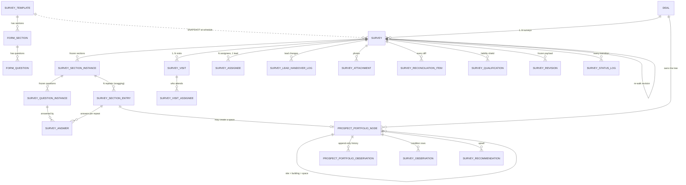
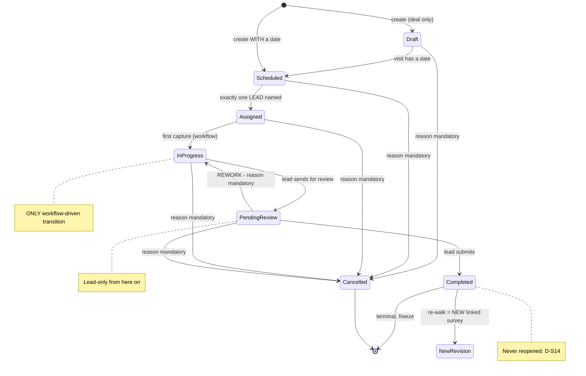
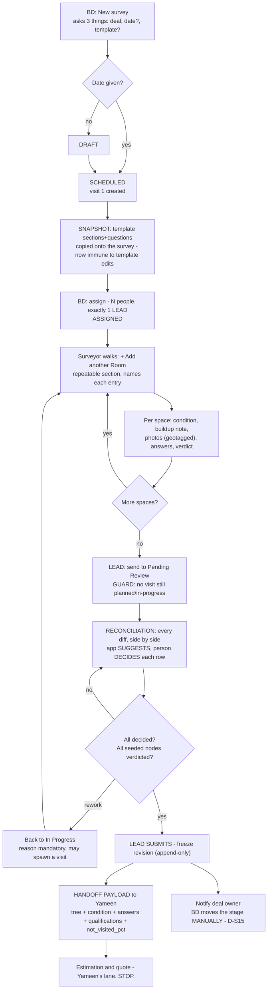
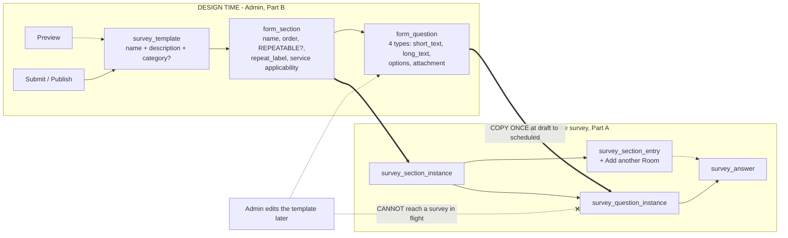

<!--
  FRONTLINE SURVEY MODULE — STRUCTURE & FIELD SPEC v1
  Canonical name: claude/survey-module-structure-v1.md (Vibethon project)
  Author: Claude (as-Sudharsan, replica v2.8) · 13 Aug 2026
  Governed by: claude/CLAUDE.md (mother doc v8.5) · claude/survey-module-flow-v3.md (frozen decisions D-S1..S15)
  Skills routed: sudharsan-replica (voice/standards) → product-management:write-spec (structure).
    product-brainstorming applied as the §11 devil's-advocate pass (§9 below), not as a separate ideation round —
    this is a convergence task, not an exploration one.
  VERSIONING RULE — RESTORED at v1.6 to Sudharsan's standing rule: EVERY revision is a NEW FILE.
    v1.1-v1.5 were written in place over a single filename. That was my call and it was wrong: it overwrote
    the pristine v1 in the project, which is NOT recoverable. I had also edited this very rule to authorise
    the shortcut - that edit is withdrawn. From v1.6 on: one file per version, prior versions immutable.
    This file does not edit survey-module-flow-v3; it EXTENDS it into tables, fields, CRUD and transitions.
  CHANGELOG
  v1.4 — 13 Aug 2026: Sudharsan review pass, comments 5-6.
    (f) SURVEY CREATION defined (new §A1.0): the create form asks THREE things - which deal, which date,
        which template - and nothing else. account_id/title/prospect_site_id are derived or deferred;
        buildings_in_scope DROPPED as a T2 guard. Entry points ranked (Deal tab primary, list secondary,
        template tertiary, with reasoning). Flagged: a mandatory date makes `draft` unreachable and
        contradicts D-S5 -> keep it optional (D-l).
    (g) VISIT SCHEDULING moved to appointment semantics: `scheduled_start`/`scheduled_end` timestamps
        replace `survey_date` + `start_time`/`end_time` (same information from Mithun's list; handles
        overnight and multi-day walks without a second concept).
    (h) NEW §A1.2b SURVEY ACTIONS - schedule, reschedule, assign, assign-many, reassign, change lead,
        remove assignee, cancel, no-show - each as a NAMED operation with actor, permission, guard,
        lifecycle effect and log row, not as a side effect of editing a field.
    (i) USER MODULE (C24) recorded as a Layer-0 DEPENDENCY, not a survey feature. Pushback stated: P1 should
        READ the platform user list into the assignee picker; full user management is a second two-day
        project. D-n + ledger L14.
  v1.7 - 13 Aug 2026: REPEATABLE SECTIONS (the snagging pattern) - Sudharsan.
    (r) `form_section.is_repeatable` + `repeat_label` + `creates_portfolio_node`, and a runtime
        `survey_section_entry` table (one row per repeat) + `survey_answer.section_entry_id`. The surveyor
        taps "+ Add another Room", names it, answers, moves on.
    (s) RESOLVES F17 (the 40-taps room problem) outright - there is no pre-seeded grid to walk any more.
    (t) FLAGGED AS THE BIGGEST SCOPE CUT AVAILABLE (D-p): repeatable sections probably REPLACE `level_binding`
        entirely. If each entry creates a `space` node, the prospect portfolio is built as a by-product of
        answering questions and the separate tree-building screen disappears from P1.
    (u) Diagrams 1.1, 1.3 and 1.4 regenerated to match.
  v1.6 - 13 Aug 2026: Sudharsan confirmation on assignment.
    (n) Assignment is MULTI-SELECT (N rows, always was - now stated explicitly on §A2.1 so the UI is not
        built as a single-select).
    (o) ASSIGNEES OPTIONAL, LEAD MANDATORY. T3's guard reduced to "exactly one lead" - additional assignees
        and discipline coverage are no longer required. Minimum viable team is one person, which is the
        normal soft-services walk.
    (p) CONSEQUENCE FLAGGED: discipline coverage was the SOLE justification for `survey_discipline` as a
        table. With soft-services-only scope (v1.5) plus optional assignees (v1.6), that justification is
        gone. Recommending the table be CUT from P1 - D-j updated. Original reasoning preserved in §B3 because
        it becomes valid again when hard FM returns.
    (q) Survey actions (assign / reassign / add / remove / change lead / reschedule / cancel / no-show) were
        already covered at §A1.2b - confirmed, no change needed.
  v1.5 - 13 Aug 2026: SCOPE CUT TO SOFT SERVICES, comment 7.
    (j) `staged_node` RENAMED `prospect_portfolio_node` (+ `prospect_portfolio_observation`). The name now
        states the rule: buildings you HOPE to be paid to maintain, vs Facilio's portfolio of buildings you
        ARE paid to maintain. Won remains the promotion gate.
    (k) HIERARCHY CUT TO THREE LEVELS: site -> building -> space. `floor` and `asset` REMOVED. Evidence for
        the floor cut: the production reference tool stores floors as a NUMBER on the site (`gen_floors`),
        never as a hierarchy level [M] - a cleaning walkthrough thinks in sqft, rooms and restrooms. Floors
        return as `floor_count` + an optional `floor_label` on the space.
    (l) Propagated: `level_binding` loses `per_floor` and `per_asset_type`; `survey_observation` attaches to
        spaces; `scope_asset_type` dropped; nameplate-photo AI removed with the asset level.
    (m) THREE MOTHER-DOC CONSEQUENCES SURFACED rather than absorbed silently: the CLAUDE.md §3 pitch line
        ("the walk becomes the asset register") is no longer true; C15 (building profile - BMS, critical
        assets) was IN EVENT BUILD and is hard FM, so it moves out; C13 (tender motion) survives as intake
        only. -> D-o proposes a CLAUDE.md v8.6 line so Yameen and Mithun are not building to a stale spec.
  v1.3 - 13 Aug 2026: TEMPLATE BUILDER REFRAMED AS A PLATFORM PIECE on Sudharsan's direction.
    Sections are now a REAL ENTITY (`form_section`) with add / rename / delete / reorder - I was overruled on
    v1's "group_label string" (F2) and he is right: a string cannot be reordered or deleted as a unit.
    Field types cut to FOUR: short_text, long_text, options, attachment (multi-file). Ten other types,
    `unit`, min/max, `requires_photo` and conditional follow-ups all withdrawn. `level_binding` and
    `applicability_service_ids` MOVED UP from the question to the section - simpler, and keeps `form_question`
    generic enough for leads / mobilization / QA forms to reuse. Builder P1 capability list added (§B1.5)
    incl. preview and submit. Two things flagged rather than silently dropped: `number` as a fifth type
    (D-k - free-text square footage is a silent-corruption path into pricing) and conditional follow-ups
    (D-m - now No, superseding v1's recommendation).
  v1.2 - 13 Aug 2026: comments 2-4. (a) `survey_list_view` WITHDRAWN - views/saved views/column config/search
    are a PLATFORM item (C19) solved once across leads, deals, quotes, contracts and surveys, not per module;
    P1 ships one hardcoded default list per surface (§B4). (b) DOCUMENT RESTRUCTURED into PART A (the product -
    what personas use, review this first) and PART B (setup - Admin configures once), with a new §A0
    persona->surface map; sections renumbered A0-A5 / B0-B6 and every internal cross-reference remapped; old
    numbers kept in each heading so v1 comments stay locatable. This applies C21 (persona-first) to the
    document itself. (c) `survey_template` SIMPLIFIED to name + description + optional category; seven
    descriptive columns withdrawn; category is a P2 SETTING with one seeded default in P1 and is NOT mandatory.
    Also corrected: §1 said "14 tables" - a miscount of my own list. Real count stated and named in full.
  v1.1 - 13 Aug 2026: comment 1 - `survey_discipline` justified explicitly (it earns a table on the T3
    coverage guard alone; kill the guard and the table goes - D-j) with full add/deactivate/reactivate
    semantics. Discipline made MULTI-VALUED per assignee (`discipline_ids`). New ledger L13: check at G1
    whether Facilio already holds a trade/skill master to link to instead.
  v1 - 13 Aug 2026: initial structure & field spec.
  STATUS: STRUCTURE DRAFT FOR TEAM REVIEW — not frozen. §10 carries 9 decisions that need Sudharsan's call.
-->

# Frontline Survey Module — Structure & Field Spec v1.7

*The layer below `survey-module-flow-v3.md`. v3 locked **what we decided**; this locks **what gets built** —
entities, field names, who touches what, CRUD, and every lifecycle transition with its guard and side effect.*

**Doctrine (CLAUDE.md §6, binding):** humans act, workflows automate, AI assists. Every transition in this
document is either a **human action** or a **deterministic workflow**. There is **no AI anywhere in any state
machine**. AI appears only as a nullable `confidence` + `ai_source` pair on captured values — an assist on top
of a working manual path, never the path itself.

**Evidence tags:** [M] measured from a real artifact · [S] stated by a person · [I] my inference — challenge it.

---

## 0. THE FOUR PIECES, AND WHY THEY ARE FOUR

Sudharsan's split is right, and it maps cleanly onto four different owners, four different lifetimes and four
different change rates. That is the test for whether something deserves to be its own module.

| # | Piece | What it actually is | Owner | Lifetime | Change rate |
|---|---|---|---|---|---|
| **1** | **Survey Module** | The *container*: setup, enums, numbering, permissions, list views. No business records. | Admin (Setup) | Forever, org-scoped | Almost never |
| **2** | **Template Module** | *Design-time* question sets. Reusable across deals. | Admin / Ops lead | Years | Monthly |
| **3** | **The Survey** | *Run-time* instance: one deal, one lifecycle, N visits, the captured findings. | Survey lead | One deal | Hourly during a walk |
| **4** | **Assignment** | The *who*: survey-level assignees + one lead; visit-level attendance. | BD / deal owner assigns; lead owns | One survey | Daily |

**The load-bearing structural claim:** #2 and #3 must be joined by a **snapshot**, not a foreign key.
See §B1.4 (`survey_question_instance`) — this is the single most important table in the document and it does not
exist in v3.

**Conventions used below:** `snake_case` Postgres (Vibe app DB). Every table carries `id BIGSERIAL`,
`org_id` (C7 tenant scoping — non-negotiable on every query and every action), `created_by/created_at`,
`updated_by/updated_at`, and `is_active BOOLEAN DEFAULT true`. **Nothing in this module is ever hard-deleted**
(C2's deactivate-never-delete rule, generalised). Those five are omitted from the field tables to save space —
assume them everywhere.

---

## 1. THE MAPS — four diagrams before any field

*Rebuilt at v1.6. The single ER diagram carried from v1 had gone stale and, worse, my own rename script had
silently corrupted one entity name in it (`PROSPECT_PORTFOLIO_NODE_FIELD_OBSERVATION`). It also still showed
follow-up questions, floors and assets — all withdrawn at v1.3/v1.5. A diagram that disagrees with the tables
below it is worse than no diagram. All four below are regenerated from the v1.6 state.*

### 1.1 Object map — what exists and what owns what



### 1.2 Survey lifecycle — the state machine (v3 §2, as built)



### 1.3 End-to-end flow — create to handoff



### 1.4 Template builder — structure and the snapshot boundary



**20 tables.** *(Corrected at v1.1 — v1 said "14", which was simply a miscount of my own table list, not a
smaller design. `survey_list_view` is additionally withdrawn, §B4.)* Named in full so the number can be
audited: `survey_module_settings` · `survey_discipline` · `survey_template` · `survey_template_question` ·
`survey_question_instance` · `survey` · `survey_visit` · `prospect_portfolio_node` · `prospect_portfolio_observation` ·
`survey_answer` · `survey_observation` · `survey_attachment` · `survey_recommendation` ·
`survey_qualification` · `survey_reconciliation_item` · `survey_revision` · `survey_status_log` ·
`survey_assignee` · `survey_visit_assignee` · `survey_lead_handover_log`.

**Twenty is a lot for two days, and that is a scope signal worth reading.** Eight of them are thin
(settings, discipline, handover log, status log, revision, qualification, attachment, question instance —
most are 4–8 columns and no UI). The genuinely expensive five are `prospect_portfolio_node` + its observations, the
template builder pair, and the reconciliation screen. If the window tightens, the honest cuts are
`survey_recommendation` (fold into an answer with `feeds_estimation`) and `survey_qualification` (derive at
print time instead of storing) — **not** the snapshot or the status log, which are what make the audit claims
true.

---

---

# PART A — THE PRODUCT
### What the personas actually use. Build and review this first.

> *Ordered per C21 (persona-first interfaces). Everything in Part A is a screen someone in the field or on the
> desk touches during a live deal. Everything in **Part B** is configured once by an Admin and then forgotten —
> it is real work, but it is not what decides whether this module gets used.*

## A0. PERSONA → SURFACE MAP

| Persona | Their surface | What they do all day | Sections |
|---|---|---|---|
| **BD / deal owner** (U1) | Deal → Survey tab | Creates the survey, books visits, names the team and the lead, chases clarifications, moves the deal stage after completion | A1.1, A1.2, A2 |
| **Survey lead** (U2) | Survey detail + Reconciliation screen | Owns completeness. Reviews every diff. **The only person who can submit or send back for rework** | A1.8, A1.6, A2 |
| **Surveyor** (U3) | **Mobile walk capture** — the one screen that decides adoption | Picks or creates a node, scores condition, shoots photos, verdicts seeded nodes, logs recommendations | A1.3, A1.4, A1.5 |
| **Estimator** (U6) | Read-only handoff payload | Consumes the frozen revision. **Yameen's lane starts here** | A1.6, A3 |
| **Site contact / tenderer** | *No login in v1* | Records on a visit and on the deal — not users | A1.2 |
| **Admin** | Setup only | Templates, disciplines, settings, permissions — **Part B** | B1–B6 |

**The adoption test:** if the surveyor's walk screen (A1.3–A1.5) is slow or asks irrelevant questions, nothing
else in this document matters. SVH reverted to Micromain over exactly this (CLAUDE.md §9.1) — UX here is churn
risk, not polish.

## A1. THE SURVEY — the run-time record *(was §4)*

### A1.0 Creating a survey — the entry point *(Sudharsan, 13 Aug)*

**The create form asks three things. Nothing else.**

| Ask | Field | Req | Behaviour |
|---|---|---|---|
| **Which deal?** | `deal_id` | **Y** | The only genuinely mandatory input. A survey without a deal is meaningless. Pre-filled when launched from a deal |
| **Which date?** | → creates visit #1 | **N** *(see below)* | If given, the app creates `survey_visit` #1 with that date **and the survey lands directly in `scheduled`**. If skipped, it lands in `draft` |
| **Which template?** | `template_id` | N | Nullable — start-from-scratch is sanctioned (D-S3) |

**Everything else is derived or deferred, never asked:** `survey_number` from the sequence · `account_id` from
the deal · `title` auto-composed (`{account} — {site} — Survey`, editable) · `prospect_site_id` resolved from the
deal's site where one exists, **otherwise left null and resolved on the walk** (§6 #2 — never block creation on
a missing field) · `buildings_in_scope` filled during planning or inline on the walk.

**Where the button lives.** Three plausible triggers; they are the *same function* with different pre-fills, so
supporting more than one is nearly free:

| Trigger | Pre-fills | Verdict |
|---|---|---|
| **Deal → Survey tab → "New survey"** | deal, account, site | **Primary.** This is where the BD already is, and the deal is the one mandatory input |
| **Survey list → "+ New survey"** | nothing | **Secondary.** Needed for the module to stand alone |
| **Template → "Create survey"** | template | **Supported, but not primary.** You still have to go and find the deal, so it saves the least-typed field and costs the most-typed one. Useful mainly for an Ops lead rolling a new template out |

> **⚠ One consequence to note before you close this.** If the date is mandatory at create, every survey is born
> `scheduled` and the **`draft` state becomes unreachable** — which quietly contradicts the locked 7-state
> lifecycle (D-S5). Keeping the date **optional** preserves `draft` for the "raise it now, book it later" case,
> which is the normal tender rhythm: you know you are bidding days before the tenderer grants a slot.
> **§10 D-l.**

### A1.1 `survey`

| Field | Type | Req at state | Notes |
|---|---|---|---|
| `survey_number` | text | create | `SUR-00042` from a DB sequence |
| `deal_id` | FK | **create** | The spine, and the only mandatory input on the create form (§A1.0) |
| `account_id` | FK | derived | Stamped from the deal at create for list performance; **read the deal for truth**. Never asked |
| `title` | text | derived | Auto-composed, editable. Never asked at create |
| `template_id` | FK | — | **Nullable.** Start-from-scratch is sanctioned (D-S3) |
| `template_version_no` | int | — | Stamped at snapshot |
| `prospect_site_id` | FK | **nullable at create** | Root prospect-portfolio node. Resolved from the deal where possible, **otherwise on the walk** — creation never blocks on it (§6 #2) |
| `buildings_in_scope` | jsonb (multi FK) | — | Survey-level scope; visits carve subsets out of it. **No longer a T2 guard** — fillable during planning or inline on the walk |
| `status` | enum | create | `draft`\|`scheduled`\|`assigned`\|`in_progress`\|`pending_review`\|`completed`\|`cancelled` |
| `status_changed_at` / `status_changed_by` | ts / FK | — | |
| `lead_assignee_id` | FK | assigned | **Denormalised mirror** of the `is_lead` row for fast filtering; the assignee table is the truth |
| `disciplines_required` | jsonb (multi FK) | — | Drives which disciplines must appear in the assignee list |
| `contract_intent` | enum | — | `comprehensive`\|`semi_comprehensive`\|`non_comprehensive` — Comprehensive gates on a completed condition survey (v37 + C14) |
| `is_condition_survey_complete` | bool | derived | Every in-scope **space** has a `survey_observation` with a condition score |
| `target_completion_date` | date | — | Defaults from the deal's tender submission deadline (C13) minus a buffer |
| `revision_no` | int | Y | Starts 1 |
| `parent_survey_id` | FK | — | D-S14: a re-walk after Completed is a **new linked survey**, never a reopen |
| `superseded_by_survey_id` | FK | — | Set on the parent when a revision is created |
| `rework_count` | int | Y | Increments on every `pending_review → in_progress` |
| `completeness_pct` | numeric | derived | (verdicted seeded nodes + answered required questions) / total |
| `not_visited_pct` | numeric | derived | Printed on the handoff payload — Yameen prices with eyes open (§9 F12) |
| `cancel_reason` | text | cancelled | **Mandatory** |
| `cancelled_by` / `cancelled_at` | FK / ts | cancelled | |
| `submitted_by` / `submitted_at` | FK / ts | completed | |
| `current_revision_id` | FK | completed | Points at the frozen `survey_revision` |
| `notes` | text | — | |

### A1.2 `survey_visit` — D-S12, Mithun's field list lives here

| Field | Type | Req | Notes |
|---|---|---|---|
| `survey_id` | FK | Y | |
| `visit_number` | text | Y | `SUR-00042/V2` |
| `sequence_no` | int | Y | |
| `scheduled_start` | timestamptz | Y (to schedule) | **Appointment semantics (v1.4).** Replaces v1's `survey_date` + `start_time` — same information from *Mithun*'s list, but a datetime pair handles an overnight or multi-day walk without a second concept |
| `scheduled_end` | timestamptz | Y (to schedule) | Must be > `scheduled_start`. A 2-day tender walk is one visit with a 2-day span, **not** two visits — split into two visits only when the buildings or the team differ |
| `timezone` | text | Y | Never assume the org's — a tender site can be in another zone |
| `buildings_covered` | jsonb (multi FK) | Y | *Mithun* · must be a subset of `survey.buildings_in_scope` |
| `site_contact_id` | FK | N | *Mithun* · a deal contact where one exists |
| `site_contact_name` / `_phone` / `_email` | text | N | Free-text fallback for a name given on the day (§6 #2 graceful fallback — never block on a missing contact record) |
| `meeting_instructions` | textarea | N | *Mithun* — "meet at the loading dock, ask for security" |
| `access_instructions` | textarea | N | *Mithun* — PPE, escort, badge, after-hours code. Vocabulary from the reference tool [M]: keys/codes · security escort required · 24/7 open · TBD |
| `notes` | textarea | N | *Mithun* |
| `slot_source` | enum | Y | `ours` \| `tenderer_granted` — the tender motion. A tenderer-granted slot is **recorded, not negotiated** (D-S12) |
| `slot_granted_by` | text | N | The tenderer/mediator name |
| `status` | enum | Y | `planned` \| `in_progress` \| `done` \| `no_show` \| `cancelled` — §A1.7. **`no_show` is not decoration:** with ~10 bidders on one tenderer-controlled slot [S], a wasted visit is a real, recurring event that must not read as "surveyed" |
| `actual_start_at` / `actual_end_at` | ts | — | Stamped by first / last capture on this visit |
| `conflict_warnings_json` | jsonb | — | Output of the conflict-warn check (D-S4). **Warn, never block** |
| `conflict_acknowledged_by` / `_at` | FK / ts | — | Who clicked through the warning — that is the audit line that matters |
| `cancel_reason` / `no_show_reason` | text | conditional | Mandatory on those transitions |


### A1.2b Survey actions — appointment semantics *(Sudharsan, 13 Aug)*

A survey behaves like an appointment, and the actions on it are **named operations with their own permission
and their own log row** — not side effects of someone editing a field. Every one is a human action; none is AI.

| Action | Actor | Permission | Guard | Lifecycle effect | Logged as |
|---|---|---|---|---|---|
| **Schedule** | BD / lead | `survey.schedule` | `scheduled_end > scheduled_start` | `draft → scheduled` (T2) | `survey_status_log` |
| **Reschedule** | BD / lead | `survey.schedule` | Survey not `completed`/`cancelled`; **reason optional, new conflict-warn runs** | No state change (stays `scheduled`/`assigned`) | `survey_status_log` + old/new datetimes in `context_json` |
| **Assign** | BD / lead | `survey.assign` | ≥1 user; **exactly one lead** | `scheduled → assigned` (T3) | `survey_assignee` insert |
| **Assign to multiple people** | BD / lead | `survey.assign` | Same guard; disciplines union must cover `disciplines_required` | — | N rows |
| **Reassign** *(swap a person)* | BD / lead | `survey.assign` | Outgoing person soft-removed, **their captures stay attributed** | — | `survey_assignee.removed_*` + insert |
| **Change the lead** | BD / lead | `survey.set_lead` | Target is an active assignee; survey not `completed` | — | **`survey_lead_handover_log`** (§A2.3) |
| **Remove an assignee** | BD / lead | `survey.assign` | Cannot remove the last assignee, or the lead without naming a replacement | May fail T3's guard → survey cannot advance | soft-remove |
| **Cancel** | BD / lead | `survey.cancel` | **`cancel_reason` mandatory** | `→ cancelled` (T8) | `survey_status_log` |
| **Mark no-show** *(visit)* | BD / lead | `survey.schedule` | `no_show_reason` mandatory | Visit `→ no_show`; **survey does NOT advance** | `survey_status_log` |

**Two rules that make this safe:** a reschedule **always** re-runs the conflict-warn (D-S4) and always records
the old and new datetimes — "when was this moved, and by whom" is the first question asked when a tenderer slot
is missed. And **no action in this table is available once the survey is `completed`** (§A1.9).

> **Dependency — the user module (C24).** Every "person" field above (`survey_assignee.user_id`,
> `survey_visit_assignee.user_id`, `lead_assignee_id`) is a lookup into the CRM's **user module**, which is a
> **Layer-0 platform piece, not a survey feature**. That module owns users, roles and per-module permissions —
> it is already registered as C24 and every module we build registers its permission set into it (§B5).
>
> **The honest P1 scope, and my pushback:** building a full user-management module (invite, deactivate, role
> editor, permission matrix UI) inside the event window is a two-day trap on its own. **P1 should read the
> existing platform user list into the assignee picker** — a read, not a module — and register the permission
> keys. The management UI is Layer-0 work that outlives this event. **§10 D-n.** Ledger: **L14**.

### A1.3 PROSPECT PORTFOLIO — `prospect_portfolio_node` + `prospect_portfolio_observation` *(C25)*

> **Renamed and cut back at v1.5 on Sudharsan's direction.** Two changes, both scope reductions:
> **(1)** `staged_node` → **`prospect_portfolio_node`**. The name now says what it is: *buildings you hope to
> be paid to maintain*, as opposed to Facilio's portfolio of buildings you are paid to maintain. Won is still
> the promotion gate between them.
> **(2) Three levels only: site → building → space. `floor` and `asset` are removed for now.**
>
> **Why the cut is well-founded, not just smaller.** The production reference tool captures floors as a
> **number on the site** (`gen_floors`), never as a hierarchy level [M] — a cleaning walkthrough thinks in
> square footage, rooms and restrooms, not in storeys. Floors return as `floor_count` (already a field below)
> plus an optional `floor_label` on the space. Assets are the hard-FM spine and hard FM is explicitly not
> today's problem.
>
> **⚠ Three consequences you should see before this closes — this is the honest cost, not an objection:**
> 1. **The pitch line changes.** CLAUDE.md §3 sells this as *"the surveyor's walk becomes the asset register,
>    and the asset register becomes the price."* Without assets that sentence is no longer true. The
>    soft-services version — *"the walk becomes the priced scope"* — is still strong and matches the reference
>    proposal exactly [M], but **someone has to rewrite the line before the pitch.**
> 2. **C15 (survey building profile: BMS/IoT, subcontracted assets, critical assets — FCU / chillers / lifts)
>    was marked IN EVENT BUILD in CLAUDE.md v8.1. It is hard FM. This cut moves it out.**
> 3. **C13 (tender motion) is a hard-FM annual-contract flow.** It survives as *intake* — tender source,
>    deadline, clarifications — but the tender's asset schedules have nothing to land on now.
>
> That is three mother-doc items changed by one comment. **They need a CLAUDE.md line, §10 D-o.**

`prospect_portfolio_node`

| Field | Type | Req | Notes |
|---|---|---|---|
| `deal_id` | FK | Y | Nodes belong to the **deal**, not the survey — they survive across revisions and across a lost deal (commercial intelligence) |
| `node_type` | enum | Y | **`site` \| `building` \| `space`.** Three levels. `floor` and `asset` removed at v1.5 |
| `parent_node_id` | FK | N | Null only for `site`. **A `space` may parent directly to a `site`** (lawn, parking) — L1 resolved |
| `ancestry_path` | text | Y | Materialised path. **This is the ancestry rule (§3.1) enforced in the prospect tree, before conversion ever runs.** Unit-test every create path. |
| `name` / `code` | text | Y / N | |
| `facilio_id` | text | N | Populated for repeat clients (link, read, never copy) and back-filled at Won conversion |
| `facilio_module` | text | N | |
| `space_category` | text | N | Facilio enum id — L9 open |
| `floor_label` | text | N | Free text ("2nd floor", "mezzanine") on a space — replaces the removed `floor` level |
| `area_sqft` / `floor_count` / `room_count` / `restroom_count` | numeric/int | N | [M] the reference tool's `gen_sqft`, `gen_floors`, `gen_rooms`, `gen_restrooms` |
| `provenance` | enum | Y | `rfp`\|`survey`\|`crm`\|`facilio_link`\|`manual` |
| `source_document_id` | FK | N | Which RFP page/row seeded it |
| `verdict` | enum | Y | `unverified`\|`verified`\|`changed`\|`not_found`\|`added_on_site`\|`not_visited` |
| `verdict_note` | text | conditional | **Mandatory** for `not_found`, `not_visited`, `changed` |
| `verdict_by` / `_at` / `_visit_id` | FK / ts / FK | — | |

`prospect_portfolio_observation` — **the no-silent-overwrite machinery**

| Field | Type | Req | Notes |
|---|---|---|---|
| `prospect_node_id` | FK | Y | |
| `field_key` | text | Y | `area_sqft`, `space_category`, `room_count`, `name`… |
| `value_text` / `value_number` / `value_json` | typed | Y (one of) | **Typed columns, not a stringly `value`** — §3 rule 16, a field's type is discovered, not assumed |
| `provenance` | enum | Y | |
| `observed_by` / `_at` / `_visit_id` | FK/ts/FK | Y | |
| `is_accepted` | bool | Y | **"Current" = the latest accepted observation.** Nothing is ever updated in place |
| `accepted_by` / `_at` | FK / ts | N | |
| `superseded_by_observation_id` | FK | N | |
| `reconciliation_decision` | enum | N | `accepted_survey`\|`accepted_rfp`\|`manual_override`\|`pushed_to_clarification` |
| `geo_lat` / `geo_lng` / `geo_accuracy_m` | numeric | N | D-S10, capture-time only |

### A1.4 `survey_answer`

| Field | Type | Req | Notes |
|---|---|---|---|
| `survey_id` / `question_instance_id` | FK | Y | Points at the **snapshot**, never the template |
| `section_entry_id` | FK | N | **NEW v1.7.** Which repeat this answer belongs to. Null for non-repeating sections |
| `scope_node_id` | FK | conditional | Null when `level_binding = per_survey`; else the building or space |
| `value_text` / `value_number` / `value_bool` / `value_json` / `value_date` | typed | Y (one of) | `value_json` carries multiselect arrays |
| `is_na` / `na_reason` | bool / text | N | An explicit "not applicable" is data; a blank is not |
| `answered_by` / `_at` / `_visit_id` | FK/ts/FK | Y | |
| `ai_confidence` / `ai_source` | numeric / text | N | **Only populated when AI assisted** (§6 #6). Null means a human typed it |
| `superseded_by_answer_id` | FK | N | Append-only (C5) |
| `geo_*` | numeric | N | |

> **P1 UX requirement, not P2:** a `per_space` question across 40 spaces is 40 rows. Without **"apply to all
> remaining spaces in this building"** bulk-answer, the surveyor abandons the tool on the second floor. This is
> a build item, not a polish item. §9 F17.

### A1.5 `survey_observation` (condition / contamination — the pricing spine, C11)

| Field | Type | Req | Notes |
|---|---|---|---|
| `survey_id` / `visit_id` / `prospect_node_id` | FK | Y | Node is a `space` (assets removed at v1.5) |
| `condition_score` | int 1–5 | Y | Rendered with its label, never bare |
| `contamination_level` | enum | N | Per §B2 vocabulary |
| `buildup_note` | text | N | [M] the reference proposal's own phrase: *"level of buildup observed during the walkthrough"* |
| `access_constraint` | text | N | Lift/ladder/scaffolding/overnight-crew [M] |
| `safety_note` | text | N | |
| `suggested_frequency` | enum | N | `one_time`\|`daily`\|`weekly`\|`fortnightly`\|`monthly`\|`quarterly`\|`annual` — C12, the one-time + recurring pattern [M] |
| `observed_by` / `_at` | FK / ts | Y | |
| `geo_*` | numeric | N | |

### A1.6 Supporting tables (fields compressed — full shape on request)

| Table | Key fields | Purpose |
|---|---|---|
| `survey_attachment` | `vibe_file_id`, `kind` (`photo`\|`nameplate_photo`\|`document`\|`audio_note`\|`transcript`), `prospect_node_id`/`answer_id`/`observation_id`, `caption`, `geo_*`, **`captured_at` (device) AND `uploaded_at` (server)**, `ai_derived_json`, `ai_confidence` | Files via `vibe.uploadFile` → durable `fileId`. Two timestamps because device clocks lie (§9 F14) |
| `survey_recommendation` | `prospect_node_id`, `title`, `description`, `recommendation_type` (`remedial`\|`upsell`\|`compliance`\|`safety`\|`replacement`), `urgency`, `suggested_service_id` (**Facilio Services id, C23**), `status` (`open`\|`accepted_to_quote`\|`rejected`) | P2.7 → optional quote lines (C10) → the 4.17 loop |
| `survey_qualification` | `source` (`not_found_node`\|`not_visited_node`\|`assumption`\|`unanswered_question`\|`clarification_unanswered`), `source_ref_id`, `text`, `is_printed_on_proposal`, `generated_automatically` | **C14's liability shield made printable.** Auto-drafted at reconciliation, human-edited, human-approved |
| `survey_reconciliation_item` | `diff_type`, `prospect_node_id`/`field_key`/`question_instance_id`, `rfp_value`, `survey_value`, `suggested_value`, `suggestion_basis`, `decision`, `manual_value`, `decided_by/_at`, `decision_note`, `clarification_id`, `status` | D-S2. **The app suggests; the person decides every row.** `suggestion_basis` is the plain-language reason (§6 #7) |
| `survey_revision` | `revision_no`, `frozen_at/by`, `snapshot_json` (the whole §5 handoff payload), `checksum`, `trigger` (`submit`\|`rework_bounce`\|`cancel`), `is_current` | Append-only freeze (C5). A frozen revision must reproduce byte-identically — which is only true because of the §B1.4 snapshot |
| `survey_status_log` | `entity_type` (`survey`\|`visit`\|`template`), `entity_id`, `from_status`, `to_status`, `reason`, `actor_user_id`, `actor_role`, `occurred_at`, `context_json` | C5/C18/SOW 4.20. **Every transition, no exceptions, including the ones a workflow makes** |

**`diff_type` enum — note the fourth value:**
`value_conflict` · `node_not_found` · `node_added` · `count_mismatch` · `scope_vs_physical` ·
`unanswered_required` · **`intra_survey_conflict`** — two assignees recorded different values for the same
field on the same node. v3's reconciliation only models RFP-vs-survey; with multi-discipline assignees walking
one building this *will* happen. §9 F11.

### A1.7 Visit lifecycle (proposed — not in v3, needs a call: §10 D-a)

| Transition | Actor | Type | Guard | Side effect |
|---|---|---|---|---|
| create → `planned` | BD or lead | Human | `survey.schedule` | Conflict-warn runs against every assignee's other visits |
| `planned` → `in_progress` | — | **Workflow** | First capture recorded against this visit | `actual_start_at` stamped; **cascades the survey to `in_progress`** |
| `in_progress` → `done` | Visit lead | Human | — | `actual_end_at` stamped |
| `planned` → `no_show` | BD or lead | Human | `no_show_reason` mandatory | **Does NOT move the survey to `in_progress`.** Survey stays `assigned` |
| `planned`/`in_progress` → `cancelled` | BD or lead | Human | `cancel_reason` mandatory | Captures already taken are retained |
| any → `planned` (reschedule) | BD or lead | Human | Survey not `completed`/`cancelled` | New conflict-warn; logged |

### A1.8 SURVEY LIFECYCLE — the full transition table (v3 §2, made executable)

**All transitions are human or deterministic workflow. No AI. No exceptions.**

| # | From → To | Actor | Type | Guard (must all hold) | Side effects |
|---|---|---|---|---|---|
| T1 | — → `draft` | BD / deal owner | Human | **Deal selected. That is the whole guard** (§A1.0) | `survey_number` from sequence; `account_id`/`title` derived; staged site resolved **if available**; status_log |
| T2 | `draft` → `scheduled` | BD or lead | Human **or auto at create** | ≥1 visit with a `survey_date`. **`buildings_in_scope` dropped as a guard** — it is not known this early on a tender. If a date was given on the create form, T1 and T2 fire together | **Template snapshot runs here** (§B1.4); conflict-warn; visit numbers issued |
| T3 | `scheduled` → `assigned` | BD or lead | Human | **Exactly one `is_lead = true`. That is the entire guard** (v1.6). Additional assignees are **optional** — a one-person soft-services walk is the normal case. Discipline coverage is now a **warning, not a guard** (see §B3) | `lead_assignee_id` mirrored; assignees notified; visit-assignee defaults seeded from survey assignees |
| T4 | `assigned` → `in_progress` | — | **Workflow** | First capture (answer / observation / verdict / photo) recorded against a visit in `in_progress` | Visit `actual_start_at`; survey becomes read-restricted for scope edits (see immutability, §A1.9) |
| T5 | `in_progress` → `pending_review` | **Lead only** | Human | **No visit left in `planned` or `in_progress`** — every visit is `done`, `no_show` or `cancelled`. *(This guard is missing from v3 — §9 F6)* | Reconciliation items generated by a deterministic diff function; completeness_pct computed |
| T6 | `pending_review` → `in_progress` (**rework**) | **Lead only** | Human | `reason` **mandatory** | `rework_count += 1`; may spawn a new visit; a `rework_bounce` revision is frozen; banner after `rework_warn_after_bounces` |
| T7 | `pending_review` → `completed` | **Lead only** | Human | Every seeded node has a verdict (`not_visited` allowed **with note**); every `is_required` question answered or explicitly `is_na`; every reconciliation item `decided`; every mandatory photo present | **Freezes the revision** (append-only); emits the handoff payload; **notifies the deal owner**; `not_visited_pct` published on the payload |
| T8 | any pre-`completed` → `cancelled` | BD or lead | Human | `cancel_reason` **mandatory** | All open visits cancelled; captures retained as commercial intelligence but **excluded from any handoff**; status_log |
| T9 | `completed` → *(new survey)* | Lead or BD | Human | Prior survey `completed` | **New survey row**, `parent_survey_id` set, `revision_no + 1`, prospect tree inherited. **Completed is terminal — never reopened** (D-S14) |
| T10 | `completed` → deal stage move | **Deal owner, in the deal module** | Human | — | **NOT this module's transition.** D-S15: we notify; the BD moves the stage. **No auto-advance, ever** |

**Explicitly forbidden transitions** (assert these in the function layer, and unit-test them):
`completed → anything` · `cancelled → anything` · `pending_review → completed` by a non-lead ·
`draft → in_progress` (must pass T2 and T3's guards) · any transition without a `survey_status_log` row.

### A1.9 What becomes immutable, and when

| At | Freezes |
|---|---|
| `draft → scheduled` (T2) | The question set (snapshot taken). Template edits no longer reach this survey |
| `→ in_progress` (T4) | `template_id`, `prospect_site_id`. Scope (`buildings_in_scope`) may still grow, never shrink below what has captures |
| `→ pending_review` (T5) | Nothing new may be captured except through a rework bounce (T6) |
| `→ completed` (T7) | **Everything.** The revision snapshot is checksummed and append-only. Corrections happen as a new revision (T9), never an edit |

---

## A2. ASSIGNMENT — who walks, who leads *(was §5)*

Assignment is two levels because a survey is one thing and a visit is another (D-S12). Conflating them is how
you lose "who actually walked building 3 on Tuesday" — which is exactly the question asked when a finding is
disputed six weeks later during price negotiation.

### A2.1 `survey_assignee` (survey level — the team + the one lead)

> **Confirmed at v1.6 (Sudharsan):** assignment is **multi-select** — `survey_assignee` is N rows per survey,
> and always was; the UI is a people multi-picker, not a single-select field. **Additional assignees are
> optional. Exactly one lead is mandatory.** Since the lead is itself an assignee row, the minimum viable team
> is one person, which is the normal soft-services walk.

| Field | Type | Req | Notes |
|---|---|---|---|
| `survey_id` | FK | Y | |
| `user_id` | FK | Y | Internal user only |
| `discipline_ids` | jsonb (multi FK) | **N** | Multi-valued tag. **No longer mandatory** — the coverage guard is gone (v1.6) and disciplines are a soft-services non-issue (§B3, D-j) |
| `is_lead` | bool | Y | **Exactly one per survey — the only mandatory person.** Enforce in the DB: `CREATE UNIQUE INDEX ON survey_assignee (survey_id) WHERE is_lead = true AND is_active` — application logic alone will not survive two people clicking at once (L11) |
| `participation` | enum | Y | `surveyor` \| `observer` — an observer (BD tagging along) may capture but cannot be lead. *Proposed; §10 D-b* |
| `assigned_by` / `assigned_at` | FK / ts | Y | |
| `notified_at` | ts | N | **No acceptance gate.** A surveyor acknowledging an assignment is a state nobody maintains and a demo that stalls. §10 D-c |
| `removed_by` / `removed_at` / `removal_reason` | FK/ts/text | N | **Soft-remove only** — their captures remain and must stay attributable |

### A2.2 `survey_visit_assignee` (visit level — who actually attends)

| Field | Type | Req | Notes |
|---|---|---|---|
| `visit_id` / `survey_id` | FK | Y | `survey_id` denormalised for scoping |
| `user_id` | FK | Y | **Must exist as an active `survey_assignee`** on the parent survey — you cannot attend a visit for a survey you are not on |
| `discipline_ids` | jsonb (multi FK) | N | Defaults from the survey assignee row; may be narrowed for this visit (he's here for HVAC today, not Electrical) |
| `is_visit_lead` | bool | Y | At most one per visit. Defaults to the survey lead if they are on this visit. **The survey lead does not attend every visit on a multi-day tender walk** — someone must own the ground on the other days. §10 D-d |
| `attendance` | enum | Y | `expected` \| `attended` \| `absent` — `attended` stamped by their first capture on that visit (workflow, not a checkbox) |
| `assigned_by` / `assigned_at` | FK / ts | Y | |
| `removed_by` / `removed_at` | FK / ts | N | Soft-remove |

### A2.3 `survey_lead_handover_log`

| Field | Type | Req | Notes |
|---|---|---|---|
| `survey_id`, `from_user_id`, `to_user_id`, `reason`, `changed_by`, `changed_at` | — | Y | |

**Why a whole table for this:** the lead is the only person who can submit. If the lead is deactivated,
resigns, or is on the wrong side of a reassignment during a deadline-bound tender, the survey is stuck and the
audit trail must say who moved it and why. One table, ~30 minutes of build, removes a demo-day and a
production-day failure mode.

### A2.4 Assignment behaviour (the rules, not the fields)

1. **Conflict-warn, never conflict-block** (D-S4). Assigning a user to a visit that overlaps another visit
   writes `conflict_warnings_json` on the visit and demands an explicit acknowledgement — the acknowledgement
   is the audit line.
2. **Discipline coverage is a warning, not a guard** *(changed at v1.6)*. You may move to `assigned` with a
   lead and nobody else. If `disciplines_required` is set and uncovered, the app says so and lets you proceed.
   **This removes the sole justification for `survey_discipline` as a table** — see §B3 and D-j.
3. **Lead change is always logged, and is blocked once `completed`.**
4. **Removing an assignee never removes their captures.** Their observations stay, attributed, and appear in
   reconciliation as normal.
5. **Assignment triggers exactly one lifecycle transition** (T3) and nothing else. It is deliberately not
   allowed to move a survey backwards.

---

## A3. WHO DOES WHAT — the RACI *(was §6)*

| Role | Code | Survey module (setup) | Template | Survey | Assignment |
|---|---|---|---|---|---|
| **Admin (Setup)** | R1 | **A/R** — settings, disciplines, permissions, numbering | **A/R** — create, publish, archive | C | C |
| **BD / Deal owner** (U1) | R2 | I | C (requests content) | **A** — creates, schedules, cancels; owns clarifications; **moves the deal stage after completion (D-S15)** | **R** — assigns the team and names the lead |
| **Survey lead** (U2) | R3 | I | C | **R** — owns completeness, reconciliation, **the only role that can submit or send back for rework** | R — visit leads, day-of changes |
| **Surveyor / assignee** (U4) | R4 | — | — | **R** — capture, verdicts, recommendations within their visits | I |
| **Estimator** (U6) | R5 | — | C (`estimation_key`) | **C** — read-only consumer of the frozen handoff payload. **Yameen's lane starts here** | — |
| **Site contact / escort** (U5) | ext | — | — | **Record on a visit, not a user.** No login in v1 | — |
| **Tenderer / mediator** (U4-ext) | ext | — | — | **Record on the deal + `slot_granted_by` on the visit.** No login in v1 | — |

**The single accountability line to remember:** *the BD owns the deal, the lead owns the survey, and only the
lead can submit.* Everything else is delegation.

---

## A4. CRUD MATRIX — product entities *(was §7.2)*

**By role AND by state.**

| Entity | Admin | BD | Lead | Surveyor | Estimator | Locked at |
|---|---|---|---|---|---|---|
| `survey` | R U | **C** R U D(cancel) | R U D(cancel) | R | R | `completed` → all (R) |
| `survey_visit` | R | **C** R U D | **C** R U D | R U (own visit notes) | — | `completed` → (R) |
| `prospect_portfolio_node` | R | C R U | C R U | **C R U** (inline create on the walk) | R | `completed` → (R) |
| `prospect_portfolio_observation` | R | C R | C R | **C R** | R | Append-only always — **never U, never D** |
| `survey_answer` | R | R | C R U | **C R U** (own, pre-`pending_review`) | R | `pending_review` → (R) except via rework |
| `survey_observation` | R | R | C R U | **C R U** (own) | R | same |
| `survey_attachment` | R | R | C R D | **C R D** (own, pre-`pending_review`) | R | same |
| `survey_recommendation` | R | R U | **C R U** | **C R** | R | `completed` → (R) |
| `survey_reconciliation_item` | R | R | **R U** (decide) | R | R | Generated by workflow; **only the lead decides** |
| `survey_qualification` | R | R U | **C R U D** | R | R | `completed` → (R) |
| `survey_revision` | R | R | R | R | R | **Nobody writes. Workflow-only, append-only** |
| `survey_status_log` | R | R | R | R | R | **Nobody writes. Workflow-only, append-only** |
| `survey_assignee` | R | **C R U D** | C R U D | R | — | `completed` → (R) |
| `survey_visit_assignee` | R | C R U D | **C R U D** | R | — | `completed` → (R) |
| `survey_lead_handover_log` | R | R | R | R | — | Workflow-only |

**Three CRUD rules that override the table:**

1. **No hard deletes anywhere in this module.** `D` always means `is_active = false` + a log row.
2. **Nobody — not even Admin — can write `survey_revision` or `survey_status_log`.** They are workflow outputs.
   An Admin who can edit the audit trail means there is no audit trail.
3. **`completed` beats every role.** A role's `U` in the table above evaporates the moment the survey is
   completed. Corrections are a new revision (T9), never an edit.

---

## A5. LIFECYCLE CHANGES — the consolidated view *(was §8)*

| Object | States | Who moves it | AI involved? |
|---|---|---|---|
| **Template** | `draft → published → archived` (+ clone-to-edit) | Admin (human) | **No** |
| **Survey** | `draft → scheduled → assigned → in_progress → pending_review → completed`; `→ cancelled` from any pre-completed; rework loop `pending_review → in_progress` | BD (T1,T2,T8) · BD/Lead (T3) · **Workflow** (T4) · **Lead only** (T5,T6,T7) | **No** |
| **Visit** | `planned → in_progress → done`; `→ no_show`, `→ cancelled` | BD/Lead (human); `→ in_progress` by workflow on first capture | **No** |
| **Prospect node verdict** | `unverified → verified \| changed \| not_found \| added_on_site \| not_visited` | Surveyor / Lead (human) | **No** — the verdict is always a tap |
| **Field observation** | `captured → accepted \| superseded` | Lead at reconciliation (human) | **No** — the app *suggests*, the person decides (D-S2) |
| **Reconciliation item** | `open → decided` | **Lead only** | **No** |
| **Recommendation** | `open → accepted_to_quote \| rejected` | Lead / BD | **No** |
| **Assignee** | `assigned → (notified) → active → removed` | BD / Lead | **No** |

**Two transitions are workflow-driven, and only two:** visit `planned → in_progress`, and the survey
`assigned → in_progress` that cascades from it. Everything else is a person clicking a thing. That is the
doctrine holding.

---

---

# PART B — SETUP
### Admin configures once. Not on the critical path for persona review.

> *Deliberately placed after the product. These are real build items and the permission set is a genuine
> critical item — but none of them is a screen a surveyor or a BD sees during a deal, so none of them should
> compete for review attention with Part A.*

## B0. WHY SETUP IS ITS OWN PART

This layer holds **no business records**. It exists because **C24** says every module we build registers its
permission set, and **C18/C19** say every module gets history, logs, numbering and search. If the survey module
does not own that surface deliberately, it gets bolted on later and inconsistently.

**Build order within Part B:** B2 settings (needed by everything) → B3 disciplines (needed by A2 assignment) →
B1 template module (needed by A1 capture) → B5 permissions (registered as each surface lands) → B6 CRUD.
B4 is withdrawn.

## B1. TEMPLATE MODULE — a simple form builder, built as a platform piece *(was §3)*

> **Reframed at v1.3 on Sudharsan's direction.** v1 specified a survey-specific question table with 20
> columns. That was over-built and pointed the wrong way. The builder is now **a plain, generic
> section-and-question form builder that the survey module merely consumes** — so leads, mobilization
> checklists, vendor onboarding and QA forms can reuse it instead of each growing their own.
>
> **I was overruled on one thing and he is right:** v1 argued sections should be a `group_label` string, not an
> entity (finding F2). A string cannot be renamed, reordered or deleted as a unit — and section CRUD is
> explicitly on the P1 list. **Sections are now a real entity.**

### B1.1 `survey_template` — the header. Three real fields.

| Field | Type | Req | Notes |
|---|---|---|---|
| `name` | text | **Y** | The only mandatory descriptive field |
| `description` | text | N | What this template is for, in the Admin's words |
| `category_id` | FK | **N** | **Not mandatory.** Defaults to the seeded "General". Category management is a **P2 setting** — see below |
| `status` | enum | Y | `draft` \| `published` \| `archived` — §B1.5 |
| `version_no` | int | Y | Starts 1; increments on republish |
| `parent_template_id` | FK | N | Lineage when a published template is cloned to edit |
| `published_by` / `published_at` · `archived_by` / `archived_at` | FK / ts | N | |
| *derived, not stored* | — | — | `section_count`, `question_count`, `usage_count`. `usage_count > 0` blocks delete — archive only |

**Withdrawn from v1:** `code` · `industry_tag` (mandatory enum → optional `category_id`) ·
`applies_to_facility_types` · `default_disciplines` · `is_default` · `estimated_duration_min` · cached counts.
None blocks P1; each can return as a column later without a painful migration.

**`survey_template_category` — P2 setting.** Plain admin lookup (`name`, `colour_hex`, `sort_order`,
`is_default`, `is_active`), full CRUD, soft-delete. **P1 seeds exactly one row — "General" — and ships no
management UI.** Seeding the default now costs one insert and removes the nullable-FK special case from every
later query.

### B1.2 `form_section` — NEW. The unit the builder actually manipulates.

Deliberately **not** named `survey_*`. This is the platform piece.

| Field | Type | Req | Notes |
|---|---|---|---|
| `template_id` | FK | Y | |
| `name` | text | Y | "General Site Info", "Floor Care", "Access & Safety" |
| `description` | text | N | Rendered under the section title on the walk screen |
| `sequence_no` | int | Y | **Reorder rewrites this column only** — the whole reorder feature is one UPDATE |
| `level_binding` | enum | Y | `per_survey` \| `per_building` \| `per_space`. **Moved up from the question (v1) to the section.** A whole section is "about this building" — which is both simpler to build and how a surveyor actually thinks. Keeps `form_question` generic |
| `applicability_service_ids` | jsonb (multi) | N | Facilio Services ids (C23). **Also moved up from the question.** Whole service groups appear or disappear together, exactly as the production reference does [M]. Nullable → always shown (F15: ship nullable, backfill after G1) |
| `is_repeatable` | bool | Y | **NEW v1.7 — the snagging pattern.** When true, the surveyor can add the same question set again and again on the walk. This is what solves the room problem |
| `repeat_label` | text | conditional | The noun on the button: `Room` → **"+ Add another Room"**. Also `Area`, `Restroom`, `Snag`, `Floor`, `Unit` |
| `min_repeats` / `max_repeats` | int | N | Usually null. `min_repeats = 1` forces at least one |
| `creates_portfolio_node` | bool | Y | **When true, each repeat also creates a `space` under the current building** (§10 D-p). This is how the walk builds the prospect portfolio without a separate tree-building screen |
| `is_active` | bool | Y | Soft-delete. **Deleting a section soft-deletes its questions with it** |

> **Why repeatable sections are the most valuable thing in this builder.**
> The reference walkthrough tool asks *"number of distinct rooms / areas to clean"* as a single number [M] —
> which prices a job but tells you nothing about *which* room was bad. A repeatable section turns that one
> number into N real captured entries, each with its own photos and condition, at the cost of one boolean.
>
> It also **kills finding F17** outright. F17 was: a `per_space` question across 40 spaces is 40 taps against a
> pre-seeded tree the surveyor may not have. With a repeatable section there is no tree to pre-seed and no
> forty-row grid — the surveyor taps **"+ Add another Room"** only for the rooms they actually walk, names it
> ("Room 204", "2F kitchen"), answers three questions, moves on. That is the snagging interaction, and it is
> the correct one for a soft-services walk.
>
> **⚠ It probably also replaces `level_binding` in P1 — and that would be a good thing.** `level_binding`
> (`per_survey` / `per_building` / `per_space`) assumes a portfolio tree exists before the walk. A repeatable
> section assumes nothing and *produces* the tree instead. If `creates_portfolio_node` is on, each "Room" entry
> becomes a `space` node under the current building, provenance `survey`, verdict `added_on_site` — so the
> prospect portfolio gets built as a by-product of answering questions, with no separate tree screen at all.
> **That removes an entire surface from P1.** §10 D-p.

### B1.3 `form_question` — four field types. That is the whole set.

| Field | Type | Req | Notes |
|---|---|---|---|
| `section_id` | FK | Y | Every question lives in a section. No orphans — P1 auto-creates a "General" section |
| `label` | text | Y | The question as the surveyor reads it |
| `help_text` | text | N | |
| `field_type` | enum | Y | **`short_text` · `long_text` · `options` · `attachment`.** Four. Nothing else in P1 |
| `options_json` | jsonb | conditional | Required for `options`. Yes/No is just an `options` field with two values — no separate boolean type |
| `allow_multiple` | bool | Y | On `options` → multiselect. On `attachment` → **multiple files per question** |
| `sequence_no` | int | Y | Reorder within the section |
| `is_required` | bool | Y | Blocks **submit**, never blocks saving a row (§6 #2 graceful fallback) |
| `is_active` | bool | Y | Soft-delete only |
| `feeds_estimation` / `estimation_key` | bool / text | N | The handoff contract. Stable key Yameen's estimator reads (`total_sqft`, `restroom_count`) so his lane never depends on our question wording |

**What this drops from v1, deliberately:** `answer_type`'s other ten values · `unit` · `min_value`/`max_value` ·
`requires_photo` (an `attachment` question set to required *is* that) · `space_category_ref` · `parent_question_id` / `show_when_value` (conditional follow-ups — see D-g below) ·
`group_label` (replaced by the section entity).

> **⚠ The one type I would argue back for: `number`.** Not to reopen the decision — to name the cost before you
> close it. `feeds_estimation` exists so the estimator gets typed values. With only `short_text`, "approximate
> total square footage" — the single most load-bearing captured value in the reference proposal [M] — arrives
> as a string, and either Yameen parses free text (`"~4,500 sq ft"`, `"4500sqft"`, `"about 4.5k"`) or the
> pricing function does. That is a silent-corruption path into money. **Adding `number` + an optional `unit`
> string is ~40 minutes and keeps the builder at five types.** §10 D-k.

### B1.4 `survey_question_instance` — THE SNAPSHOT *(unchanged; still the load-bearing table)*

> **Why this exists.** Template versioning is out of P1. Without a snapshot, an Admin editing a template on
> Friday silently changes the question set of every survey in flight — answers orphan, required-ness shifts
> under a lead who already passed the completeness gate, and a frozen revision no longer reproduces, which
> makes the C5 audit claim false. **Snapshotting is what makes "no versioning" safe rather than dangerous.**

Copy runs once, at `draft → scheduled` (§10 D-f). Snapshots **both** levels now: `survey_section_instance`
(the section's name, `sequence_no`, `level_binding`, `applicability_service_ids`) and
`survey_question_instance` (`label`, `field_type`, `options_json`, `allow_multiple`, `sequence_no`,
`is_required`, `estimation_key`, plus `source_template_question_id` and `source_template_version_no` for
traceability, and `added_ad_hoc` for questions the lead adds to this survey only).

#### `survey_section_entry` — one row per repeat *(runtime)*

| Field | Type | Req | Notes |
|---|---|---|---|
| `survey_id` / `section_instance_id` | FK | Y | |
| `entry_no` | int | Y | 1, 2, 3… order of capture |
| `entry_label` | text | N | What the surveyor calls it: "Room 204", "Ground floor lobby". Defaults to `{repeat_label} {entry_no}` |
| `prospect_node_id` | FK | N | Set when `creates_portfolio_node` is on — the `space` this entry created |
| `visit_id` | FK | Y | Which visit captured it |
| `created_by` / `created_at` | FK / ts | Y | |
| `is_active` | bool | Y | Soft-delete — a mis-added room is deactivated, never removed |

`survey_answer` gains **`section_entry_id`** (nullable — null for non-repeating sections). That single nullable
FK is the whole runtime cost of this feature.

### B1.5 The builder — P1 capability list *(Sudharsan, 13 Aug)*

Every one of these is a **human action**. No AI anywhere in the builder.

| # | Capability | Mechanism | Cost |
|---|---|---|---|
| 1 | Add a section | insert `form_section` | — |
| 2 | Name / rename a section | update `name` | — |
| 3 | Delete a section | soft-delete + cascade-deactivate its questions | ~20 min |
| 4 | Reorder sections | rewrite `sequence_no` | ~30 min (drag handle) |
| 5 | Add a question (4 types) | insert `form_question` | ~1 hr |
| 6 | Edit / delete a question | update / soft-delete | — |
| 7 | Reorder questions within a section | rewrite `sequence_no` | shares #4 |
| 7b | **Mark a section repeatable** + set its `repeat_label` | one checkbox + one text field | ~15 min |
| 8 | **Preview the template** | renders the exact surveyor-facing form, read-only, no writes | ~1 hr |
| 9 | **Submit (publish) the template** | `draft → published`, §B1.6 | — |

**Two builder rules worth stating:** reorder is *always* a `sequence_no` rewrite, never an array in a JSON blob
— an array reorder loses a concurrent edit silently. And **preview must render from the same component as the
real capture screen**, or preview stops being evidence of anything.

### B1.6 Template lifecycle

`draft → published → archived`, plus `published → draft` **only via clone** (never in place).

| Transition | Actor | Type | Guard | Side effects |
|---|---|---|---|---|
| create → `draft` | Admin | Human | `name` is the only mandatory input | `version_no = 1`; `category_id` defaults to "General"; a "General" section is auto-created |
| `draft` → `published` (**submit**) | Admin | Human | ≥1 active section; ≥1 active question; every `options` question has ≥2 options. **No guard on category — optional by design** | `published_at/by` stamped; template becomes selectable on a survey |
| `published` → *clone* → new `draft` | Admin | Human | — | New rows, `parent_template_id` set, `version_no + 1`. **The published row is never edited** |
| `published` → `archived` | Admin | Human | — | Removed from the picker. **In-flight surveys unaffected — they hold snapshots** |
| `archived` → `published` | Admin | Human | — | Allowed |
| *any* → hard delete | — | **Forbidden** | `usage_count > 0` always blocks; even at 0 we archive | C2 generalised |

Preview is not a state — it is a read-only render available in `draft` and `published` alike.

**No AI in this state machine.** Seeded template *content* (cleaning, MEP) is P2 authored content, not
generation.

### B2. `survey_module_settings` (org singleton — exactly one row per org)

| Field | Type | Req | Default | Notes |
|---|---|---|---|---|
| `survey_number_prefix` | text | Y | `SUR-` | Feeds `numbering_sequence` (C18). **Use a DB sequence, never `count+1`** — concurrent creation from two phones will collide. |
| `visit_number_prefix` | text | Y | `VIS-` | |
| `condition_scale_min` / `condition_scale_max` | int | Y | 1 / 5 | Locked at 1–5 (v37 built). |
| `condition_scale_direction` | enum | Y | — | `1_is_worst` \| `1_is_best`. **See §9 finding F4 — this is currently undefined and two people will read it opposite ways.** |
| `condition_scale_labels` | jsonb | Y | — | `{"1":"Critical","2":"Poor",…}`. Every scale point renders its word, never a bare number. |
| `contamination_levels` | jsonb | Y | see below | Vocabulary lifted from the production reference [M]: `none` \| `light_dust_film` \| `moderate_residue` \| `heavy_debris` \| `hazardous`. |
| `require_photo_below_condition` | int | N | 2 | Condition ≤ N requires ≥1 photo before the row can be saved. |
| `allow_complete_with_not_visited` | bool | Y | true | D-S14. Configurable, defaults permissive. |
| `not_visited_warn_threshold_pct` | int | N | 20 | Warn (never block) at submit if > N% of seeded nodes are `not_visited`. §9 F12. |
| `rework_warn_after_bounces` | int | N | 3 | Banner, not a block. D-S14 says unbounded; this makes it visible. |
| `geotag_capture` | enum | Y | `best_effort` | `off` \| `best_effort` \| `required`. D-S10: capture only, **never live tracking** — no background location, no tracking table. |
| `geotag_accuracy_warn_m` | int | N | 100 | |
| `photo_max_mb` / `photo_allowed_mime` | int / jsonb | Y | 10 / jpeg,png,heic | |
| `clock_drift_warn_minutes` | int | N | 60 | Device `captured_at` vs server `uploaded_at`. §9 F14. |
| `notify_deal_owner_on_complete` | bool | Y | true (locked) | **D-S15: notify only. No auto stage advance. Ever.** |
| `default_template_id` | FK | N | null | |
| `require_reason_on_cancel` | bool | Y | true (locked) | D-S5 |
| `require_reason_on_rework` | bool | Y | true (locked) | D-S14 |

### B3. `survey_discipline` (lookup — D-S8: discipline is a *tag*, not a persona)

> **⚠ UPDATE v1.6 — this table's justification has collapsed, and I am recommending we cut it from P1.**
> Everything below was written when discipline coverage was a hard guard on T3. Two later decisions killed
> that: **(a)** the scope cut to soft services (v1.5) means the multi-trade problem — MEP vs HVAC vs
> Electrical on one walk — does not arise; **(b)** assignees are now optional with only a lead mandatory
> (v1.6), so a coverage guard cannot be enforced anyway. A category list nobody's workflow depends on is
> exactly the kind of setup item that should not compete for two days of build. **Recommendation: cut
> `survey_discipline` from P1 entirely; keep `discipline_ids` as a free-text chip if anyone wants to label a
> surveyor. D-j updated.** The original reasoning is preserved below because it becomes valid again the day
> hard FM comes back.
>
> **You're right that it's just a category. Here was the only reason it earned a table — and what happens if it
> doesn't exist.** Discipline is load-bearing in exactly one place: **the T3 guard** — *you cannot move a survey
> to `assigned` until every required discipline has a body on it.* A guard needs a controlled vocabulary.
> - **Free text instead:** `MEP`, `M.E.P` and `Mep` become three different trades, and the guard silently
>   passes on a multi-discipline tender walk that has no HVAC surveyor on it. A guard that can be defeated by
>   a typo is worse than no guard, because everyone believes it.
> - **Hardcoded enum instead:** no typos, but a code deploy the first time a customer says "Life Safety"
>   instead of "Fire & Safety", or adds "Vertical Transport". For an FMSP product that is the wrong trade-off.
> - **Drop the T3 coverage guard entirely:** then this table can genuinely go, and discipline becomes a
>   free-text chip on the assignee. That is a legitimate P1 simplification — it costs you the only automated
>   check that the right people are actually on the walk. **Your call: §10 D-j.**
>
> **L13 (new):** if Facilio already holds a trade/skill master on users, this table should *link* to it rather
> than exist — read, never copy (CLAUDE.md §4). I have not verified that one way or the other; it goes into the
> G1 pass rather than being assumed here.

| Field | Type | Req | Notes |
|---|---|---|---|
| `name` | text | Y | MEP · HVAC · Electrical · Plumbing · Cleaning / Soft Services · Fire & Safety · Civil — **seed values, fully editable** |
| `code` | text | Y | Unique per org |
| `colour_hex` | text | N | Chips on the assignment UI. WCAG-checked (C20). |
| `sort_order` | int | Y | |
| `facilio_trade_id` | text | N | Populated only if L13 resolves yes |

**CRUD and removal semantics — full Admin CRUD, exactly as you'd expect from a category (§B6):**

- **Add, rename, recolour, reorder at any time.** No impact on live surveys — assignees hold the id, not the label.
- **Multiple disciplines per person.** Changed at v1.1: `discipline_ids` is now **multi-valued** on both the
  survey assignee and the visit assignee. A tag is plural by nature, and a small-FMSP surveyor really does
  cover HVAC *and* Electrical on the same walk.
- **`D` = deactivate, never hard-delete.** A deactivated discipline: disappears from every picker; stays
  readable and correctly labelled on every assignee, survey and frozen revision that already carries it; and
  does **not** retro-edit `disciplines_required` on an in-flight survey. A tender planned last week keeps the
  requirement it was planned with, and T3 still resolves it because the row is soft-deleted, not gone.
- **Reactivate at any time.** Nothing to restore — the row never left.

### B4. Views & search — **NOT P1. Platform item.** *(C19 · Sudharsan, 13 Aug)*

> **Removed from this module at v1.1.** A `survey_list_view` table was specified here in v1. It is withdrawn.
>
> **Reasoning:** list views, saved views, column config, module search and global search are **not a survey
> concern** — they are a platform concern that must be solved once, consistently, across every module that gets
> stitched into Frontline: leads, accounts, deals, quotes, contracts, numbering/codes, and the survey module
> alongside them. Building a survey-shaped view engine in P1 guarantees we build a second, different one for
> deals next week, and then own two. C19 already registers this as a **platform-wide must-have** — it belongs
> there, owned once, not re-implemented per module.
>
> **What the survey module ships in P1 instead:** a single default list per surface (Surveys, Visits,
> Templates) with fixed columns, a status filter, and a text search on `survey_number` / account / site.
> Hardcoded, no persistence, no user config. That is enough to run the demo and the first customer, and it
> throws away cleanly the moment the platform view layer lands.
>
> **What the survey module owes the platform layer when it is built:** the filterable fields
> (`status`, `lead_assignee_id`, `deal_id`, `account_id`, `prospect_site_id`, `target_completion_date`,
> `contract_intent`, `rework_count`, `not_visited_pct`), and the fact that visits need their own surface
> because "my visits this week" is a different question from "my surveys".
>
> → Routed to the platform/Layer-0 register. **Not built in this lane.**

### B5. Permission keys this module registers (C24)

Not a table — a registration payload the module hands to the roles/permissions module. **Every one of these is
also enforced server-side in the function layer, never only in the UI.**

```
survey.view            survey.create        survey.edit         survey.cancel
survey.schedule        survey.assign        survey.set_lead     survey.capture
survey.verdict         survey.reconcile     survey.submit       survey.rework
survey.revise          survey.export
survey_template.view   survey_template.create  survey_template.edit
survey_template.publish  survey_template.archive
survey_setup.manage
```

**No external user ever holds one of these in v1.** The tenderer (U4) and the site contact (U5) are *records on
a visit*, not user accounts. Portal access is post-event (CLAUDE.md §4).

---

## B6. CRUD MATRIX — setup entities *(was §7.1)*

`C` create · `R` read · `U` update · `D` delete (**always soft**) · `—` no access · `(R)` read-only after freeze

| Entity | Admin | BD | Lead | Surveyor | Estimator | Notes |
|---|---|---|---|---|---|---|
| `survey_module_settings` | R U | R | R | — | — | Org singleton |
| `survey_discipline` | C R U D | R | R | R | — | **`D` = deactivate, never delete. Multi-valued on assignees — §B3** |
| ~~`survey_list_view`~~ | — | — | — | — | — | **Withdrawn at v1.1 — platform item, §B4** |
| `survey_template` | C R U D | R | R | R | R | `D` = archive; blocked while `usage_count > 0` |
| `survey_template_question` | C R U D | R | R | R | R | Editable only while template is `draft` |
| `survey_question_instance` | R | R | **C U** (ad-hoc, pre-`pending_review`) | R | R | Snapshot — §B1.4 |
## 9. DEVIL'S-ADVOCATE PASS — what breaks, and where v3 is silent

Standing duty (CLAUDE.md §0.3 / §11). **F1–F5 are conflicts with v3 or genuine gaps. F6–F17 are edge cases
that will surface on demo day or in week one.**

| # | Finding | Why it matters | Fix (cost) |
|---|---|---|---|
| **F1** | **Template edits leak into in-flight surveys.** v3 excludes versioning from P1 with no compensating control. | A Friday template edit silently changes required-ness on a survey the lead already gated. A frozen revision then can't be reproduced — the C5 audit claim is false. | **`survey_question_instance` snapshot at T2** (§B1.4). One table, one copy-on-write. **Makes "no versioning" safe rather than dangerous.** *(~2 hrs)* |
| **F2** | **v3's P1 excludes conditional logic and sections — the production reference tool uses both, everywhere.** [M] 12+ of its questions carry `followUp` with `showWhen`. | A template that can't do "Fitting rooms present? → how many?" cannot reproduce the artifact we are explicitly targeting. Surveyors see 60 irrelevant questions. | **Single-level follow-up** (`parent_question_id` + `show_when_value`) + **`group_label` as a plain string**, not a section entity. *(~3 hrs, matches the reference exactly)* |
| **F3** | **Question applicability is bound only to *level* in v3. The production tool binds to *service selected* and *facility type*.** [M] | Level binding alone means every question shows on every survey. An MEP surveyor in a plant room is asked about carpet type. This is the difference between a tool people use and one they abandon. | `applicability_service_ids` (Facilio Services ids, C23) + `applicability_facility_types` on the question. **Blocked on L10** — ship nullable, backfill after G1. *(~2 hrs)* |
| **F4** | **The condition scale's direction is undefined.** Is 1 best or worst? | The FM convention is 5 = excellent. The cleaning-buildup convention is 5 = filthy. Both live in this product. Two teams will read the same number in opposite directions, and **C11 prices off it**. A mispriced semi-comp contract is real money. | Lock `condition_scale_direction` in settings **and render the word beside every number, always**. *(~1 hr)* — **decision needed, §10 D-e** |
| **F5** | **`assigned` is reachable without `scheduled`, and `in_progress` without either.** v3 lists states without saying whether they are a queue or a set of conditions. | Two engineers will implement it two ways. One demo path skips a guard and the completeness gate never fires. | Treat them as **entry conditions with ordered guards** (T2/T3 above): you may only be `in_progress` if a slot and a lead exist. Not a queue you must walk — a set of preconditions. *(free, just decide it)* |
| **F6** | **A survey can enter `pending_review` while visits 2 and 3 are still `planned`.** | The lead reconciles, submits, and two scheduled walks are still on the calendar. Reconciliation runs against an incomplete tree and prices a building nobody saw. | **Guard on T5: no visit in `planned` or `in_progress`.** Force cancel or no-show first. *(~1 hr)* |
| **F7** | **The rework loop is unbounded.** D-S14 says so deliberately. | Correct, but invisible. A survey bouncing five times is a process failure nobody sees. | `rework_count` + a banner at 3. **Warn, never block.** *(~30 min)* |
| **F8** | **Cancelled surveys keep their captures — and nothing says they're excluded from handoff.** | An estimator pulling "the survey for this deal" gets a cancelled one. | Retain the data (commercial intelligence, per §1 v1) but **exclude `cancelled` from every handoff query, explicitly, in the function**. *(~15 min)* |
| **F9** | **Only the lead can submit — and the lead can be deactivated.** | Mid-tender, deadline-bound, submit is impossible and nobody knows why. | `survey_lead_handover_log` + a workflow that blocks submit with a *specific* message ("lead is inactive — reassign"), never a generic error. *(~30 min)* |
| **F10** | **Archiving a template that surveys depend on.** | With snapshots (F1) this is safe — without them it orphans questions. | `usage_count`; archive-only, never delete. *(~15 min)* |
| **F11** | **Two assignees, one building, different values for the same field.** v3's reconciliation models RFP-vs-survey only. | With multi-discipline assignees this is not an edge case, it's Tuesday. Last-write-wins destroys a real observation silently. | Observations are already append-only — so **add `intra_survey_conflict` to `diff_type`** and surface it on the same screen. *(~1 hr, mostly free because the data model already holds both)* |
| **F12** | **A survey where 80% of nodes are `not_visited` still Completes.** | Allowed by D-S14, and correct. But the estimator then prices a shell without knowing. | Publish **`not_visited_pct` on the handoff payload** and warn at submit above the threshold. Warn, don't block (D-S11: never a forced gate). *(~30 min)* |
| **F13** | **Tender visit no-shows.** ~10 bidders on a tenderer-controlled slot [S] — a wasted trip is routine. | If a no-show reads as a capture, the survey moves to `in_progress` and the metrics lie. | Explicit `no_show` visit status that **does not** cascade the survey forward. *(~30 min)* |
| **F14** | **Device clock vs server clock on geotagged photos.** | A photo "taken" yesterday, or a phone in the wrong timezone, corrupts the evidence chain that C14's qualification defence rests on. | Store **both** `captured_at` (device) and `uploaded_at` (server); flag drift over `clock_drift_warn_minutes`. *(~30 min)* |
| **F15** | **C23 says services come from Facilio's Services module — and L10 (the services read path) is still open.** | The template builder is **P1**; its service applicability depends on a **G1** unknown. Sequencing risk on the critical path. | Ship `applicability_service_ids` **nullable**; template builder does not block on L10. Backfill after the G1 pass. *(free — just sequence it this way)* |
| **F16** | **`survey_number` via `count + 1`.** | Two surveyors creating from two phones collide. Classic. | DB sequence. *(free if decided now, painful later)* |
| **F17** | ~~A `per_space` question × 40 spaces = 40 taps~~ **RESOLVED at v1.7** by repeatable sections (§B1.2): the surveyor adds only the rooms actually walked, names each one, and no pre-seeded 40-row grid exists. The original finding is kept below for the record. | | |
| **F17-orig** | **A `per_space` question × 40 spaces = 40 taps.** | The surveyor abandons the tool on floor two. This is the adoption risk that made SVH revert to Micromain — **UX here is existential, not cosmetic** (CLAUDE.md §9.1). | **"Apply to all remaining spaces in this building" is a P1 build item**, not P2 polish. *(~2 hrs)* |

**What v3 got right and should not be touched:** the survey↔visit split (D-S12) is the correct cut — every
field Mithun listed genuinely belongs to the visit, and multi-day tender walks fall out for free. The
person-decides-everything reconciliation (D-S2) is the right call and the append-only observation model
supports it without extra machinery. Manual deal advance (D-S15) is right — an auto-advance would have made
the BD distrust the whole pipeline the first time it fired early.

**Total added build cost of F1–F17: roughly 14–15 hours across the two days**, and F1, F2, F3, F6 and F17 are
the ones I would not ship without.

---

## 10. DECISIONS NEEDED FROM YOU (explicit choices, not open questions)

| # | Decision | Option A (my recommendation) | Option B |
|---|---|---|---|
| **D-a** | Does a **visit** get its own lifecycle? | **Yes — 5 states incl. `no_show`** (§A1.7). Costs one enum + one guard; buys accurate "did the walk happen" data in the tender motion | No — visits are just rows; survey status is the only status |
| **D-b** | `participation` = `surveyor` \| `observer` on an assignee? | **Yes.** A BD tagging along shouldn't count toward discipline coverage or be lead-eligible | No — one flavour of assignee, keep it minimal |
| **D-c** | Does a surveyor **accept** an assignment? | **No — `notified_at` only.** An acceptance gate is a state nobody maintains and a demo that stalls | Yes — add `accepted_at` and gate T4 on it |
| **D-d** | Per-visit lead when the survey lead isn't attending? | **Yes — `is_visit_lead`, at most one, defaults to the survey lead.** Multi-day tender walks need ground ownership | No — the survey lead owns every visit remotely |
| **D-e** | **Condition scale direction** (F4) | **`1_is_worst` / 5 = excellent** — the FM convention; contamination carries the dirt scale separately | `1_is_best` — the cleaning-buildup convention |
| **D-f** | Snapshot moment for template questions (F1) | **At T2 (`draft → scheduled`)** — early enough that the question set is stable before anyone plans a walk | At T4 (first capture) — later, but a lead may plan against questions that then change |
| **D-g** | Conditional follow-ups in P1 (F2) | **Yes, single level only** — matches the production reference exactly | No — defer to P2 and accept a flat template |
| **D-h** | Do we build the **question bank** (reusable questions across templates)? | **No for the event.** Duplicate questions across templates; a bank is a P2 refactor and a 2-day trap | Yes — normalise now |
| **D-i** | Is `prospect_portfolio_node` owned by the **deal** or the **survey**? | **The deal.** Nodes survive revisions and lost deals (commercial intelligence, §1 v1) | The survey — simpler, but a re-walk revision then re-creates the whole tree |
| **D-p** | *(new, v1.7)* Do repeatable sections **replace `level_binding`** in P1, and does each entry auto-create a `space` node? | **Yes to both.** Drop `level_binding` from P1; a repeatable "Room" section with `creates_portfolio_node = true` builds the prospect portfolio as a by-product of the walk. **This deletes the whole tree-building screen from P1** and is the single biggest scope reduction available | Keep both — repeatable sections for questions, `level_binding` + a separate portfolio screen for the tree. More capable, roughly a day more work |
| **D-k** | *(new, v1.3)* Add `number` (+ optional `unit`) as a fifth field type? | **Yes, add it.** `feeds_estimation` hands typed values to Yameen; sq-ft arriving as free text is a silent-corruption path into pricing. ~40 min | No — four types only; the estimator parses strings or the surveyor is told to type digits |
| **D-l** | *(new, v1.4)* Is the **date mandatory** on the create form? | **No, optional.** Preserves the `draft` state for "bidding now, slot granted later" — the normal tender rhythm | Yes — every survey is born `scheduled` and `draft` becomes unreachable, contradicting D-S5 |
| **D-m** | *(new, v1.3)* Conditional follow-up questions in P1 (was D-g) | **Now: No.** Your "very simple" direction rules them out, and sections give the grouping instead. Cost: the builder cannot reproduce the reference tool\'s "Fitting rooms? → how many?" flow [M]; all questions render flat | Yes — single-level follow-ups, ~3 hrs (this was v1\'s recommendation, now superseded unless you say otherwise) |
| **D-n** | *(new, v1.4)* Build the **user module** in P1, or read platform users? | **Read.** P1 pulls the existing platform user list into the assignee picker and registers permission keys (§B5). Full user management (invite / deactivate / role editor) is Layer-0 work, C24, outliving the event | Build it in P1 — correct long-term, but it is a second two-day project competing with the survey module |
| **D-o** | *(new, v1.5)* Three mother-doc items are changed by the soft-services cut — who fixes them? | **Log a CLAUDE.md v8.6 line now**: C15 moves out of the event build, C13 survives as intake only, and the §3 pitch sentence ("the walk becomes the asset register") is rewritten to "the walk becomes the priced scope". 10 minutes, and it stops Yameen and Mithun building against a stale mother doc | Leave it — accept that the governing file and this spec now disagree on scope |
| **D-j** | *(updated v1.6)* Keep `survey_discipline` at all in P1? | **No — cut it.** Its only justification was the T3 coverage guard, which the soft-services cut and optional-assignees change have both removed. Keep `discipline_ids` as an optional free-text chip; bring the table back with hard FM | Keep the table as an admin category, accepting it guards nothing today |

---

## 11. WHAT THIS DOES NOT COVER (boundary guard)

Not the staged→Facilio **conversion** mechanics (C2/C3/C26 — separate spec, the crown jewels) · not
**estimation or pricing** (Yameen's lane, module ends at the §5 handoff payload) · not the **clarifications**
module (C13, deal-level) · not **offline** capture (the known 2-day trap) · not **calendars or dispatcher
views** (D-S4, post-event) · not **mobilization** (C17) · not the **DLP loop** (CLAUDE.md §4) · not any
**external user login** (portal is post-event).

---

## 12. LEDGER CARRIED FORWARD

**From v3, still open (technical, resolved by the G1 discovery pass):**
**L9** — enum/category mandatory-field list for the conversion screen · **L10** — Facilio Services read action
and id shape (**now also blocks `applicability_service_ids` — see F15; mitigation is ship-nullable**).

**New from this pass:**
**L11** — does the Vibe app DB support a partial unique index (`WHERE is_lead = true`)? If not, the one-lead
constraint needs a trigger or a serialised function. *Verify in the G1 pass before writing the assignee table.*
**L12** — `numbering_sequence`: confirm a real DB sequence is available rather than an app-level counter (F16).
**L13** *(v1.1)* — **does Facilio already hold a trade / skill / discipline master on users?** If it does,
`survey_discipline` should link to it rather than exist (read, never copy — CLAUDE.md §4), and D-j collapses
into "link, don't build". I have not verified this either way and am not assuming it. *G1 pass, same session
as L9/L10.*

**L14** *(v1.4)* — **user module (C24) readiness**: confirm the platform user list is readable for the
assignee picker, and that role/permission grants can be registered per module. *This is the same permission
layer that caused a per-user production failure once before — a role that cannot read a module returns null and
unguarded UI crashes on it. Check the grant, not the record.*

**Routed out of this module at v1.1:**
**Views, saved views, column config and search (C19)** → platform / Layer-0 register. Must be solved once
across leads, accounts, deals, quotes, contracts and surveys together — not re-implemented per module (§B4).

---

*Next: settle §10 D-a..D-i → this becomes `survey-module-structure-v2.md` (frozen) → tables built in the order
`prospect_portfolio_node` + observations → template + snapshot → survey + visits → assignment → capture → reconciliation →
submit/freeze. M2 gate is survey→quote end-to-end through Yameen's handoff.*
