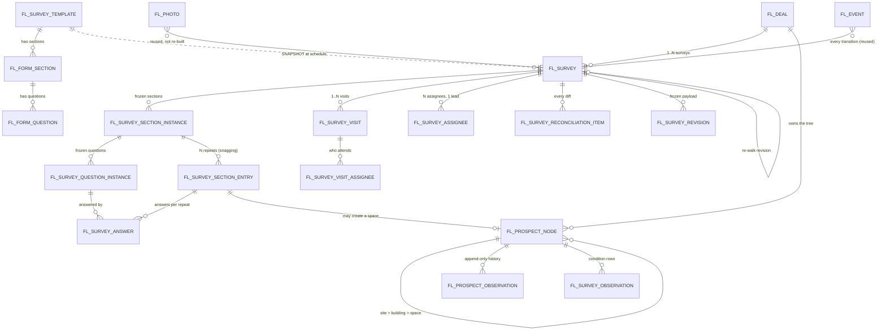
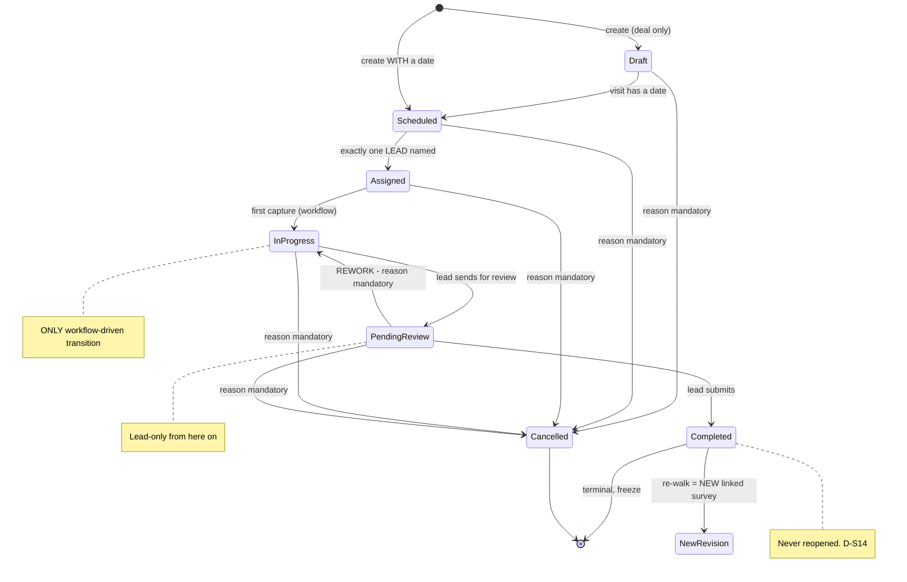
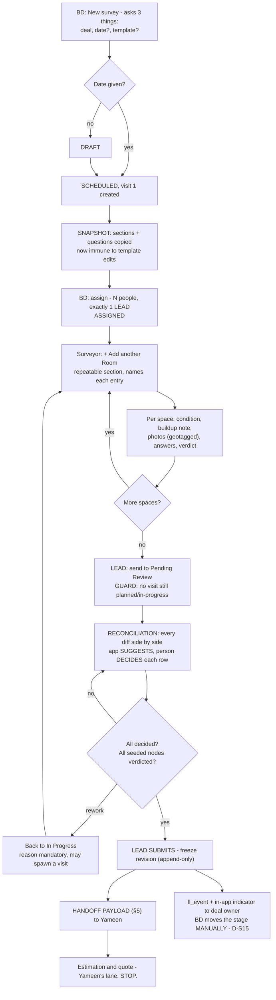
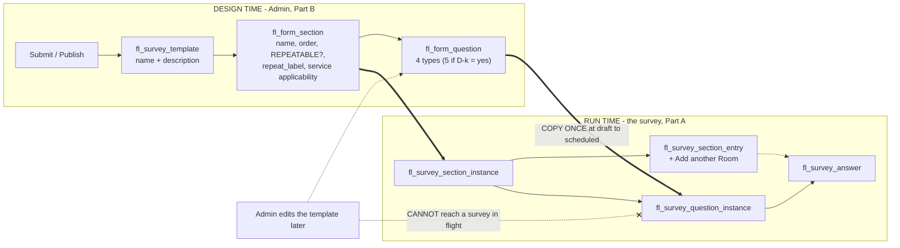

<!--
  FRONTLINE SITE SURVEY MODULE — STRUCTURE & BUILD SPEC v1.8
  Canonical name: claude/survey-module-structure-v1.8.md (Vibethon project)
  Author: Claude (as-Sudharsan, replica) · 13 Aug 2026
  Governed by: claude/CLAUDE.md (mother doc v8.7) — especially §0a GLOSSARY and §3a PLATFORM CONSTRAINTS.
  Supersedes: claude/survey-module-structure-v1.7.md (immutable; keep it — it holds the reasoning
    archaeology and the hard-FM return path that this file deliberately does not repeat).
  Decision record: claude/survey-module-flow-v3.md (D-S1..S15) remains valid as the record of WHAT WAS
    DECIDED; it is superseded on structure, hierarchy, assignment and table design.
  Basis for the v1.8 rewrite: claude/frontline-alignment-audit-v1.md — the three-way diff of Yameen's
    repo inventory (WHATWEBUILT.md @ 28e3ad9) against the mother doc and v1.7.

  VERSIONING RULE (Sudharsan's standing rule): EVERY revision is a NEW FILE. Prior versions immutable.

  WHY v1.8 IS SHORTER THAN v1.7, DELIBERATELY: v1.7 carried ~40% of its length as argument about its own
  earlier revisions — what was overruled, what was withdrawn, why. That reasoning is preserved in v1.7 and
  is not repeated here. v1.8 is a BUILD SPEC: someone should be able to open it and start writing tables
  and handlers without reading anything else except CLAUDE.md §0a and §3a.

  STATUS: BUILDABLE. Six decisions remain open (§8) and none of them blocks starting on the tables.
-->

# Frontline — Site Survey Module · Structure & Build Spec v1.8

**Doctrine (CLAUDE.md §6, binding):** humans act, workflows automate, AI assists. Every transition in this
document is a **human action** or a **deterministic workflow**. There is **no AI in any state machine** —
and on this platform there structurally cannot be, because a Vibe function cannot call a model
(CLAUDE.md §3a P5). AI appears only as a nullable `ai_confidence` + `ai_source` pair on a captured value.

**Evidence tags:** [M] measured from a real artifact · [S] stated by a person · [I] my inference — challenge it.

---

## §0. WHAT CHANGED FROM v1.7 — the diff, so nobody re-reads 90 KB

| # | Change | Why |
| --- | --- | --- |
| **1** | **Every table carries the `fl_` prefix.** `survey` → `fl_survey`, `prospect_portfolio_node` → **`fl_prospect_node`**, `form_section` → `fl_form_section`, and so on | The built repo prefixes all 16 of its tables `fl_`. One unprefixed table in a shared schema is a permanent wart. Free now, impossible later (no ALTER, no RENAME). Sudharsan, 13 Aug |
| **2** | **24 specified tables → 16.** Eight cut by reusing what already exists | See §4.2. Sudharsan accepted all eight, 13 Aug |
| **3** | **v1.7's stated count of "20 tables" was wrong** — the named list still included the withdrawn `survey_template_question` and omitted five tables the document specified. Real figure was 24 | Third miscount in the lineage (14 → 20 → 24). §4 now names all 16 exactly |
| **4** | **"Use a DB sequence" is deleted.** `CREATE SEQUENCE` is DDL and DDL is denied | **L12 answered: NO.** The built pattern is `fl_sequence` + `UPDATE … RETURNING` (§1, P3) |
| **5** | **The partial unique index for the one-lead rule is deleted.** `CREATE INDEX` is DDL | **L11 answered: NO.** Function-level guard, with the residual race stated honestly (§A2.1) |
| **6** | **"Conversion" is renamed "promotion" throughout**, and the ledger table is **`fl_promotion_log`** | `convert` already means lead→deal in shipped code. Two writes were sharing one word (CLAUDE.md §0a, §4.1) |
| **7** | **The handoff payload is specified** — a real numbered section with example JSON (§5) | It was referenced as "the §5 payload" in a document that had no §5, and Yameen's own terminology audit independently flagged it as undefined. It is the only contract between two lanes |
| **8** | **Entry points re-ranked** — the survey list is **primary**; Deal → Survey tab becomes primary the moment a Deal detail screen exists | There is no Deal screen in the build (CLAUDE.md §2.2) |
| **9** | **"Notify" is defined** as an `fl_event` row + in-app indicator (C29) | Email is absent from the build and jobs need production |
| **10** | **A handler list** for the `survey` function, written to the repo's own naming convention (§6) | So scaffolding does not re-decide names that are an API contract |
| **11** | **`survey_discipline` is cut** (D-j closed: cut) | Its only justification was the T3 coverage guard, removed at v1.6 |
| **12** | **Cross-file citations fixed** — v1.7 wrote "§3.1 ancestry rule" meaning *CLAUDE.md* §3.1 | Three files have clashing section numbers |
| **13** | **A jsonb caveat** on ~12 columns (**L15**) | CSV type inference may hand back `text` |

**Unchanged and not to be re-litigated:** the survey↔visit split · person-decides-every-diff reconciliation ·
conflict-warn never conflict-block · the 7-state lifecycle with a mandatory-reason rework loop · Completed is
terminal · **manual** deal advance (notify only) · the template→survey **snapshot** · repeatable sections ·
soft-services scope (site → building → space) · assignees optional, exactly one lead mandatory.

---

## §1. THE PLATFORM'S PHYSICS — read before designing a single column

Full list: **CLAUDE.md §3a**. The five that change *this* spec:

| Constraint | Consequence for the survey module |
| --- | --- |
| **P1 — no DDL.** A CSV *is* the schema; no `ALTER`, no `CREATE INDEX`, no unique constraints, no FK constraints | **Every column must be right before the first import.** Uniqueness (`one lead per survey`, `one dedup key per promotion target`) is enforced in the function layer, never by the DB. Referential integrity is a convention we keep, not a constraint we get. |
| **P2 — no indexes** | Every query full-scans. Acceptable at demo scale; stated as a week-one limit. Design list queries to filter on few columns and page. |
| **P3 — no sequences** | `survey_number` and `visit_number` come from **`fl_sequence`** via a single `UPDATE fl_sequence SET current = current + 1 WHERE key = $1 RETURNING current` inside the function. Row-locked, safe against two phones. Never `count + 1`. |
| **P4 — preview and production share one DB** | Additive changes only, forever (N-1). |
| **P5 — a function cannot call a model** | No AI anywhere in capture, reconciliation or any transition. If capture-time AI ever returns, it uses the built two-call split (`*-input` hands out the prompt, client calls the model, `*-store` saves it with confidence). |

**Conventions.** `snake_case` Postgres in the Vibe app DB. Every table carries `id`, `org_id`
(**C7 tenant scoping — on every query and every action, no exceptions**), `created_by`/`created_at`,
`updated_by`/`updated_at`, `is_active`. **Nothing in this module is ever hard-deleted** — `D` always means
`is_active = false` plus an `fl_event` row. Those columns are omitted from the field tables below; assume
them everywhere.

**⚠ L15 — the jsonb question.** Twelve columns below are typed `jsonb` (`buildings_in_scope`,
`options_json`, `conflict_warnings_json`, `condition_scale_labels`, `snapshot_json`, `discipline_ids`,
`applicability_service_ids`, `value_json`, `ai_*` bundles…). CSV type inference may produce `text`.
**Verify on the first import.** If it is `text`, the columns hold JSON strings and every read parses —
which works, but must be written down rather than discovered.

---

## §2. THE FOUR PIECES

| # | Piece | What it is | Owner | Change rate |
| --- | --- | --- | --- | --- |
| **1** | **Survey module (setup)** | The container: settings keys, enums, numbering, permissions, one default list. **No business records.** | Admin | Almost never |
| **2** | **Form builder (template)** | *Design-time* question sets. Generic — reusable by leads, mobilization, QA. | Admin / Ops lead | Monthly |
| **3** | **The Site Survey** | *Run-time* instance: one deal, one lifecycle, N visits, the captured findings. | Survey lead | Hourly during a walk |
| **4** | **Assignment** | The who: survey-level assignees + exactly one lead; visit-level attendance. | BD assigns; lead owns | Daily |

**The load-bearing structural claim:** #2 and #3 are joined by a **snapshot**, not a foreign key
(§B1.4). Without it, an Admin editing a template on Friday silently changes the question set of every survey
in flight, and a frozen revision no longer reproduces — which makes the C5 audit claim false.

---

## §3. THE MAPS

### 3.1 Object map



### 3.2 Lifecycle



### 3.3 End to end



### 3.4 Builder and the snapshot boundary



---

## §4. THE TABLE REGISTER — 16, named exactly

### 4.1 What this module builds

| # | Table | Rows are | Notes |
| --- | --- | --- | --- |
| 1 | **`fl_survey`** | one per deal-survey | §A1.1 |
| 2 | **`fl_survey_visit`** | one per walk appointment | §A1.2 |
| 3 | **`fl_survey_assignee`** | the team + exactly one lead | §A2.1 |
| 4 | **`fl_survey_visit_assignee`** | who actually attended | §A2.2 |
| 5 | **`fl_prospect_node`** | site / building / space | §A1.3 |
| 6 | **`fl_prospect_observation`** | append-only field history (C25) | §A1.3 |
| 7 | **`fl_survey_answer`** | one per question per repeat | §A1.4 |
| 8 | **`fl_survey_observation`** | condition + contamination per space (C11) | §A1.5 |
| 9 | **`fl_survey_reconciliation_item`** | every diff, decided by a person | §A1.6 |
| 10 | **`fl_survey_revision`** | the frozen, checksummed handoff payload | §A1.6, §5 |
| 11 | **`fl_survey_template`** | template header | §B1.1 |
| 12 | **`fl_form_section`** | section (generic, reusable) | §B1.2 |
| 13 | **`fl_form_question`** | question (generic, reusable) | §B1.3 |
| 14 | **`fl_survey_section_instance`** | snapshot of a section | §B1.4 |
| 15 | **`fl_survey_question_instance`** | snapshot of a question | §B1.4 |
| 16 | **`fl_survey_section_entry`** | one per "+ Add another Room" | §B1.4 |

**Adjacent, and NOT a survey table:** **`fl_promotion_log`** — the prospect-portfolio → Facilio idempotency
ledger (CLAUDE.md C2/C3/C26). Assigned to Sudharsan's platform lane at v8.7 because all three documents were
pointing at each other. Named here so nobody builds a second one.

### 4.2 What this module reuses instead of building — the eight cuts

| v1.7 table | Replaced by | Reasoning |
| --- | --- | --- |
| `survey_module_settings` | **`fl_setting`** + the shipped `settings-get` / `settings-put` handlers | A settings mechanism exists. Survey settings are **keys** (§B2), not a singleton table |
| `survey_status_log` | **`fl_event`** + `shared/events.ts` | v1.7's own shape (`entity_type` / `entity_id` / `from_status` / `to_status`) *is* a generic event table. **C18 says platform-wide history** — per-module log tables are how you end up with five audit trails and no audit |
| `survey_attachment` | **`fl_photo`** | Photo storage exists. ⚠ **Conditional on L17** — if `fl_photo` cannot carry `kind`, device `captured_at` vs server `uploaded_at`, and geo without an ALTER (P1), this cut is void and a 17th table returns. **Check before the first survey CSV.** |
| `survey_discipline` | nothing — **cut** (D-j closed) | Its only justification was the T3 coverage guard, removed at v1.6. `discipline_ids` survives as an optional free-text chip. Returns with hard FM |
| `survey_template_category` | a **`reference`** entry | v1.7 already said: seed one row, ship no UI. Then it does not need a table |
| `survey_qualification` | **derived at print time** | Every input (`not_found` / `not_visited` nodes, unanswered questions) is already queryable. v1.7 named this as an honest cut |
| `survey_recommendation` | a flag on **`fl_survey_answer`** (`feeds_estimation` + `answer_role='recommendation'`) | v1.7 named this as the other honest cut. Returns as a table when the SOW 4.17 loop is real |
| `survey_lead_handover_log` | one **`fl_event`** row, `event_type = 'survey.lead_changed'` | The reasoning (the lead is the only person who can submit, so handover must be auditable) is satisfied exactly by an event row |

**24 → 16.** Every cut either reuses something Yameen already built or takes a cut v1.7 itself flagged as
honest. **No audit or integrity claim is lost.** Sudharsan accepted all eight, 13 Aug.

---

# PART A — THE PRODUCT

## A0. PERSONA → SURFACE MAP

| Persona | Their surface | What they do | Sections |
| --- | --- | --- | --- |
| **BD / deal owner** (U1) | Survey list → New survey *(Deal → Survey tab once that screen exists)* | Creates the survey, books visits, names the team and the lead, moves the deal stage after completion | A1.0, A1.2, A2 |
| **Survey lead** (U2) | Survey detail + Reconciliation screen | Owns completeness. Reviews every diff. **The only person who can submit or send back for rework** | A1.6, A1.8 |
| **Surveyor** (U3) | **Mobile walk capture** — the screen that decides adoption | Adds entries, scores condition, shoots photos, verdicts seeded nodes | A1.3–A1.5 |
| **Estimator** (U6) | Read-only frozen payload | Consumes §5. **Yameen's lane starts here** | §5 |
| **Site contact / tenderer** | *No login in v1* | Records on a visit and on the deal — not users | A1.2 |
| **Admin** | Setup only | Templates, settings keys, permissions | Part B |

**The adoption test:** if the surveyor's walk screen is slow or asks irrelevant questions, nothing else here
matters. SVH reverted to Micromain over exactly this. **UX here is churn risk, not polish.** Build it from
the existing 13-component kit and DSM tokens — do not invent a second visual system.

## A1. THE SITE SURVEY — the run-time record

### A1.0 Creating one — the form asks three things

| Ask | Field | Req | Behaviour |
| --- | --- | --- | --- |
| **Which deal?** | `deal_id` | **Y** | The only genuinely mandatory input |
| **Which date?** | → creates visit #1 | N *(D-l)* | If given, `fl_survey_visit` #1 is created and the survey lands directly in `scheduled`. If skipped, `draft` |
| **Which template?** | `template_id` | N | Nullable — start-from-scratch is sanctioned (D-S3) |

**Derived or deferred, never asked:** `survey_number` from `fl_sequence` · `account_id` from the deal ·
`title` auto-composed (`{account} — {site} — Site Survey`, editable) · `prospect_site_id` resolved from the
deal where one exists, **otherwise null and resolved on the walk** (§6 #2 — never block creation on a missing
field) · `buildings_in_scope` filled during planning or inline on the walk.

**Where the button lives — re-ranked at v1.8:**

| Trigger | Pre-fills | Verdict |
| --- | --- | --- |
| **Survey list → "+ New survey"** | nothing | **PRIMARY today.** There is no Deal detail screen in the build |
| **Deal → Survey tab → "New survey"** | deal, account, site | **Becomes primary the day the Deal screen ships.** Same function, different pre-fill — supporting both is nearly free |
| Template → "Create survey" | template | Supported, not primary. Saves the least-typed field and costs the most-typed one |

> **Keep the date optional (D-l).** A mandatory date makes every survey born `scheduled` and the `draft`
> state unreachable, which contradicts the locked 7-state lifecycle. `draft` is the "bidding now, slot
> granted later" case — the normal tender rhythm.

### A1.1 `fl_survey`

| Field | Type | Req at state | Notes |
| --- | --- | --- | --- |
| `survey_number` | text | create | `SUR-00042` from **`fl_sequence`** (P3) |
| `deal_id` | FK | **create** | The spine, and the only mandatory create input |
| `account_id` | FK | derived | Stamped at create for list performance; **read the deal for truth** |
| `title` | text | derived | Auto-composed, editable |
| `template_id` | FK | — | Nullable |
| `template_version_no` | int | — | Stamped at snapshot |
| `prospect_site_id` | FK | **nullable at create** | Root `fl_prospect_node`. Resolved on the walk if unknown |
| `buildings_in_scope` | jsonb *(L15)* | — | Survey-level scope; visits carve subsets. **Not a guard** |
| `status` | enum | create | `draft`\|`scheduled`\|`assigned`\|`in_progress`\|`pending_review`\|`completed`\|`cancelled` |
| `status_changed_at` / `status_changed_by` | ts / FK | — | |
| `lead_assignee_id` | FK | assigned | **Denormalised mirror** of the `is_lead` row; the assignee table is truth |
| `contract_intent` | enum | — | `comprehensive`\|`semi_comprehensive`\|`non_comprehensive` (C14) |
| `is_condition_survey_complete` | bool | derived | Every in-scope **space** has an observation with a condition score |
| `target_completion_date` | date | — | Defaults from the deal's tender deadline (C13) minus a buffer |
| `revision_no` | int | Y | Starts 1 |
| `parent_survey_id` | FK | — | A re-walk after Completed is a **new linked survey**, never a reopen (D-S14) |
| `superseded_by_survey_id` | FK | — | Set on the parent when a revision is created |
| `rework_count` | int | Y | Increments on every `pending_review → in_progress` |
| `completeness_pct` | numeric | derived | (verdicted seeded nodes + answered required questions) / total |
| `not_visited_pct` | numeric | derived | **Printed on the handoff payload** — the estimator prices with eyes open |
| `cancel_reason` | text | cancelled | **Mandatory** |
| `cancelled_by` / `cancelled_at` | FK / ts | cancelled | |
| `submitted_by` / `submitted_at` | FK / ts | completed | |
| `current_revision_id` | FK | completed | Points at the frozen `fl_survey_revision` |
| `notes` | text | — | |

*Dropped from v1.7: `disciplines_required` (the coverage guard is gone with `survey_discipline`).*

### A1.2 `fl_survey_visit` — appointment semantics

| Field | Type | Req | Notes |
| --- | --- | --- | --- |
| `survey_id` | FK | Y | |
| `visit_number` | text | Y | `SUR-00042/V2`, from `fl_sequence` |
| `sequence_no` | int | Y | |
| `scheduled_start` | timestamptz | Y (to schedule) | Handles overnight and multi-day walks without a second concept |
| `scheduled_end` | timestamptz | Y (to schedule) | Must be > start. A 2-day tender walk is **one visit with a 2-day span** — split only when buildings or team differ |
| `timezone` | text | Y | Never assume the org's — a tender site can be in another zone |
| `buildings_covered` | jsonb *(L15)* | Y | Must be a subset of `survey.buildings_in_scope` |
| `site_contact_id` | FK | N | A deal contact where one exists |
| `site_contact_name` / `_phone` / `_email` | text | N | Free-text fallback for a name given on the day |
| `meeting_instructions` | text | N | "meet at the loading dock, ask for security" |
| `access_instructions` | text | N | PPE, escort, badge, after-hours code. Vocabulary from the reference tool [M]: keys/codes · security escort required · 24/7 open · TBD |
| `notes` | text | N | |
| `slot_source` | enum | Y | `ours` \| `tenderer_granted` — a tenderer slot is **recorded, not negotiated** |
| `slot_granted_by` | text | N | The tenderer/mediator name |
| `status` | enum | Y | `planned`\|`in_progress`\|`done`\|`no_show`\|`cancelled`. **`no_show` is not decoration** — with ~10 bidders on one tenderer-controlled slot [S], a wasted trip is routine and must never read as "surveyed" |
| `actual_start_at` / `actual_end_at` | ts | — | Stamped by first / last capture |
| `conflict_warnings_json` | jsonb *(L15)* | — | Output of the conflict-warn check. **Warn, never block** |
| `conflict_acknowledged_by` / `_at` | FK / ts | — | Who clicked through the warning — that is the audit line that matters |
| `cancel_reason` / `no_show_reason` | text | conditional | Mandatory on those transitions |

### A1.2b Survey actions — named operations, not field edits

Each has its own permission, guard, lifecycle effect and `fl_event` row. Every one is a human action.

| Action | Actor | Permission | Guard | Lifecycle effect |
| --- | --- | --- | --- | --- |
| **Schedule** | BD / lead | `survey.schedule` | `scheduled_end > scheduled_start` | `draft → scheduled` (T2) |
| **Reschedule** | BD / lead | `survey.schedule` | Not `completed`/`cancelled`; **re-runs conflict-warn**; old + new datetimes into the event | No state change |
| **Assign** | BD / lead | `survey.assign` | **Exactly one lead** | `scheduled → assigned` (T3) |
| **Reassign** (swap) | BD / lead | `survey.assign` | Outgoing person soft-removed; **their captures stay attributed** | — |
| **Change the lead** | BD / lead | `survey.set_lead` | Target is an active assignee; survey not `completed` | — (event: `survey.lead_changed`) |
| **Remove an assignee** | BD / lead | `survey.assign` | Cannot remove the last assignee, or the lead without naming a replacement | May fail T3's guard → cannot advance |
| **Cancel** | BD / lead | `survey.cancel` | **`cancel_reason` mandatory** | `→ cancelled` (T8) |
| **Mark no-show** (visit) | BD / lead | `survey.schedule` | `no_show_reason` mandatory | Visit `→ no_show`; **survey does NOT advance** |

**Two rules that make this safe:** a reschedule **always** re-runs conflict-warn and always records old and
new datetimes — *"when was this moved, and by whom"* is the first question asked when a tenderer slot is
missed. And **no action here is available once the survey is `completed`** (§A1.9).

> **Users come from the platform, not from us (D-n).** Every person field (`survey_assignee.user_id`,
> `visit_assignee.user_id`, `lead_assignee_id`) is a lookup into the platform user list. **P1 reads that
> list into the assignee picker and registers permission keys — it does not build a user-management module.**
> Full user management (invite / deactivate / role editor) is Layer-0 work that outlives this event (C24).
> Blocked on **L14** — check the *grant*, not the record: a role that cannot read a module returns null and
> unguarded UI crashes on it. That failure has happened here before.

### A1.3 The prospect portfolio — `fl_prospect_node` + `fl_prospect_observation`

**Three levels: site → building → space.** `floor` and `asset` are out (CLAUDE.md §3). Floors are a
`floor_count` number plus an optional `floor_label` on the space — the production walkthrough reference
stores floors as a number, never as a level [M].

`fl_prospect_node`

| Field | Type | Req | Notes |
| --- | --- | --- | --- |
| `deal_id` | FK | Y | Nodes belong to the **deal**, not the survey — they survive revisions and lost deals (commercial intelligence). D-i |
| `node_type` | enum | Y | **`site` \| `building` \| `space`** |
| `parent_node_id` | FK | N | Null only for `site`. **A `space` may parent directly to a `site`** (lawn, parking) |
| `ancestry_path` | text | Y | Materialised path. **This is CLAUDE.md §3.1's ancestry rule enforced in the prospect tree, before the promotion ever runs.** Unit-test every create path |
| `name` / `code` | text | Y / N | |
| `facilio_id` | text | N | Populated for repeat clients (link, read, never copy) and back-filled at promotion |
| `facilio_module` | text | N | |
| `space_category` | text | N | Facilio enum id — **L9 open** |
| `floor_label` | text | N | Free text ("2nd floor", "mezzanine") on a space |
| `area_sqft` / `floor_count` / `room_count` / `restroom_count` | numeric / int | N | [M] the reference tool's `gen_sqft`, `gen_floors`, `gen_rooms`, `gen_restrooms` |
| `provenance` | enum | Y | `rfp`\|`survey`\|`crm`\|`facilio_link`\|`manual` (C25) |
| `source_document_id` | FK | N | Which RFP page/row seeded it |
| `verdict` | enum | Y | `unverified`\|`verified`\|`changed`\|`not_found`\|`added_on_site`\|`not_visited` |
| `verdict_note` | text | conditional | **Mandatory** for `not_found`, `not_visited`, `changed` |
| `verdict_by` / `_at` / `_visit_id` | FK / ts / FK | — | |

`fl_prospect_observation` — **the no-silent-overwrite machinery (C25)**

| Field | Type | Req | Notes |
| --- | --- | --- | --- |
| `prospect_node_id` | FK | Y | |
| `field_key` | text | Y | `area_sqft`, `space_category`, `room_count`, `name`… |
| `value_text` / `value_number` / `value_json` | typed | Y (one of) | **Typed columns, not a stringly `value`** — a field's type is discovered, not assumed |
| `provenance` | enum | Y | |
| `observed_by` / `_at` / `_visit_id` | FK / ts / FK | Y | |
| `is_accepted` | bool | Y | **"Current" = the latest accepted observation.** Nothing is ever updated in place |
| `accepted_by` / `_at` | FK / ts | N | |
| `superseded_by_observation_id` | FK | N | |
| `reconciliation_decision` | enum | N | `accepted_survey`\|`accepted_rfp`\|`manual_override`\|`pushed_to_clarification` |
| `geo_lat` / `geo_lng` / `geo_accuracy_m` | numeric | N | Capture-time only — **never live tracking** |

### A1.4 `fl_survey_answer`

| Field | Type | Req | Notes |
| --- | --- | --- | --- |
| `survey_id` / `question_instance_id` | FK | Y | Points at the **snapshot**, never the template |
| `section_entry_id` | FK | N | Which repeat this belongs to. Null for non-repeating sections |
| `scope_node_id` | FK | conditional | The building or space, when the section is level-bound |
| `value_text` / `value_number` / `value_bool` / `value_json` / `value_date` | typed | Y (one of) | `value_json` carries multiselect arrays *(L15)* |
| `is_na` / `na_reason` | bool / text | N | An explicit "not applicable" is data; a blank is not |
| `answer_role` | enum | N | `finding` *(default)* \| **`recommendation`** — absorbs the cut `survey_recommendation` (§4.2) |
| `recommendation_type` / `urgency` / `suggested_service_id` | enum / enum / text | N | Only when `answer_role='recommendation'`. **`suggested_service_id` is a Facilio Services id (C23) — ship it nullable until L10 resolves** |
| `answered_by` / `_at` / `_visit_id` | FK / ts / FK | Y | |
| `ai_confidence` / `ai_source` | numeric / text | N | **Only populated when AI assisted.** Null means a human typed it |
| `superseded_by_answer_id` | FK | N | Append-only (C5) |
| `geo_*` | numeric | N | |

### A1.5 `fl_survey_observation` — the pricing spine (C11)

| Field | Type | Req | Notes |
| --- | --- | --- | --- |
| `survey_id` / `visit_id` / `prospect_node_id` | FK | Y | The node is a **space** |
| `condition_score` | int 1–5 | Y | **Always rendered with its label, never bare** (see D-e) |
| `contamination_level` | enum | N | Per §B2 vocabulary |
| `buildup_note` | text | N | [M] the reference proposal's own phrase: *"level of buildup observed during the walkthrough"* |
| `access_constraint` | text | N | Lift / ladder / scaffolding / overnight-crew [M] |
| `safety_note` | text | N | |
| `suggested_frequency` | enum | N | `one_time`\|`daily`\|`weekly`\|`fortnightly`\|`monthly`\|`quarterly`\|`annual` — C12's one-time + recurring pattern [M] |
| `observed_by` / `_at` | FK / ts | Y | |
| `geo_*` | numeric | N | |

### A1.6 Supporting tables

| Table | Key fields | Purpose |
| --- | --- | --- |
| **`fl_survey_reconciliation_item`** | `diff_type`, `prospect_node_id` / `field_key` / `question_instance_id`, `rfp_value`, `survey_value`, `suggested_value`, `suggestion_basis`, `decision`, `manual_value`, `decided_by`/`_at`, `decision_note`, `clarification_id`, `status` | **The app suggests; the person decides every row** (D-S2). `suggestion_basis` is the plain-language reason (§6 #7) |
| **`fl_survey_revision`** | `revision_no`, `frozen_at`/`_by`, `snapshot_json` (the whole §5 payload), `checksum`, `trigger` (`submit`\|`rework_bounce`\|`cancel`), `is_current` | Append-only freeze (C5). A frozen revision must reproduce byte-identically — only true because of the §B1.4 snapshot |

**`diff_type` enum:** `value_conflict` · `node_not_found` · `node_added` · `count_mismatch` ·
`scope_vs_physical` · `unanswered_required` · **`intra_survey_conflict`** — two assignees recorded different
values for the same field on the same node. With multiple people walking one building this is not an edge
case; the append-only observation model already holds both values, so surfacing it is nearly free.

**Reused, not built:** photos → **`fl_photo`** (with `kind`, device `captured_at` **and** server
`uploaded_at`, geo — ⚠ L17) · every transition → **`fl_event`** · settings → **`fl_setting`** ·
numbering → **`fl_sequence`**.

### A1.7 Visit lifecycle

| Transition | Actor | Type | Guard | Side effect |
| --- | --- | --- | --- | --- |
| create → `planned` | BD or lead | Human | `survey.schedule` | Conflict-warn runs against every assignee's other visits |
| `planned` → `in_progress` | — | **Workflow** | First capture against this visit | `actual_start_at` stamped; **cascades the survey to `in_progress`** |
| `in_progress` → `done` | Visit lead | Human | — | `actual_end_at` stamped |
| `planned` → `no_show` | BD or lead | Human | `no_show_reason` mandatory | **Does NOT move the survey to `in_progress`** — survey stays `assigned` |
| `planned`/`in_progress` → `cancelled` | BD or lead | Human | `cancel_reason` mandatory | Captures already taken are retained |
| any → `planned` (reschedule) | BD or lead | Human | Survey not `completed`/`cancelled` | New conflict-warn; logged |

### A1.8 Survey lifecycle — the executable transition table

**All transitions are human or deterministic workflow. No AI. No exceptions.**

| # | From → To | Actor | Type | Guard (all must hold) | Side effects |
| --- | --- | --- | --- | --- | --- |
| **T1** | — → `draft` | BD | Human | **Deal selected. That is the whole guard** | `survey_number` from `fl_sequence`; `account_id`/`title` derived; site resolved **if available**; `fl_event` |
| **T2** | `draft` → `scheduled` | BD or lead | Human **or auto at create** | ≥1 visit with a datetime. `buildings_in_scope` is **not** a guard — it is not known this early on a tender | **The template snapshot runs here** (§B1.4); conflict-warn; visit numbers issued |
| **T3** | `scheduled` → `assigned` | BD or lead | Human | **Exactly one `is_lead = true`. That is the entire guard.** Additional assignees optional — a one-person soft-services walk is the normal case | `lead_assignee_id` mirrored; assignees notified **(C29: `fl_event` + in-app)**; visit-assignee defaults seeded |
| **T4** | `assigned` → `in_progress` | — | **Workflow** | First capture (answer / observation / verdict / photo) against a visit | Visit `actual_start_at`; scope edits restrict (§A1.9) |
| **T5** | `in_progress` → `pending_review` | **Lead only** | Human | **No visit left in `planned` or `in_progress`** — every visit is `done`, `no_show` or `cancelled` | Reconciliation items generated by a deterministic diff function; `completeness_pct` computed |
| **T6** | `pending_review` → `in_progress` (**rework**) | **Lead only** | Human | `reason` **mandatory** | `rework_count += 1`; may spawn a visit; a `rework_bounce` revision is frozen; banner after 3 bounces |
| **T7** | `pending_review` → `completed` | **Lead only** | Human | Every seeded node has a verdict (`not_visited` allowed **with note**); every required question answered or explicitly `is_na`; every reconciliation item decided; every mandatory photo present | **Freezes the revision**; emits the §5 payload; **notifies the deal owner (C29)**; publishes `not_visited_pct` |
| **T8** | any pre-`completed` → `cancelled` | BD or lead | Human | `cancel_reason` **mandatory** | Open visits cancelled; captures retained as commercial intelligence but **excluded from every handoff query, explicitly, in the function** |
| **T9** | `completed` → *(new survey)* | Lead or BD | Human | Prior survey `completed` | **New survey row**, `parent_survey_id` set, `revision_no + 1`, prospect tree inherited. **Completed is terminal — never reopened** |
| **T10** | `completed` → deal stage move | **Deal owner, in the deal module** | Human | — | **NOT this module's transition.** We notify; the BD moves the stage. **`survey.submit` must never write `deal.stage`. No auto-advance, ever** |

**Explicitly forbidden — assert in the function layer and unit-test in `src/domain/survey-state.ts`:**
`completed → anything` · `cancelled → anything` · `pending_review → completed` by a non-lead ·
`draft → in_progress` · **any transition without an `fl_event` row**.

> **Where this code lives:** `src/domain/survey-state.ts`, beside the shipped `lead-state.ts` — pure logic,
> no IO, unit-tested on a laptop. That pattern already exists in the repo with 81 passing tests. Use it.

### A1.9 What becomes immutable, and when

| At | Freezes |
| --- | --- |
| `draft → scheduled` (T2) | The question set (snapshot taken). Template edits no longer reach this survey |
| `→ in_progress` (T4) | `template_id`, `prospect_site_id`. Scope may still grow, never shrink below what has captures |
| `→ pending_review` (T5) | Nothing new may be captured except through a rework bounce (T6) |
| `→ completed` (T7) | **Everything.** The revision is checksummed and append-only. Corrections are a new revision (T9), never an edit |

## A2. ASSIGNMENT

Two levels, because a survey is one thing and a visit is another. Conflating them loses *"who actually
walked building 3 on Tuesday"* — the exact question asked when a finding is disputed six weeks later during
price negotiation.

### A2.1 `fl_survey_assignee` — the team + the one lead

Assignment is **multi-select**: N rows per survey. **Additional assignees are optional; exactly one lead is
mandatory.** The lead is itself an assignee row, so the minimum viable team is one person.

| Field | Type | Req | Notes |
| --- | --- | --- | --- |
| `survey_id` | FK | Y | |
| `user_id` | FK | Y | Internal platform user only (D-n) |
| `discipline_ids` | jsonb *(L15)* | N | Optional free-text chips. **The `survey_discipline` table is cut** (§4.2) |
| `is_lead` | bool | Y | **Exactly one per survey.** ⚠ **Cannot be a partial unique index — P1 forbids it (L11 answered: no).** Enforce in **one serialised handler**: read the current lead, clear it, set the new one, in a single handler call. **State the residual race:** two simultaneous `set-lead` calls could both pass the read. Mitigation — the mirrored `survey.lead_assignee_id` is written in the same handler and a nightly/at-submit check flags any survey with ≠1 active lead |
| `participation` | enum | Y | `surveyor` \| `observer` — an observer (BD tagging along) may capture but cannot be lead. D-b |
| `assigned_by` / `assigned_at` | FK / ts | Y | |
| `notified_at` | ts | N | **No acceptance gate** (D-c) — an acknowledgement is a state nobody maintains and a demo that stalls |
| `removed_by` / `removed_at` / `removal_reason` | FK / ts / text | N | **Soft-remove only** — captures remain and must stay attributable |

### A2.2 `fl_survey_visit_assignee` — who actually attends

| Field | Type | Req | Notes |
| --- | --- | --- | --- |
| `visit_id` / `survey_id` | FK | Y | `survey_id` denormalised for scoping |
| `user_id` | FK | Y | **Must be an active `fl_survey_assignee`** on the parent survey |
| `discipline_ids` | jsonb | N | Defaults from the survey row; may be narrowed for this visit |
| `is_visit_lead` | bool | Y | At most one per visit. Defaults to the survey lead if present. **The survey lead does not attend every visit on a multi-day tender walk** — someone must own the ground on the other days. D-d |
| `attendance` | enum | Y | `expected` \| `attended` \| `absent` — `attended` stamped by their first capture (workflow, not a checkbox) |
| `assigned_by` / `assigned_at` | FK / ts | Y | |
| `removed_by` / `removed_at` | FK / ts | N | Soft-remove |

### A2.3 Assignment rules (not fields)

1. **Conflict-warn, never conflict-block.** An overlapping assignment writes `conflict_warnings_json` and
   demands an explicit acknowledgement — **the acknowledgement is the audit line**.
2. **Discipline coverage is not checked at all** in P1 — the table is cut and the guard is gone.
3. **Lead change is always logged** (`fl_event`: `survey.lead_changed`) and **blocked once `completed`**.
4. **Removing an assignee never removes their captures.** Observations stay, attributed, and appear in
   reconciliation as normal.
5. **Assignment triggers exactly one lifecycle transition (T3) and nothing else.** It can never move a
   survey backwards.
6. **If the lead is deactivated, submit fails with a *specific* message** — "lead is inactive — reassign" —
   never a generic error. Mid-tender, deadline-bound, a generic failure is a lost bid.

## A3. RACI

| Role | Setup | Template | Survey | Assignment |
| --- | --- | --- | --- | --- |
| **Admin** | **A/R** | **A/R** | C | C |
| **BD / deal owner** (U1) | I | C | **A** — creates, schedules, cancels; **moves the deal stage after completion** | **R** — assigns the team, names the lead |
| **Survey lead** (U2) | I | C | **R** — owns completeness, reconciliation; **the only role that can submit or rework** | R — visit leads, day-of changes |
| **Surveyor** (U3) | — | — | **R** — capture, verdicts within their visits | I |
| **Estimator** (U6) | — | C (`estimation_key`) | **C** — read-only consumer of §5. **Yameen's lane starts here** | — |
| **Site contact / tenderer** | — | — | **Record on a visit, not a user** | — |

**The accountability line:** *the BD owns the deal, the lead owns the survey, and only the lead can submit.*

## A4. CRUD MATRIX

`C` create · `R` read · `U` update · `D` delete (**always soft**) · `(R)` read-only after freeze

| Entity | Admin | BD | Lead | Surveyor | Estimator | Locked at |
| --- | --- | --- | --- | --- | --- | --- |
| `fl_survey` | R U | **C** R U D | R U D | R | R | `completed` → all (R) |
| `fl_survey_visit` | R | **C** R U D | **C** R U D | R U (own notes) | — | `completed` → (R) |
| `fl_prospect_node` | R | C R U | C R U | **C R U** (inline on the walk) | R | `completed` → (R) |
| `fl_prospect_observation` | R | C R | C R | **C R** | R | **Append-only always — never U, never D** |
| `fl_survey_answer` | R | R | C R U | **C R U** (own, pre-`pending_review`) | R | `pending_review` → (R) except via rework |
| `fl_survey_observation` | R | R | C R U | **C R U** (own) | R | same |
| `fl_photo` (survey-scoped) | R | R | C R D | **C R D** (own, pre-`pending_review`) | R | same |
| `fl_survey_reconciliation_item` | R | R | **R U** (decide) | R | R | Generated by workflow; **only the lead decides** |
| `fl_survey_revision` | R | R | R | R | R | **Nobody writes. Workflow-only, append-only** |
| `fl_event` | R | R | R | R | R | **Nobody writes directly. Workflow-only** |
| `fl_survey_assignee` | R | **C R U D** | C R U D | R | — | `completed` → (R) |
| `fl_survey_visit_assignee` | R | C R U D | **C R U D** | R | — | `completed` → (R) |

**Three rules that override the table:**

1. **No hard deletes anywhere.** `D` = `is_active = false` + an `fl_event` row.
2. **Nobody — not even Admin — writes `fl_survey_revision` or `fl_event`.** An Admin who can edit the audit
   trail means there is no audit trail.
3. **`completed` beats every role.** A `U` evaporates the moment the survey completes.

## A5. LIFECYCLE SUMMARY

| Object | States | Who moves it | AI? |
| --- | --- | --- | --- |
| **Template** | `draft → published → archived` (+ clone-to-edit) | Admin | **No** |
| **Site Survey** | 7 states + rework loop | BD (T1,T2,T8) · BD/Lead (T3) · **Workflow** (T4) · **Lead only** (T5–T7) | **No** |
| **Visit** | `planned → in_progress → done`; `→ no_show`, `→ cancelled` | BD/Lead; `→ in_progress` by workflow | **No** |
| **Prospect node verdict** | `unverified → verified \| changed \| not_found \| added_on_site \| not_visited` | Surveyor / Lead | **No** — always a tap |
| **Field observation** | `captured → accepted \| superseded` | Lead at reconciliation | **No** — app suggests, person decides |
| **Reconciliation item** | `open → decided` | **Lead only** | **No** |
| **Assignee** | `assigned → (notified) → active → removed` | BD / Lead | **No** |

**Exactly two transitions are workflow-driven:** visit `planned → in_progress`, and the survey
`assigned → in_progress` that cascades from it. Everything else is a person clicking a thing.

---

# PART B — SETUP

## B1. THE FORM BUILDER — a generic platform piece the survey merely consumes

Deliberately not survey-shaped: leads, mobilization checklists, vendor onboarding and QA forms reuse it.

### B1.1 `fl_survey_template`

| Field | Type | Req | Notes |
| --- | --- | --- | --- |
| `name` | text | **Y** | The only mandatory descriptive field |
| `description` | text | N | |
| `category_key` | text | N | **A `reference` value, not a table** (§4.2). Defaults to `general` |
| `status` | enum | Y | `draft` \| `published` \| `archived` |
| `version_no` | int | Y | Starts 1; increments on republish |
| `parent_template_id` | FK | N | Lineage when a published template is cloned to edit |
| `published_by`/`_at` · `archived_by`/`_at` | FK / ts | N | |
| *derived* | — | — | `section_count`, `question_count`, `usage_count`. `usage_count > 0` blocks delete — **archive only** |

### B1.2 `fl_form_section` — the unit the builder manipulates

| Field | Type | Req | Notes |
| --- | --- | --- | --- |
| `template_id` | FK | Y | |
| `name` | text | Y | "General Site Info", "Floor Care", "Access & Safety" |
| `description` | text | N | Rendered under the section title on the walk screen |
| `sequence_no` | int | Y | **Reorder rewrites this column only** — never an array in a JSON blob, which loses a concurrent edit silently |
| `level_binding` | enum | Y | `per_survey` \| `per_building` \| `per_space`. **⚠ Probably dropped from P1 — see D-p** |
| `applicability_service_ids` | jsonb *(L15)* | N | **Facilio Services ids (C23).** Ship **nullable** — L10 is unresolved, and nullable → always shown. Do not invent a local catalogue to unblock it |
| `is_repeatable` | bool | Y | **The snagging pattern.** The surveyor adds the same question set again and again on the walk |
| `repeat_label` | text | conditional | The noun on the button: `Room` → **"+ Add another Room"**. Also `Area`, `Restroom`, `Snag`, `Unit` |
| `min_repeats` / `max_repeats` | int | N | Usually null |
| `creates_portfolio_node` | bool | Y | **When true, each repeat also creates a `space` under the current building** — this is how the walk builds the prospect portfolio with no separate tree screen (D-p) |
| `is_active` | bool | Y | Soft-delete. **Deleting a section soft-deletes its questions with it** |

> **Why repeatable sections are the most valuable thing in this builder.** The reference walkthrough tool
> asks *"number of distinct rooms / areas to clean"* as a single number [M] — which prices a job but tells
> you nothing about *which* room was bad. A repeatable section turns that number into N real entries, each
> with its own photos and condition, at the cost of one boolean. It also removes the 40-tap grid problem
> entirely: there is no pre-seeded tree to walk, so the surveyor adds only the rooms they actually enter.

### B1.3 `fl_form_question` — four field types (five if D-k = yes)

| Field | Type | Req | Notes |
| --- | --- | --- | --- |
| `section_id` | FK | Y | No orphans — P1 auto-creates a "General" section |
| `label` | text | Y | The question as the surveyor reads it |
| `help_text` | text | N | |
| `field_type` | enum | Y | **`short_text` · `long_text` · `options` · `attachment`** — *plus `number` if D-k = yes* |
| `options_json` | jsonb *(L15)* | conditional | Required for `options`. Yes/No is an `options` field with two values — no separate boolean type |
| `unit` | text | N | **Only if D-k = yes** — "sq ft", "each" |
| `allow_multiple` | bool | Y | On `options` → multiselect. On `attachment` → multiple files |
| `sequence_no` | int | Y | |
| `is_required` | bool | Y | **Blocks submit, never blocks saving a row** (§6 #2 graceful fallback) |
| `is_active` | bool | Y | Soft-delete only |
| `feeds_estimation` / `estimation_key` | bool / text | N | **The handoff contract.** A stable key the estimator reads (`total_sqft`, `restroom_count`) so Yameen's lane never depends on our question wording |

> **⚠ D-k, restated because it is a money risk, not a preference.** With only `short_text`, "approximate
> total square footage" — the single most load-bearing captured value in the reference proposal [M] —
> reaches the estimator as a string: `"~4,500 sq ft"`, `"4500sqft"`, `"about 4.5k"`. Either Yameen parses
> free text or the pricing function does. **That is a silent-corruption path into money.** Adding `number`
> + `unit` is ~40 minutes and keeps the builder at five types.

### B1.4 The snapshot, and the repeat runtime

Copy runs **once, at `draft → scheduled` (T2)**. It snapshots **both** levels:

- **`fl_survey_section_instance`** — `name`, `sequence_no`, `level_binding`, `applicability_service_ids`,
  `is_repeatable`, `repeat_label`, `creates_portfolio_node`, `source_section_id`, `source_version_no`.
- **`fl_survey_question_instance`** — `label`, `field_type`, `options_json`, `unit`, `allow_multiple`,
  `sequence_no`, `is_required`, `estimation_key`, `source_question_id`, `source_version_no`, plus
  `added_ad_hoc` for questions the lead adds to this survey only.

**`fl_survey_section_entry`** — one row per repeat:

| Field | Type | Req | Notes |
| --- | --- | --- | --- |
| `survey_id` / `section_instance_id` | FK | Y | |
| `entry_no` | int | Y | Order of capture |
| `entry_label` | text | N | What the surveyor calls it: "Room 204", "Ground floor lobby". Defaults to `{repeat_label} {entry_no}` |
| `prospect_node_id` | FK | N | Set when `creates_portfolio_node` is on — the `space` this entry created |
| `visit_id` | FK | Y | Which visit captured it |
| `created_by` / `created_at` | FK / ts | Y | |
| `is_active` | bool | Y | Soft-delete — a mis-added room is deactivated, never removed |

`fl_survey_answer.section_entry_id` (nullable) is the whole runtime cost of the feature.

### B1.5 Builder capabilities — P1

Add / rename / delete (soft, cascading) / reorder a section · add / edit / delete / reorder a question
(4–5 types) · **mark a section repeatable** + set its `repeat_label` · **preview** (read-only, rendered from
**the same component as the real capture screen** — otherwise preview is evidence of nothing) ·
**submit/publish**. **No AI anywhere in the builder.**

### B1.6 Template lifecycle

`draft → published → archived`; `published → draft` **only via clone**, never in place.

| Transition | Guard | Side effects |
| --- | --- | --- |
| create → `draft` | `name` only | `version_no = 1`; a "General" section auto-created |
| `draft` → `published` | ≥1 active section; ≥1 active question; every `options` question has ≥2 options | Becomes selectable on a survey |
| `published` → clone → new `draft` | — | New rows, `parent_template_id` set, `version_no + 1`. **The published row is never edited** |
| `published` → `archived` | — | Removed from the picker. **In-flight surveys unaffected — they hold snapshots** |
| any → hard delete | **Forbidden** | `usage_count > 0` always blocks; even at 0 we archive |

## B2. SETTINGS — keys in `fl_setting`, not a table

Namespace `survey.*`. Read/written through the shipped `settings-get` / `settings-put` handlers.

| Key | Default | Notes |
| --- | --- | --- |
| `survey.number_prefix` | `SUR-` | Feeds `fl_sequence` (P3) |
| `survey.visit_number_prefix` | `VIS-` | |
| `survey.condition_scale_min` / `_max` | 1 / 5 | |
| **`survey.condition_scale_direction`** | — | `1_is_worst` \| `1_is_best`. **⚠ Undefined today and two people will read it opposite ways — and C11 prices off it. D-e.** |
| `survey.condition_scale_labels` | — | `{"1":"Critical","2":"Poor",…}`. **Every scale point renders its word, never a bare number** |
| `survey.contamination_levels` | `none`, `light_dust_film`, `moderate_residue`, `heavy_debris`, `hazardous` | Vocabulary lifted from the production reference [M] |
| `survey.require_photo_below_condition` | 2 | Condition ≤ N requires ≥1 photo before the row saves |
| `survey.allow_complete_with_not_visited` | true | Defaults permissive |
| `survey.not_visited_warn_threshold_pct` | 20 | **Warn, never block** |
| `survey.rework_warn_after_bounces` | 3 | Banner, not a block |
| `survey.geotag_capture` | `best_effort` | `off` \| `best_effort` \| `required`. **Capture only — never live tracking.** No background location, no tracking table |
| `survey.geotag_accuracy_warn_m` | 100 | |
| `survey.photo_max_mb` / `survey.photo_allowed_mime` | 10 / jpeg,png,heic | |
| `survey.clock_drift_warn_minutes` | 60 | Device `captured_at` vs server `uploaded_at`. A photo "taken" yesterday, or a phone in the wrong timezone, corrupts the evidence chain |
| `survey.notify_deal_owner_on_complete` | true (locked) | **Notify only. No auto stage advance. Ever.** C29: `fl_event` + in-app |
| `survey.default_template_id` | null | |
| `survey.require_reason_on_cancel` / `_on_rework` | true (locked) | |

## B3. PERMISSION KEYS this module registers (C24)

Not a table — a registration payload. **Every key is enforced server-side in the function layer, never only
in the UI.**

```
survey.view          survey.create        survey.edit        survey.cancel
survey.schedule      survey.assign        survey.set_lead    survey.capture
survey.verdict       survey.reconcile     survey.submit      survey.rework
survey.revise        survey.export
survey_template.view    survey_template.create   survey_template.edit
survey_template.publish survey_template.archive
survey_setup.manage
```

**No external user holds one of these in v1.** The tenderer and the site contact are *records on a visit*,
not accounts. Portal access is post-event and blocked by CLAUDE.md §3a P7.

*(Note for the platform lane: `lead.*` keys are not registered at all today — **L18**.)*

## B4. VIEWS & SEARCH — not this module's job (C19)

List views, saved views, column config, module search and global search are a **platform** concern, solved
once across leads, accounts, deals, quotes, contracts and surveys. Building a survey-shaped view engine in P1
guarantees a second, different one for deals next week.

**P1 ships:** one hardcoded default list per surface (Surveys, Visits, Templates) — fixed columns, a status
filter, text search on `survey_number` / account / site. No persistence, no user config. Throws away cleanly.

**What this module owes the platform layer:** the filterable fields (`status`, `lead_assignee_id`, `deal_id`,
`account_id`, `prospect_site_id`, `target_completion_date`, `contract_intent`, `rework_count`,
`not_visited_pct`), and the fact that **visits need their own surface** — "my visits this week" is a
different question from "my surveys".

---

## §5. THE HANDOFF PAYLOAD — the contract between two lanes ★ NEW, PREVIOUSLY UNDEFINED ★

This is the **only** interface between the survey module and Yameen's estimation lane. It is frozen into
`fl_survey_revision.snapshot_json` at T7, checksummed, and never edited. Read it with
`survey.handoff-payload` (or straight from the revision row).

**Five rules:**

1. **It is a snapshot, not a query.** The estimator reads the frozen payload, never the live tables — so a
   later revision cannot change a quote that was already priced.
2. **`estimation_key` is the contract, not the question wording.** Yameen reads keys. Admins may rename any
   question label freely and nothing downstream breaks.
3. **Cancelled surveys never appear in a handoff.** Enforce it in the function, explicitly.
4. **Incompleteness is published, not hidden.** `not_visited_pct` and the qualification list travel with the
   payload — the estimator prices with eyes open.
5. **Values are typed where they can be.** *(This is the strongest argument for D-k: without a `number`
   type, `values` below carry strings.)*

```json
{
  "payload_version": "1.0",
  "survey": {
    "id": 4021,
    "survey_number": "SUR-00042",
    "deal_id": 771,
    "account_id": 302,
    "revision_no": 2,
    "submitted_at": "2026-08-14T09:12:44Z",
    "submitted_by": 88,
    "contract_intent": "semi_comprehensive",
    "completeness_pct": 94.5,
    "not_visited_pct": 6.0,
    "rework_count": 1,
    "checksum": "sha256:9f2c…"
  },
  "portfolio": [
    {
      "node_id": 9001, "node_type": "site", "name": "Willow Park Plaza",
      "ancestry_path": "9001", "facilio_id": null,
      "provenance": "rfp", "verdict": "verified",
      "attributes": { "area_sqft": 48000, "floor_count": 3 }
    },
    {
      "node_id": 9002, "node_type": "building", "name": "Block A",
      "parent_node_id": 9001, "ancestry_path": "9001/9002", "facilio_id": null,
      "provenance": "rfp", "verdict": "verified",
      "attributes": { "floor_count": 3, "restroom_count": 6 }
    },
    {
      "node_id": 9037, "node_type": "space", "name": "Room 204",
      "parent_node_id": 9002, "ancestry_path": "9001/9002/9037", "facilio_id": null,
      "provenance": "survey", "verdict": "added_on_site",
      "floor_label": "2nd floor",
      "attributes": { "area_sqft": 320 },
      "observation": {
        "condition_score": 2,
        "condition_label": "Poor",
        "condition_scale_direction": "1_is_worst",
        "contamination_level": "heavy_debris",
        "buildup_note": "Heavy grease film on skirting; level of buildup observed during the walkthrough",
        "access_constraint": "overnight crew only",
        "suggested_frequency": "one_time",
        "observed_by": 91,
        "observed_at": "2026-08-14T06:40:02Z",
        "photo_ids": [55201, 55202]
      }
    }
  ],
  "estimation_values": [
    { "estimation_key": "total_sqft",      "value": 48000, "value_type": "number", "scope_node_id": 9001, "source_answer_id": 71001 },
    { "estimation_key": "restroom_count",  "value": 6,     "value_type": "number", "scope_node_id": 9002, "source_answer_id": 71014 },
    { "estimation_key": "floor_type",      "value": "vinyl", "value_type": "text", "scope_node_id": 9037, "source_answer_id": 71088 }
  ],
  "answers": [
    {
      "question_instance_id": 61088,
      "label": "Floor type",
      "field_type": "options",
      "estimation_key": "floor_type",
      "section_entry_id": 30112,
      "entry_label": "Room 204",
      "scope_node_id": 9037,
      "value": "vinyl",
      "answer_role": "finding",
      "is_na": false,
      "ai_confidence": null,
      "ai_source": null,
      "answered_by": 91,
      "answered_at": "2026-08-14T06:41:10Z"
    },
    {
      "question_instance_id": 61102,
      "label": "Anything the client should quote separately?",
      "field_type": "long_text",
      "section_entry_id": 30112,
      "scope_node_id": 9037,
      "value": "Grease trap servicing looks overdue",
      "answer_role": "recommendation",
      "recommendation_type": "upsell",
      "urgency": "medium",
      "suggested_service_id": null,
      "answered_by": 91,
      "answered_at": "2026-08-14T06:43:55Z"
    }
  ],
  "qualifications": [
    { "source": "not_visited_node", "source_ref_id": 9044, "text": "Block B basement was not accessible on the scheduled visit; not surveyed." },
    { "source": "unanswered_question", "source_ref_id": 61140, "text": "Window-cleaning frequency not confirmed by the site contact." }
  ],
  "visits": [
    { "visit_id": 5501, "visit_number": "SUR-00042/V1", "scheduled_start": "2026-08-14T05:30:00Z", "status": "done",
      "slot_source": "tenderer_granted", "slot_granted_by": "Meridian Consultants", "attended_user_ids": [91, 92] },
    { "visit_id": 5502, "visit_number": "SUR-00042/V2", "scheduled_start": "2026-08-14T11:00:00Z", "status": "no_show",
      "slot_source": "tenderer_granted", "no_show_reason": "Site access denied — escort unavailable" }
  ],
  "excluded": { "cancelled_surveys_included": false }
}
```

**`suggested_service_id` is null in the example on purpose.** C23 requires a Facilio Services id and **L10 —
the Services read action and id shape — is unresolved**. Ship the column nullable; back-fill after G1. Do not
substitute an app-local service id to make it non-null.

---

## §6. HANDLERS — the `survey` function

Written to the repo's own convention: **bare verb** for the primary entity, **`<noun>-<verb>`** for
secondary entities, kebab-case throughout. `src/functions/survey/` already exists and is empty.

| Group | Handlers |
| --- | --- |
| Lifecycle | `create`, `get`, `list`, `update`, `schedule`, `assign`, `set-lead`, `submit`, `rework`, `cancel` |
| Capture | `capture-answer`, `capture-observation`, `verdict`, `entry-create`, `entry-remove` |
| Visits | `visit-create`, `visit-update`, `visit-cancel`, `visit-no-show` |
| Portfolio | `node-create`, `node-update`, `node-list` |
| Reconciliation | `reconcile-list`, `reconcile-decide` |
| Handoff | `revision-get`, `handoff-payload` |
| Template / builder | `template-list`, `template-get`, `template-create`, `template-update`, `template-publish`, `template-archive`, `template-clone`, `section-create`, `section-update`, `section-reorder`, `question-create`, `question-update`, `question-reorder` |
| Reference | `reference` *(enums, condition labels, contamination vocabulary)* |

**The builder lives inside the `survey` function for P1** (D-w) — the *tables* stay generic (`fl_form_*`) so
extracting a `form` function later is cheap, but an extra function today is an extra deploy unit and an extra
bundle for no gain.

**Two engineering notes carried from the built repo:** one file per function is all the platform accepts, so
everything pre-bundles through `scripts/bundle.mjs`; and **the state machine belongs in
`src/domain/survey-state.ts`**, not in the handler — that is where it gets unit-tested.

---

## §7. DEVIL'S-ADVOCATE STATUS — where v1.7's findings stand

| # | Finding | Status in v1.8 |
| --- | --- | --- |
| F1 | Template edits leak into in-flight surveys | **FIXED** — snapshot at T2 (§B1.4) |
| F2 / F3 | Conditional follow-ups; applicability bound only to level | **ACCEPTED COST** — no follow-ups (D-m: no); section-level service applicability, nullable pending L10 |
| F4 | Condition scale direction undefined | **STILL OPEN — D-e. The one open decision that touches money** |
| F5 | `assigned` reachable without `scheduled` | **FIXED** — ordered entry conditions, T2/T3 guards (§A1.8) |
| F6 | `pending_review` with visits still planned | **FIXED** — T5 guard |
| F7 | Unbounded rework loop | **FIXED** — `rework_count` + banner at 3. Warn, never block |
| F8 | Cancelled surveys leaking into handoff | **FIXED** — §5 rule 3, enforced in the function |
| F9 | Only the lead can submit, and the lead can be deactivated | **FIXED** — `fl_event` handover trail + a *specific* blocking message (§A2.3 rule 6) |
| F10 | Archiving a template surveys depend on | **FIXED** — `usage_count`, archive-only |
| F11 | Two assignees, one field, different values | **FIXED** — `intra_survey_conflict` diff type |
| F12 | 80%-not-visited survey still completes | **FIXED** — `not_visited_pct` on the payload + warn at threshold |
| F13 | Tender visit no-shows | **FIXED** — `no_show` does not cascade the survey forward |
| F14 | Device clock vs server clock | **FIXED** — both timestamps + drift warning. ⚠ **conditional on L17** (can `fl_photo` carry them?) |
| F15 | Services applicability blocked on L10 | **SEQUENCED** — ship nullable, back-fill after G1. C23 held as written |
| F16 | `survey_number` via `count + 1` | **FIXED, differently than v1.7 said** — `fl_sequence` + `UPDATE … RETURNING` (P3). "Use a DB sequence" was unbuildable |
| F17 | 40 taps for a per-space question | **RESOLVED** — repeatable sections; only the rooms actually walked are added |
| **F18** *(new)* | **The one-lead rule has no DB enforcement** | **MITIGATED, NOT SOLVED** — P1 forbids the index. Serialised handler + a consistency check at submit. **Residual race stated, not hidden** (§A2.1) |
| **F19** *(new)* | **No indexes → the reconciliation screen and per-space queries full-scan** | **ACCEPTED** — fine at demo scale, named as a week-one limit (P2) |
| **F20** *(new)* | **No table can be ALTERed after import** | **DESIGN CONSTRAINT** — this is why the count was cut to 16 and why every column is specified before build (P1) |
| **F21** *(new)* | **The survey's primary entry point does not exist** (no Deal screen) | **RE-RANKED** — survey list is primary today (§A1.0) |
| **F22** *(new)* | **Notifications assumed a delivery mechanism that isn't there** | **DEFINED** — `fl_event` + in-app (C29) |

**What v1.7 got right and must not be touched:** the survey↔visit split · person-decides-every-diff
reconciliation with an append-only observation model · manual deal advance (an auto-advance would have made
the BD distrust the whole pipeline the first time it fired early) · the snapshot.

---

## §8. OPEN DECISIONS — six left, none of them blocks starting

| # | Decision | Recommendation | Cost of deferring |
| --- | --- | --- | --- |
| **D-e** | **Condition scale direction** — is 1 worst or best? | **`1_is_worst` / 5 = excellent** (the FM convention); contamination carries the dirt scale separately. **And always render the word beside the number** | **C11 prices off this.** Two teams reading one number in opposite directions is a mispriced contract |
| **D-p** | Do repeatable sections **replace `level_binding`**, with each entry auto-creating a `space`? | **Yes to both.** Drop `level_binding` from P1; the walk builds the prospect portfolio as a by-product. **This deletes the whole tree-building screen from P1 — the single biggest scope cut available** | Roughly a day of extra work, and a screen the surveyor may not need |
| **D-k** | Add `number` (+ `unit`) as a fifth field type? | **Yes, ~40 min.** Square footage reaching the estimator as a string is a silent-corruption path into money (§5 rule 5) | Yameen parses free text, or the pricing function does |
| **D-l** | Is the date mandatory on the create form? | **No, optional** — preserves `draft` for the tender rhythm ("bidding now, slot granted later") | `draft` becomes unreachable, contradicting the locked lifecycle |
| **D-a** | Does a visit get its own 5-state lifecycle incl. `no_show`? | **Yes.** One enum + one guard; buys accurate "did the walk happen" data in the tender motion | Metrics lie about wasted trips |
| **D-b / D-c / D-d** | `participation` (surveyor/observer)? · acceptance gate on assignment? · per-visit lead? | **Yes · No · Yes** — an observer shouldn't be lead-eligible; an acceptance gate is a state nobody maintains; a multi-day walk needs ground ownership on days the lead isn't there | Small, all recoverable |

**Closed since v1.7:** D-f (snapshot at T2) · D-g / D-m (no conditional follow-ups) · D-h (no question bank) ·
D-i (nodes owned by the deal) · **D-j (cut `survey_discipline`)** · D-n (read platform users, don't build the
module) · **D-o (mother doc fixed — CLAUDE.md is now v8.7)** · D-w (builder inside the `survey` function).

---

## §9. LEDGER

**Answered:** **L11** — partial unique index → **NO** (P1); function-level guard, residual race stated.
**L12** — real DB sequence → **NO** (P1); `fl_sequence` + `UPDATE … RETURNING` (P3).

**Open, and the order they matter in:**

| # | Item | Resolve at | Blocks |
| --- | --- | --- | --- |
| **L15** | Does `jsonb` survive CSV type inference, or does everything land as `text`? | **Before the first survey CSV** — this is now the most urgent one, because P1 means no second chance | ~12 columns |
| **L17** | Can `fl_photo` carry `kind`, device `captured_at` vs server `uploaded_at`, and geo **without an ALTER**? | Before the first survey CSV | The `survey_attachment` cut, and F14 |
| **L10** | Facilio Services read action + id shape | G1 | **C23**, `applicability_service_ids`, `suggested_service_id` |
| **L9** | Enum / category mandatory-field list for the promotion pre-flight | G1 | `space_category`, C26 |
| **L14** | Platform user list readable? Permission keys registerable per module? | G1 | The assignee picker, B3. **Check the grant, not the record** |
| **L13** | Does Facilio hold a trade/skill master on users? | G1 | Only matters if disciplines return with hard FM |
| **L16** | Confirm "notify" = `fl_event` + in-app (C29) | Confirm | T3, T7 |
| **L18** | Do `lead.*` permission keys exist? | Platform lane | C24 consistency |

**Routed out of this module:** views / saved views / column config / search (C19 → platform, §B4) ·
estimation and pricing (Yameen, everything after §5) · the promotion mechanics (C2/C3/C26 → Sudharsan's
platform lane, `fl_promotion_log`) · clarifications (C13, deal-level) · offline capture (the known two-day
trap) · calendars and dispatcher views (post-event) · mobilization (C17) · the DLP loop · any external user
login (blocked by P7).

---

## §10. BUILD ORDER

1. **Verify L15 and L17 first** — one throwaway CSV import each. Everything below assumes the answers.
2. **Add the root `tsconfig.json`** (CLAUDE.md G11) so the backend is typechecked at all before new code lands.
3. `fl_prospect_node` + `fl_prospect_observation` — with `ancestry_path` unit-tested on every create path.
4. `fl_survey_template` + `fl_form_section` + `fl_form_question`, then the two snapshot tables and
   `fl_survey_section_entry`.
5. `fl_survey` + `fl_survey_visit`, and `src/domain/survey-state.ts` with T1–T10 and every forbidden
   transition under test.
6. `fl_survey_assignee` + `fl_survey_visit_assignee` — the serialised one-lead handler.
7. Capture: `fl_survey_answer` + `fl_survey_observation` + `fl_photo` wiring (**this is where the Vibe
   *files* block earns its place**).
8. Reconciliation: the deterministic diff function + `fl_survey_reconciliation_item`.
9. Submit / freeze: `fl_survey_revision` + the §5 payload.
10. **Then, and only then:** websocket for two surveyors on one building (the seventh Vibe block).

**M2 is this list through step 9, standing alone, with a payload someone can open and read.** It does not
depend on a quote engine — which matters, because there isn't one (CLAUDE.md §2.2).
